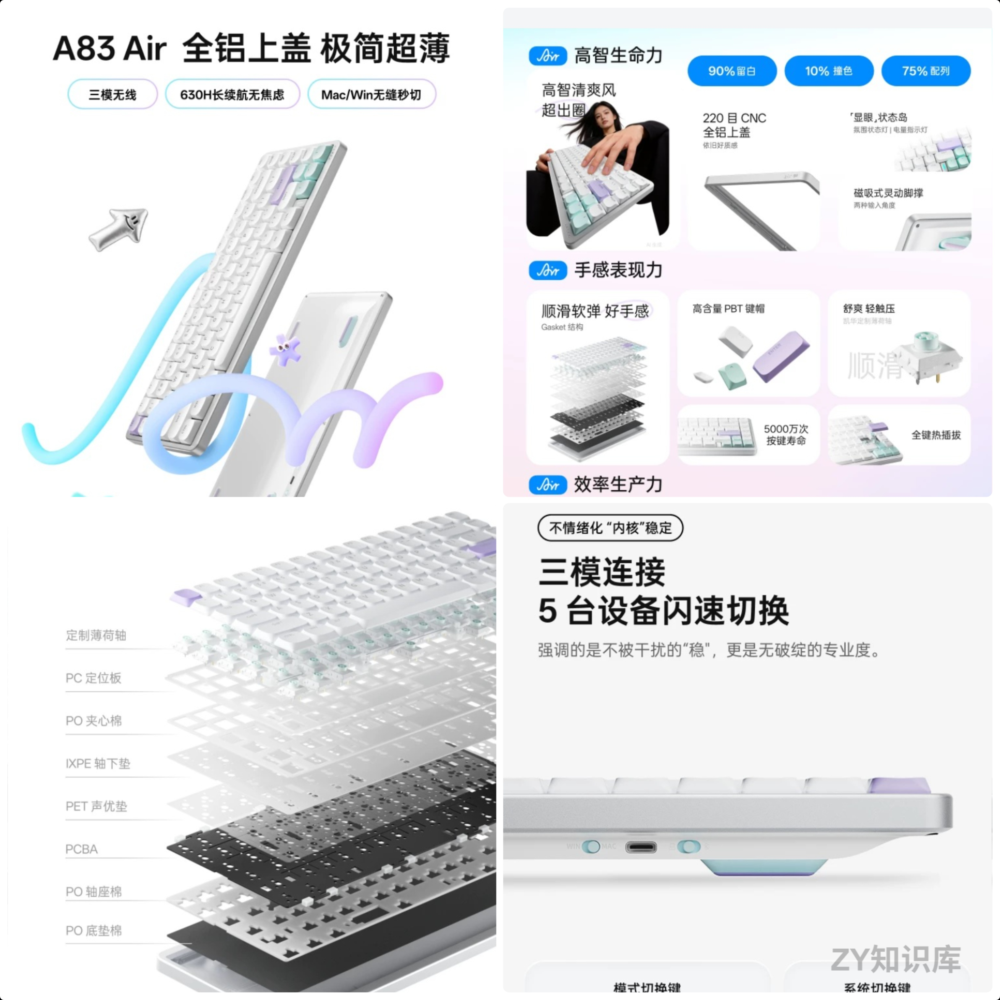
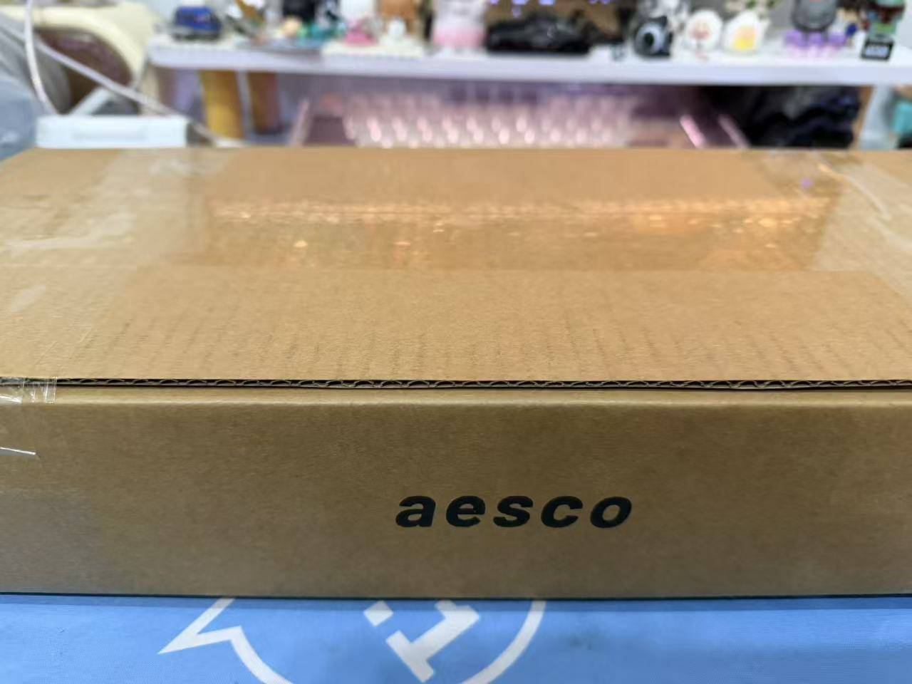
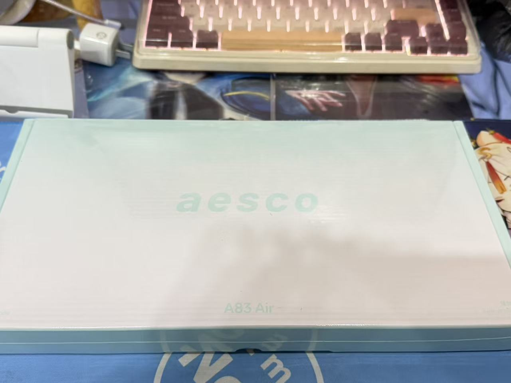
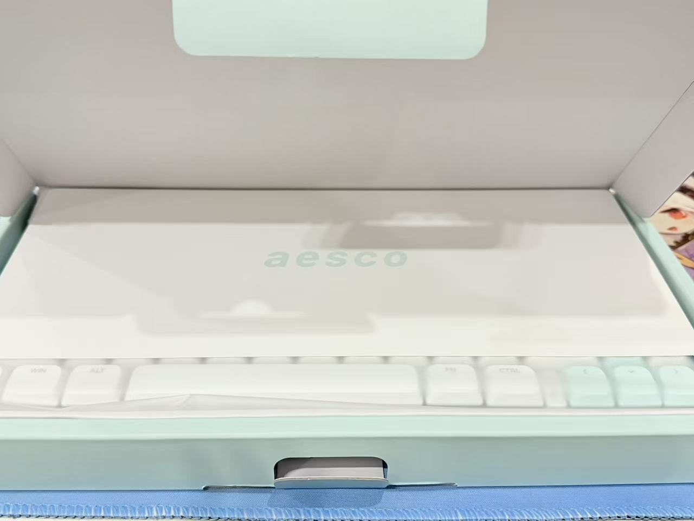
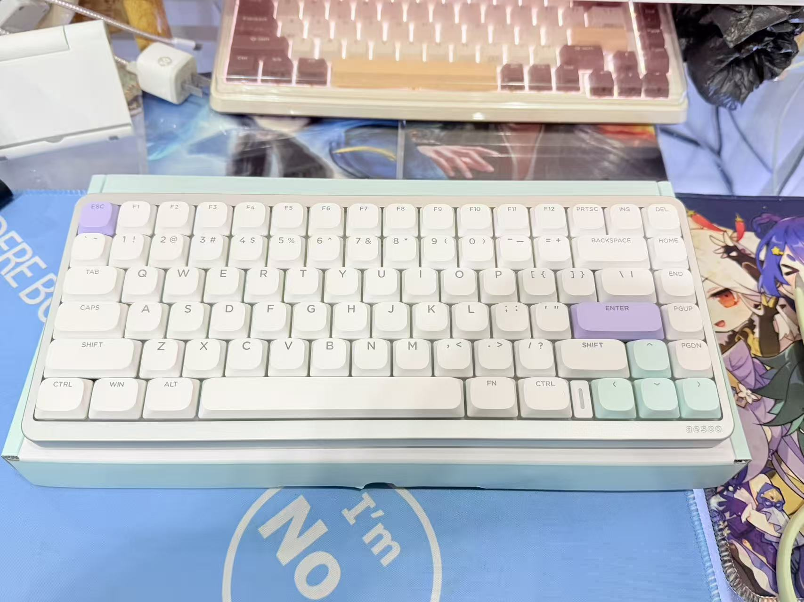
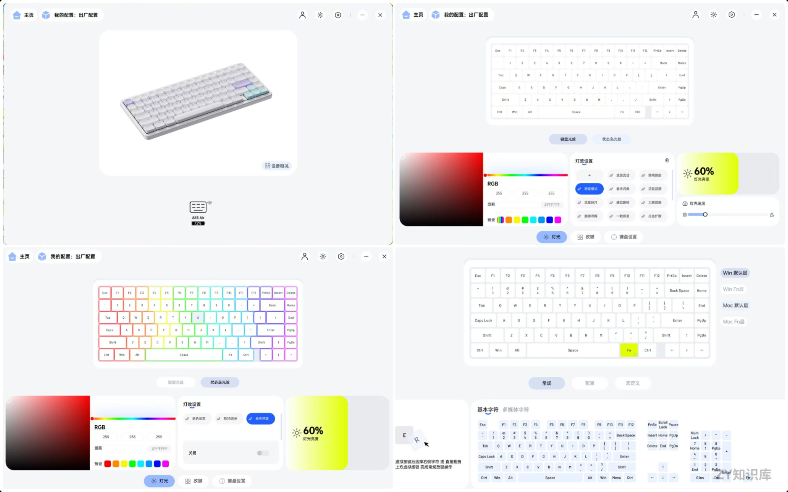

#  AESCO A83 Air 矮轴键盘开箱

## 前言

目前在使用的主力键盘有2个，分别是：

- [HELLO GANSS XS 75T 键盘开箱 - ZY知识库](https://blog.pljzy.top/posts/hello_ganss_xs_75t_键盘开箱测评/hello_ganss_xs_75t_键盘开箱测评/) (2024年1月购入)
- KZZI 珂芝K75 机械键盘（2023年6月购入）

这2款机械键盘的轴体都不是矮轴，不过都是75配列，因为平常写代码感觉还是小配列的键盘舒服，数字键很少用上。

2025年一整年没有购入新键盘，到2026年换新电脑后也产生了换个新键盘的想法，当时机械键盘、磁轴键盘我都在看，不过我朋友给我推荐矮轴键盘，说：“打字特别爽”。

我看了好几款矮轴键盘，感觉都不是我喜欢的外观风格，我买机械键盘就喜欢买有旋钮和按钮盒小屏幕的，喜欢花里胡哨的。
不过刚好26年3月新出了一款**AESCO A83 Air矮轴键盘**,虽然外观没一个符合我要求的，不过物极必反，这种极致的简约也挺不错。

## 产品介绍

| 项目     | 详情                                     |
| -------- | ---------------------------------------- |
| 产品型号 | aeesco A83 Air 多模矮轴机械键盘          |
| 产品尺寸 | 315×132×30mm                             |
| 重量     | 1032g                                    |
| 连接模式 | 蓝牙5.0、2.4GHz、有线                    |
| 电池容量 | 3800mAh                                  |
| 键帽材质 | PBT 双色注塑                             |
| 键盘结构 | Gasket 结构                              |
| 热插拔   | 支持                                     |
| 兼容系统 | Win、mac OS双系统                        |
| 充电接口 | USB-C                                    |
| 快捷功能 | 12 种                                    |
| 背光系统 | 预设9种背光模式 驱动可支持自定义背光模式 |

目前这个系列只出了一款配色和轴体，配色如图所示，轴体名叫薄荷轴，键程短。键盘采用Gasket结构，打字时声音也很好听。键帽是PBT材质，总共83键。三模连接，可手动切换`Win`和`mac`系统3800mAh可充锂电池，官方宣称630小时续航，实际多久就不知道了，我也没测试。可通过官方驱动进行按键编程，全键无冲。

## 开箱图片

包装还是无破损的，这点不错，发的是顺丰快递。

打开包装，里面就是一张说明书，然后键盘本体，以及充电线和接收器，接收器是单独一个小包装，注意不要漏掉了。

## 键盘本体

外观还是很好看的，不过目前只有这款配色，要是能有更多选择的键帽配色就好了。

## 驱动界面

直接百度搜索键盘名称，打开官网下载驱动即可。

值得注意的是右下角方向键判断的呼吸灯也是可以设置颜色的。

## 总结

这是我第一款买入的矮轴键盘，总的来说体验还是很好的，无论是手感还是敲击声音都挺满意。