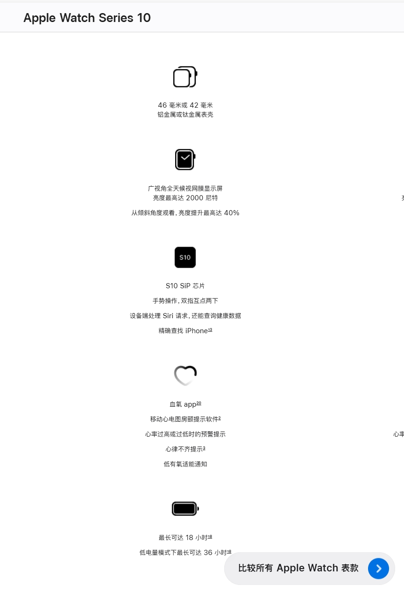
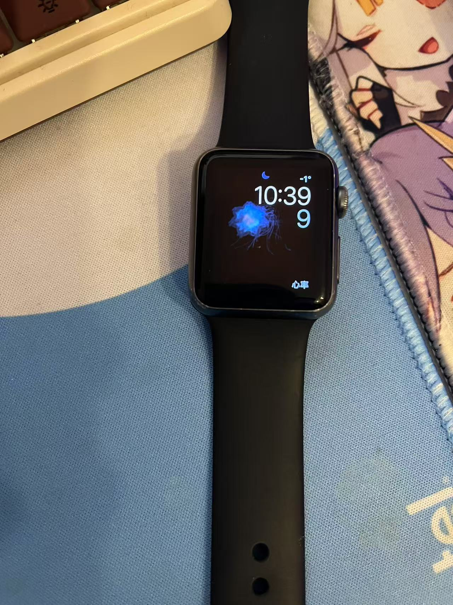
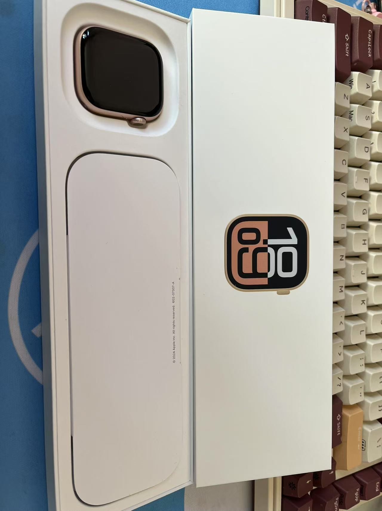
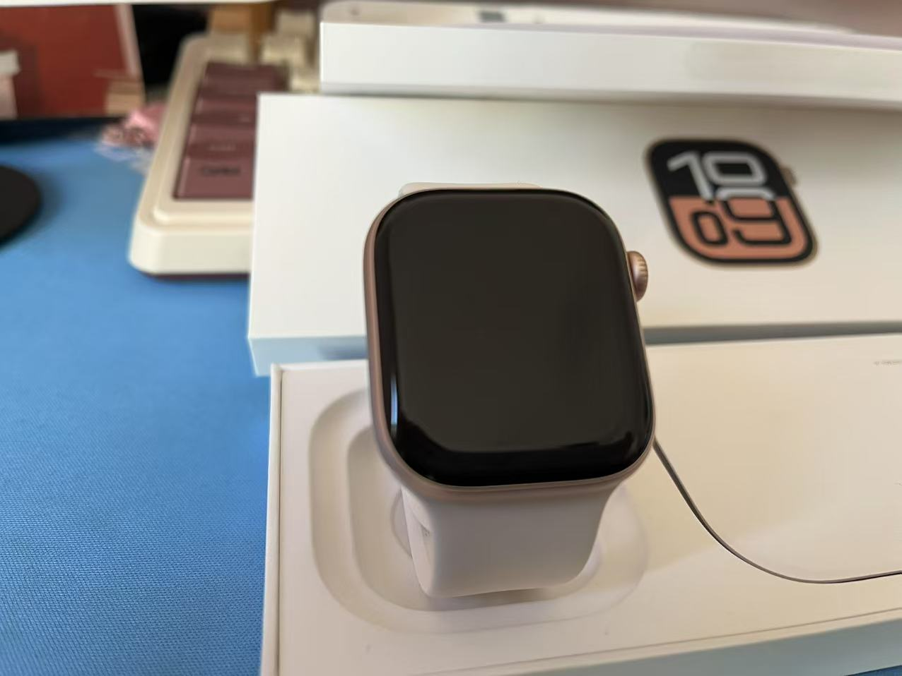
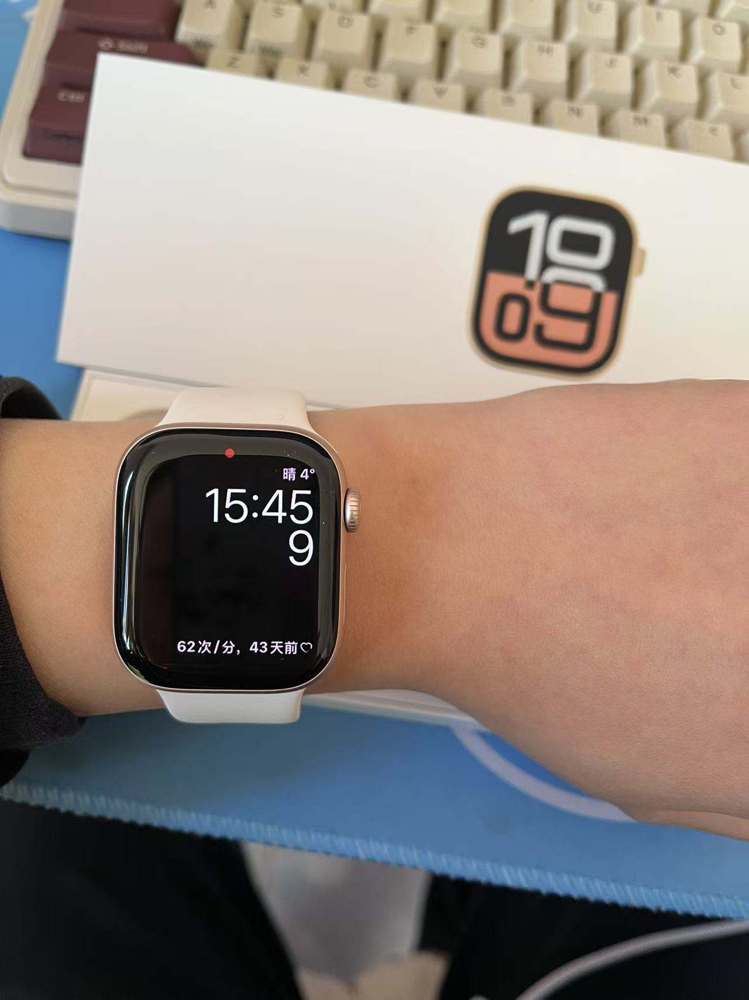
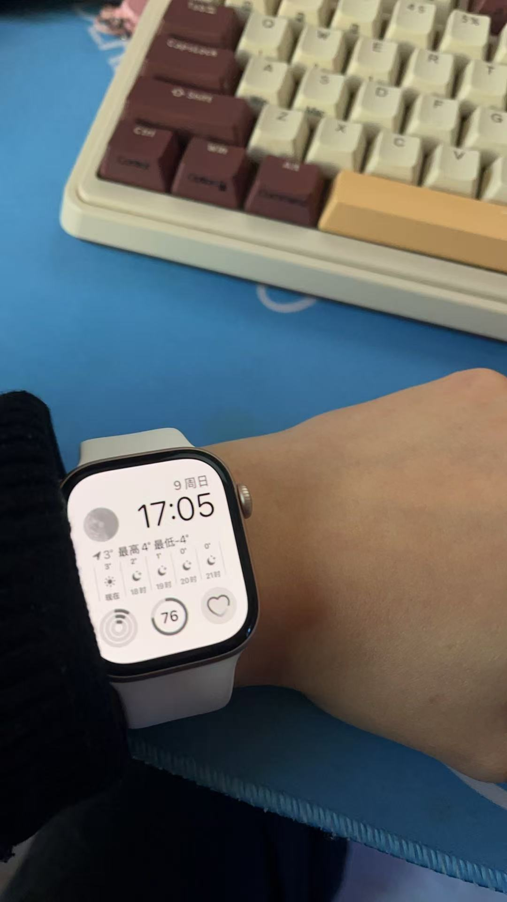

# Apple Watch Series 10-国补开箱

# 前言

高中时候买的Apple Watch 1 一直用到现在 ，将近8年之久(大部分时间在吃灰)，原本我是对手表不是很在意的，因为前几年手机换回国产了，Watch 1也就没带了。在近几年才换回苹果手机，老古董的Watch 1也用上了。不过性能和功能已经跟不上时代了，虽说可以测心跳，但是我想要的睡眠检测、压力检测等App是不受支持的。平时也就测测心率看看时间，而且电池只能勉强使用一天，大约8.00出门上班，下午6.00几乎就只有10%的电了。

刚好最近国补很火，也是一直想换，然后我这边也是有手表国补，再加上京东的卷，我是`￥2209`拿下。

我买的型号是 Series 10 42 毫米 `GPS`版本 玫瑰金色铝金属版本。

我看很多人纠结42毫米还是46毫米，我因为本身手腕就细，然后的是Watch 1 才38毫米我都觉得够用了，所以我就毫不犹豫下单了42毫米，开箱试戴之后还是很满意的。这个根据自己的喜欢选择就行了。

然后就是通关国补购买需要现场激活，我的苹果手机IOS是18版本，听说只有18版本能激活，然后激活大约花费了10分钟不到，快递员也是很有耐心。激活完成等快递员上传照片后就可以拿走了。

*由于现场激活，这些开箱图片是补拍的*

# 手表介绍

这里直接放官网的图

其实买这款手表主要就是为了搭配App检测压力和睡眠情况。

# 退役手表

屏幕还是保护很完整的，哈哈。

终于是退役了。

# 开箱图片

随手拍，非专业~

这里显示心率测试43天前，是因为同步了我之前的旧手表~

