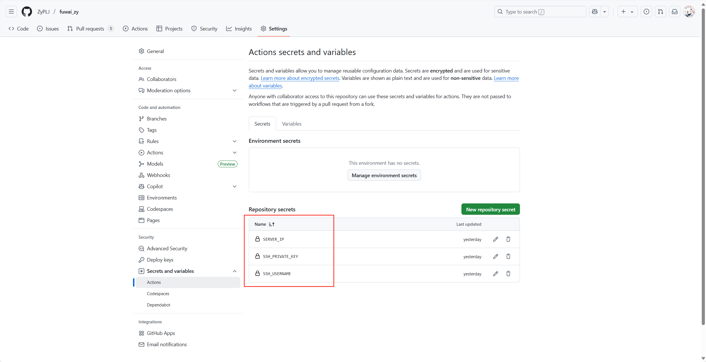

# 基于Astro开发的Fuwari静态博客模版配置CICD流程

## 前言

同往常一样，上班摸鱼的时候，就喜欢逛逛随机逛逛别人的博客，然后有一个博客的主题让我有点心动。

我自己也是部署了博客的，我目前的博客网站是：[ZY的博客](https://pljzy.top/)，已经安稳运行了800多天。不过我的博客有个缺点就是加载很慢，主要原因呢是因为静态资源的关系，虽然有一小部分我使用了七牛云的`cdn`服务，但还是无法解决访问慢的问题。加上本身的服务器带宽也不大，只有`3M`的带宽。种种原因导致我的博客访问很慢，然后就遇到了今天要说的这个博客，这是一个静态博客，访问起来速度会快很多。

这个博客是基于[Astro](https://docs.astro.build/zh-cn/concepts/why-astro/)开发的一个博客主题模版，GitHub上叫[fuwari](https://github.com/saicaca/fuwari/blob/main/docs/README.zh-CN.md)。

先来放一张博客的图片，我觉得这个主题还是很好看的。


## 在线访问

目前我的新博客也已经部署到服务器上了，地址为：

- [ZY知识库](https://blog.pljzy.top/) https://blog.pljzy.top/

欢迎大家访问我的新博客！

## 博客的不足

如果拿这个博客和我目前的博客对比，我认为的不足点有以下几点：

- [x] 评论功能还未完成；（已集成）
- [ ] 没有友情链接功能；

[fuwari](https://github.com/saicaca/fuwari/blob/main/docs/README.zh-CN.md)的开发者不知道什么时候会更新评论功能，不过我在翻阅`Pull requests`时，发现有一个关于评论的合并请求：https://github.com/saicaca/fuwari/pull/406。

我也是花了时间去实验了一下，发现我还得重新注册个域名，总的来说还是比较麻烦的。后面发现他这种办法是针对于没有服务器的博主，我有自己的服务器完全可以找一个开源的评论系统集成到[fuwari](https://github.com/saicaca/fuwari/blob/main/docs/README.zh-CN.md)中去就行了。

后续我在博客集成了[Twikoo](https://twikoo.js.org/quick-start.html)评论系统，后面我再单独出一篇文章讲如何集成评论系统。

总之我觉得[Astro](https://docs.astro.build/zh-cn/concepts/why-astro/)的自由度很高，支持很多语言如：`React`、`Preact`、`Svelte`、`Vue`、`Solid`等，可扩展性很高，完全可以根据自己的想法去修改博客的内容。

## 如何部署

下面来讲一讲如何部署一个这个博客，[Astro](https://docs.astro.build/zh-cn/concepts/why-astro/)的文档很详细，这里就拿部署到`GitHub`上来作为例子。

部署文档：[部署你的 Astro 站点至 GitHub Pages | Docs](https://docs.astro.build/zh-cn/guides/deploy/github/) https://docs.astro.build/zh-cn/guides/deploy/github/

部署文档里面说的很清楚，我这里就不再复述了，如果只是单纯的部署到`GitHub Pages`上，跟着官方文档去做，一般不会出现问题。

### 使用自己的域名

总所周知，`Github Pages`部署后会给你一个`Github.io`域名，如果想使用自己的域名则需要做一点修改。

首先修改代码中的`astro.config.mjs`文件，将`site`指向你的域名，<font color='red'>要注意的是不要为 `base` 设置值。</font>

```js
import { defineConfig } from 'astro/config'

export default defineConfig({
  site: 'https://example.com',
})
```

### 域名解析

代码改完之后，需要为你的域名添加域名解析，以阿里云域名为例。

顶级域名：需要添加A类解析，将你的顶级域名指向`Github.io`域名的`ip`地址，获取ip地址，本地控制台ping一下`github.io`域名即可。


如果是二级域名，比如我的`blog.pljzy.top`,那么则需要添加的是CNAME类型的解析，将`blog.pljzy.top`域名直接解析到`Github.io`上去就行了。

### Github配置

如图所示：

Source选择`GitHub Actions`，`Custom domian`填入自己的域名，然后强制`HTTPS`打开。


## 如何创建文章

部署完成后，如果上传文章呢，我之前的博客是在后台管理系统中上传文章，这个静态博客当然是不存在后台管理系统的，所以上传文章就需要手动去讲文章放到`posts`目录下。

注意分为带展示图的文章和不带展示图的文章。

`posts`指代`Src`->`Content`->`posts`

### 带展示图

在`posts`目录下创建文章目录`guide`，`cover.jpeg`就是首图，`index.md`就是文章。

```
guide/
├── index.md
└── cover.jpeg
```

### 不带展示图

不带展示图的文章就只需要在`posts`下创建md文件即可。

```
posts/
└── index.md
```

### 注意

需要注意的是，md文件需要再开头添加上标识，用于展示文章的标题、时间、首图、分类、标签等信息。

```
---
title: My First Blog Post
published: 2023-09-09
description: This is the first post of my new Astro blog.
image: ./cover.jpg
tags: [Foo, Bar]
category: Front-end
draft: false
lang: jp      # Set only if the post's language differs from the site's language in `config.ts`
---、
```

## 步入正题CICD

### CICD简述

CI/CD（持续集成/持续交付或持续部署）是一种自动化软件开发和交付流程。

- 持续集成（CI）：开发者提交代码后，自动触发构建和测试（单元测试、代码扫描等）。
- 持续交付（CD）：生成可部署的产物（如Docker镜像），等待人工确认发布。

简言之，CI/CD通过自动化实现从代码提交到发布的快速、可靠流程。

### deploy.yml

上面扯了很多，还没有开始讲`CICD`。部署到`GitHub Pages`时，Astro官方文档给了一个通用的`Github Action`模版。

使用这个模版就可以完成简单的`CICD`流程，我们只需要在本地的`Src`->`Content`->`posts`中创建文章，或者把文章目录移入该目录下，然后`commit`提交，`push`推送，`GitHub Action`会自动帮我们完成打包+部署。

```yml
name: Deploy to GitHub Pages

on:
  # 每次推送到 `main` 分支时触发这个“工作流程”
  # 如果你使用了别的分支名，请按需将 `main` 替换成你的分支名
  push:
    branches: [ main ]
  # 允许你在 GitHub 上的 Actions 标签中手动触发此“工作流程”
  workflow_dispatch:

# 允许 job 克隆 repo 并创建一个 page deployment
permissions:
  contents: read
  pages: write
  id-token: write

jobs:
  build:
    runs-on: ubuntu-latest
    steps:
      - name: Checkout your repository using git
        uses: actions/checkout@v4
      - name: Install, build, and upload your site
        uses: withastro/action@v3
        # with:
          # path: . # 存储库中 Astro 项目的根位置。（可选）
          # node-version: 20 # 用于构建站点的特定 Node.js 版本，默认为 20。（可选）
          # package-manager: pnpm@latest # 应使用哪个 Node.js 包管理器来安装依赖项和构建站点。会根据存储库中的 lockfile 自动检测。（可选）

  deploy:
    needs: build
    runs-on: ubuntu-latest
    environment:
      name: github-pages
      url: ${{ steps.deployment.outputs.page_url }}
    steps:
      - name: Deploy to GitHub Pages
        id: deployment
        uses: actions/deploy-pages@v4
```

### 使用自己的服务器

考虑到`Github Pages`的访问速度时好时坏，非常的不稳定,想部署到自己的服务器上。部署的方式有很多种，直接将打包后的文件丢入`Nginx`中，或者使用`Docker`构建容器去部署。

这样做都行，但是我每次添加文章，都要重新去`build`代码，然后上传到服务器，很麻烦。

聪明的网友已经发现解决办法了，上面我们是不是讲过`GitHub Action`流程可以完成简单的`CICD`，即本地编写**文章-push代码-GitHub自动构建打包部署**。

那我们只需要稍微修改一下`deploy.yml`文件，然后在Github配置一下连接服务器的ssh私钥即可。

- SERVER_IP：服务器外网ip地址
- SSH_USERNAME：登录用户名
- SSH_PRIVATE_KEY：ssh私钥



#### 打包后的文件直接丢进服务器的Nginx目录下

使用这份`deploy.yml`文件就行了，根据自己的实际情况修改挂载目录和端口。

```yml
name: Deploy with Volume Mount

on:
  push:
    branches: [main]
  workflow_dispatch:

jobs:
  deploy:
    runs-on: ubuntu-latest
    steps:
      - name: Checkout
        uses: actions/checkout@v4

      - name: Install and Build (Astro)
        uses: withastro/action@v3

      - name: Upload Files to Server
        uses: appleboy/scp-action@v0.1.6
        with:
          host: ${{ secrets.SERVER_IP }}
          username: ${{ secrets.SSH_USERNAME }}
          key: ${{ secrets.SSH_PRIVATE_KEY }}
          source: "dist/*"
          target: "/www/wwwroot/default/newblog"  # 直接上传到挂载目录

      - name: Start/Restart Container
        uses: appleboy/ssh-action@v1
        with:
          host: ${{ secrets.SERVER_IP }}
          username: ${{ secrets.SSH_USERNAME }}
          key: ${{ secrets.SSH_PRIVATE_KEY }}
          script: |
            # 直接运行Nginx容器并挂载目录
            docker stop astro-app || true
            docker rm astro-app || true
            docker run -d \
              --name astro-app \
              -p 4321:80 \
              -v /www/wwwroot/default/newblog:/usr/share/nginx/html:ro \
              nginx:alpine
```

#### 使用Docker部署到服务器

使用`Docker`相对来说麻烦一点，使用这份`deploy.yml`文件就行了，然后需要常见`DockerFile`、`docker-compose.yml`、`default.conf`这3个文件，博主就是采用的这种方式。同样注意根据自己服务器的实际情况修改目录和端口。

**deploy.yml**

```yml
name: Docker Compose Deploy

on:
  push:
    branches: [main]
  workflow_dispatch:

jobs:
  deploy:
    runs-on: ubuntu-latest
    steps:
      - name: Checkout
        uses: actions/checkout@v4

      - name: Install and Build (Astro)
        uses: withastro/action@v3
        
      - name: Debug file existence
        run: |
          ls -la
          ls -la dist/ || echo "dist/ not found"
          ls -la docker/ || echo "docker/ not found"
          test -f docker-compose.yml && echo "docker-compose.yml exists" || echo "docker-compose.yml missing"

      - name: Upload Files to Server
        uses: appleboy/scp-action@v0.1.6
        with:
          host: ${{ secrets.SERVER_IP }}
          username: ${{ secrets.SSH_USERNAME }}
          key: ${{ secrets.SSH_PRIVATE_KEY }}
          source: "dist/*,docker/*,docker-compose.yml"
          target: "/www/wwwroot/default/newblog"

      - name: Deploy with Docker Compose
        uses: appleboy/ssh-action@v1
        with:
          host: ${{ secrets.SERVER_IP }}
          username: ${{ secrets.SSH_USERNAME }}
          key: ${{ secrets.SSH_PRIVATE_KEY }}
          script: |
            cd /www/wwwroot/default/newblog
            docker-compose down
            docker-compose up -d --build
            docker system prune -f
```

**DockerFile**

```dockerfile
FROM nginx:alpine

# 删除默认配置
RUN rm /etc/nginx/conf.d/default.conf

# 复制自定义配置
COPY ./nginx/default.conf /etc/nginx/conf.d/

# 复制构建好的静态文件（由CI/CD流程完成）
WORKDIR /usr/share/nginx/html

# 暴露端口
EXPOSE 4321
```

**docker-compose.yml**

```yml
version: '3.8'
services:
  web:
    build: ./docker
    ports:
      - "4321:4321"
    volumes:
      - /www/wwwroot/default/newblog/dist:/usr/share/nginx/html:ro
    restart: unless-stopped
```

**default.conf**

```
server {
    listen       4321;# 配置端口
    server_name  0.0.0.0; # 修改为docker服务宿主机的ip
 
    location / {
        root   /usr/share/nginx/html;
        index  index.html index.htm;
        try_files $uri $uri/ /index.html =404;
    }
 
    error_page   500 502 503 504  /50x.html;
    location = /50x.html {
        root   html;
    }
}
```

无论采用上述那种方式，我们只需要在本地创建文章然后提交到git上就能自动上传到服务器完成构建并运行重新项目。

## 吐槽一下

`Github Action`调试起来还是挺费劲的，博主整整调试了10几次才完成CICD，有各种原因会导致部署失败。


## 效果演示

修改代码后直接提交git，就能完成构建部署。


在`Github Action`页面可以看到有3个流程，分别是代码检查、构建检查、以及最后的推送到服务器构建，代码检查和构建检查是[fuwari](https://github.com/saicaca/fuwari/blob/main/docs/README.zh-CN.md)模版自带的无需修改。


## 相关链接

- [部署你的Astro站点](https://docs.astro.build/zh-cn/guides/deploy/) https://docs.astro.build/zh-cn/guides/deploy/
- [快速上手Twikoo ](https://twikoo.js.org/quick-start.html)  https://twikoo.js.org/quick-start.html
- [fuwari博客主题模版](https://github.com/saicaca/fuwari/blob/main/docs/README.zh-CN.md) https://github.com/saicaca/fuwari/blob/main/docs/README.zh-CN.md
- [ZyPLJ/fuwai_zy](https://github.com/ZyPLJ/fuwai_zy) https://github.com/ZyPLJ/fuwai_zy