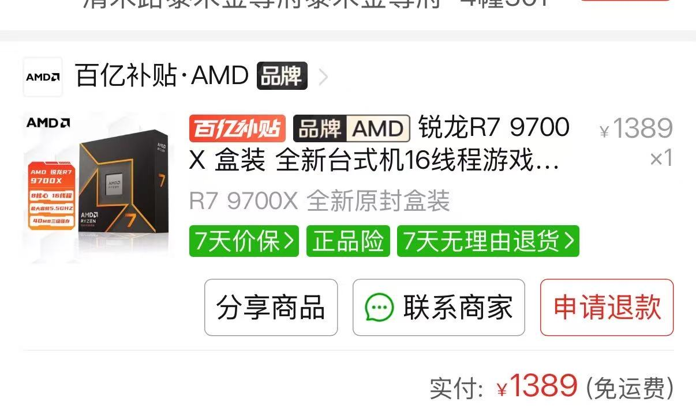
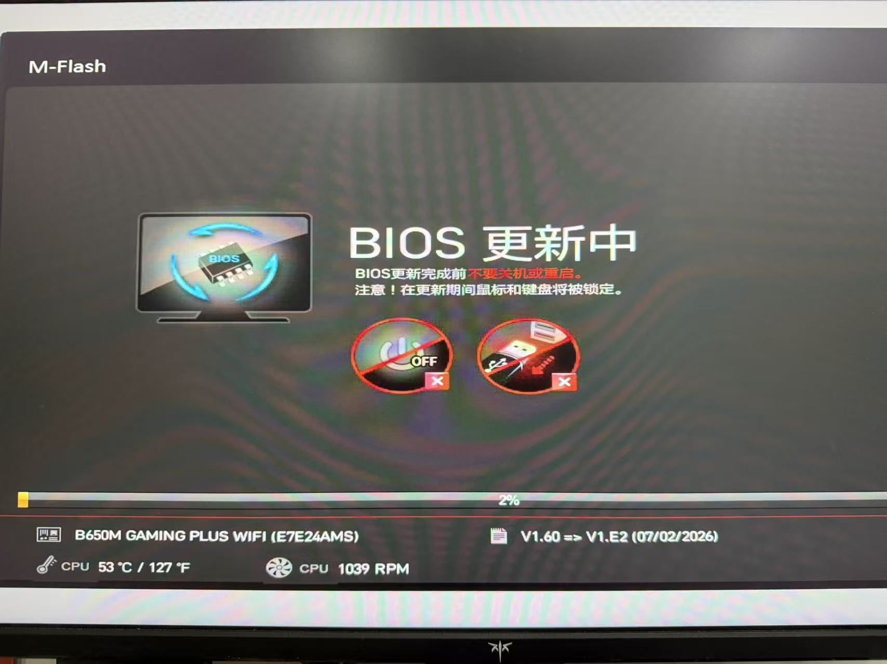
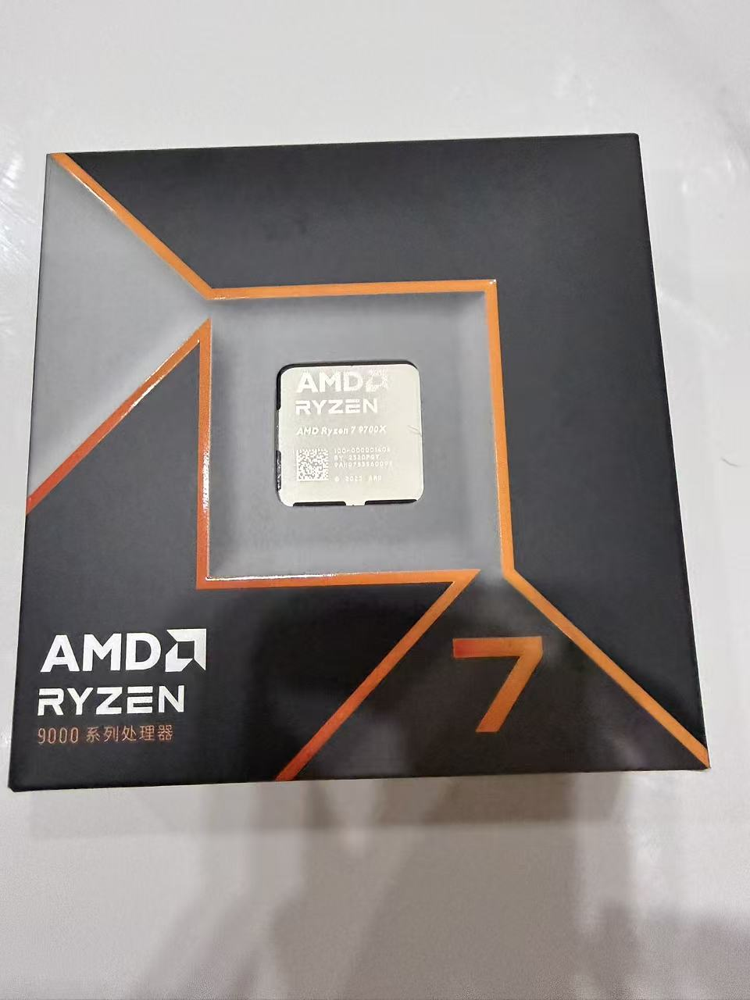
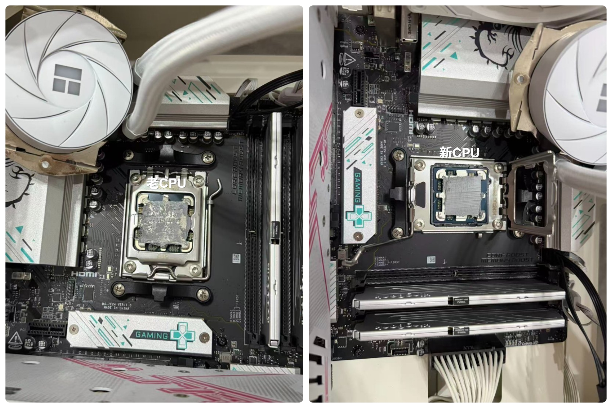
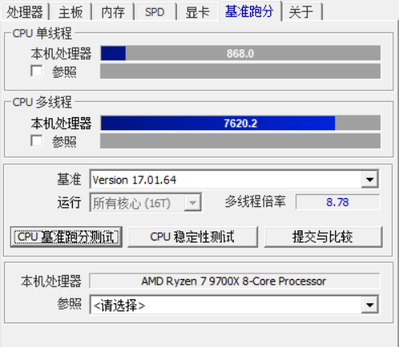
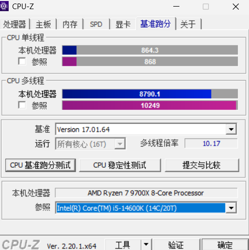
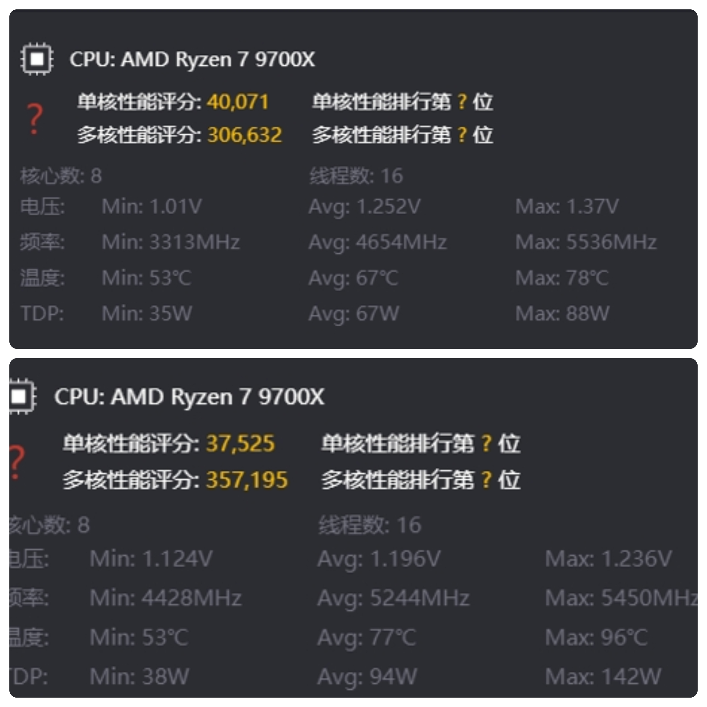
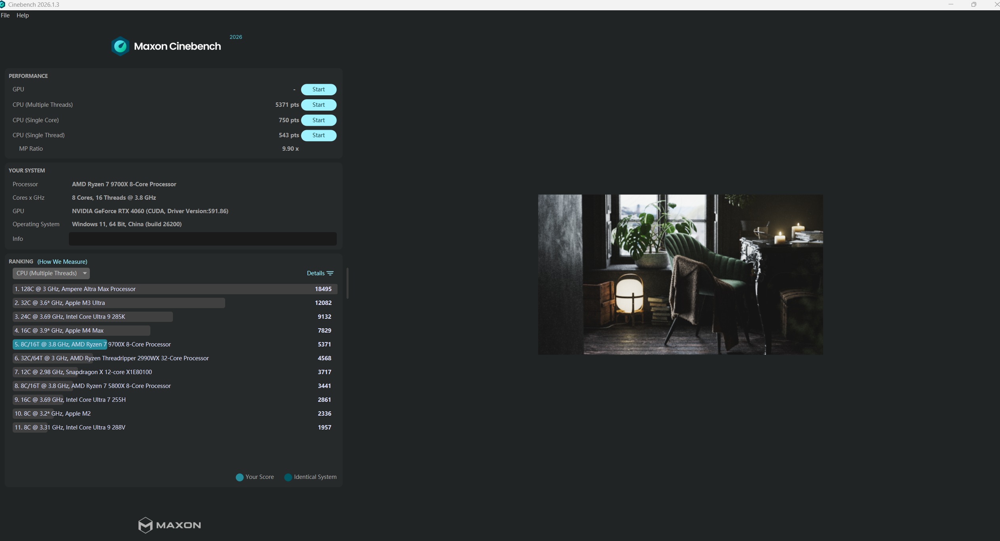
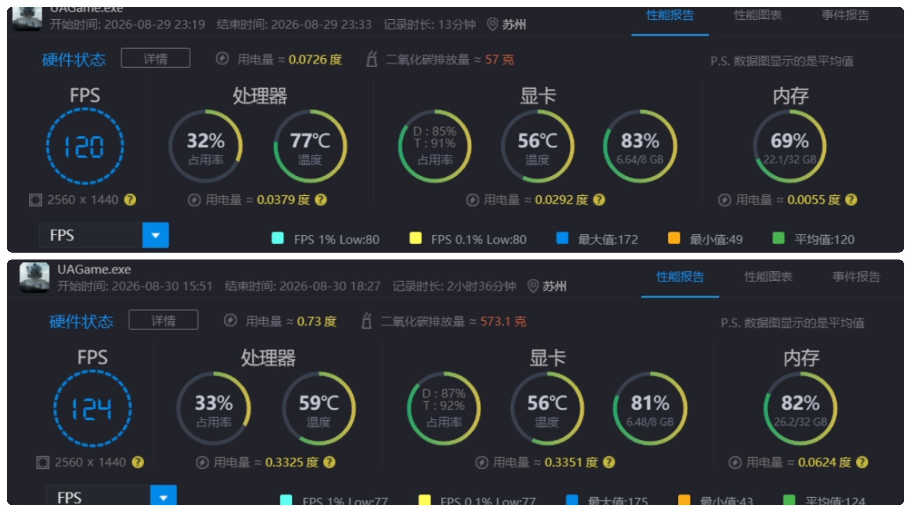

# CPU升级篇：7500F升级9700X

## 前言

我的主机是**24年**装的，当时装机对比现在那真是便宜得不了，可惜当时手动有点紧，只装了台**7500F+4060+32G**。

[[小白装机-装机篇]]

现如今内存、显卡、硬盘疯涨的情况下，`cpu`再悄悄的降价了。

某多多上面热门**Cpu**价格如下：

- 9800X3D盒装-2589￥
- 9850X3D盒装-2859￥
- 7800X3D盒装-1789￥
- 9700X盒装-1389￥

*注意：此价格是我在2026-08-27所看的价格，且有卷的情况下,随时间变化，价格可能变动。*

我一开始是准备升级到**7800X3D**，价格也就比**9700X**贵300块钱，但是我并不玩需要大三缓的游戏，比如：永劫无间。

且这2颗u都是**8核心16线程**，在其他游戏的帧数上差距非常小。

所以我最后是入手的**9700X**。

## 参数对比

### 📊 核心规格对比

| 参数项              | **AMD 锐龙5 7500F**       | **AMD 锐龙7 9700X**       |
| :------------------ | :------------------------ | :------------------------ |
| **产品定位**        | 入门级游戏处理器          | 中高端游戏/生产力处理器   |
| **架构与代号**      | Zen 4 (Raphael)           | Zen 5 (Granite Ridge)     |
| **制程工艺**        | TSMC 5nm FinFET (CPU核心) | TSMC 4nm FinFET (CPU核心) |
| **核心/线程**       | **6核心 / 12线程**        | **8核心 / 16线程**        |
| **基准频率**        | 3.7 GHz                   | 3.8 GHz                   |
| **最高加速频率**    | 最高 5.0 GHz              | 最高 **5.5 GHz**          |
| **L2 缓存**         | 6 MB                      | **8 MB**                  |
| **L3 缓存**         | 32 MB (共享)              | 32 MB (共享)              |
| **默认 TDP (功耗)** | 65W                       | 65W (可解锁至105W模式)    |
| **集成显卡**        | **无** (需搭配独立显卡)   | AMD Radeon Graphics       |
| **内存支持**        | DDR5-5200 (官方), 2通道   | DDR5-5600 (官方), 2通道   |

## 更新主板BlOS

我的主板**BlOS**还是当时装机的时候的版本，对于9000系的CPU可能支持不是特别好，顺便把主板的**BlOS**更新到最新版本吧。

我的主板型号是**B650M-GAMING-PLUS-WIFI**，在[微星官网](https://www.msi.cn/Motherboard/B650M-GAMING-PLUS-WIFI/support)上搜索这款主板，然后下载最新的**BlOS**更新文件，保存到C盘根目录。

具体过程就不演示了，b站上面有教程。

## CPU更换过程

更换CPU那必然少不了重新涂硅脂，所以在某东花费16元巨款，买了个**7921**硅脂。

在更换之前记得清理冷头上面的残留硅脂。

换CPU的时候还得注意CPU的方向，主板和CPU有个对角一定要对齐，安装上去后，用手指按压一下看看有没有对准。
确认没有问题就可以把盖板压下去，然后安装散热器了。

## CPU超频和EXPO

更新**BlOS**和新的CPU后，之前主板的设置就会重置了，这个时候需要手动在开机时连续按**Delte**键进入主板**BlOS**设置界面。

手动开启**EXPO**和CPU超频即可。

这里也不细说了，感兴趣的可以在b站搜索相关教程。

## 跑分

在安装上新的Cpu后，那必然是少不了跑分的。

不过在跑分的过程中，我发现一个问题，在没有开启超频的情况下，这颗Cpu的温度很高，对比我之前的**7500F**来说，温度高了**10几度**，导致我的散热器噪音非常大。

后面也是对这颗U进行了**降频负压**,这也是网上常用的超频降压手段。

这颗Cpu默认最高能跑到**5.5Ghz**的频率，对其**-50**频率，也就是**5.45Ghz**的频率，这样对于性能几乎没有影响。

然后全核**负压20**，这样就可以解决**高温**的问题。

当然最好的办法是每个核心针对性减压，但是比较麻烦，我这也是**省事的办法**。

每颗U的体质不一样，在做完这些操作后，记得跑跑测试，看看会不会蓝屏或者不开机的情况。

### 设置前后Cpu-Z对比

可以看到多核跑分还高了点。

那么这个Cpu-Z跑分也是达到了**9700X**的基础水平，有些好的体质，调得好，多核评分可以跑到9000。

### 设置前后游戏加加跑分

可以看到多核跑分更高，最主要的是**电压**低了很多，然后频率最高在**5.4Ghz**了。然后开启超频后，功率释放来到了**140w**。

### Cinebench r23 2026跑分

在降频负压的情况下，正常通过**Cinebench r23**，然后跑分成绩属正常水平。

### 设置前后游戏温度对比

在开启默认超频和降频负压的情况下，游戏帧数与温度对比。

可以看到默认超频的情况下，温度直逼**80°**。

在开启降频负压后，温度稳定在**60°**左右，可以说是几乎降低了15°左右的温度。

在`70-80°、50-60°`这2个区间，散热器的噪音是2个维度，一个很吵，一个很安静。

然后就是游戏帧数这里**游戏时长不一样**，主要看温度，可以看到1%low帧只降低了3，然后整体帧数上涨了4。

*如果采用网上的分核负压的方式，甚至可以提高low帧，我这里就懒得折腾了，把温度降下来就行。*

## 后续升级

后续升级计划就是显卡、散热器和机箱了。

我的水冷散热器质保只有3年，刚好明年这个时候要过质保了，所以明年得换个散热器。

然后就是显卡，最开始是准备升级显卡的，结果刚好涨价了，现在显卡的价格太贵了，只能考虑后面升级了。

最后就是机箱，准备换个小一点的机箱。

## 总结

升级后，对于游戏帧数来说提升还是有的。

**9700X**这颗U，温度对比**7500F**有点高，如果出现温度过高的情况，需要进行降频负压。

进行超频、负压操作后需要跑测试以防游戏过程中突然蓝屏。