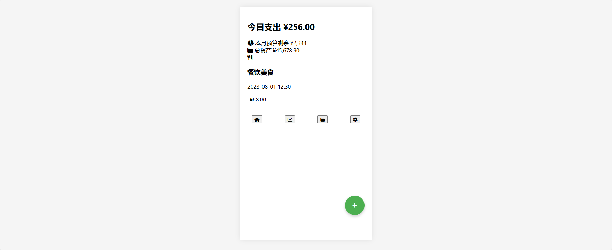
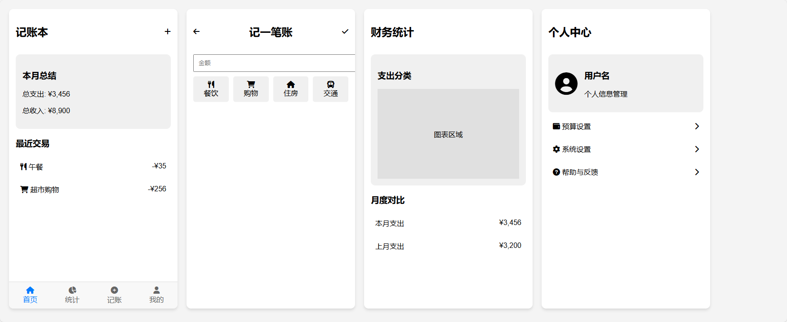
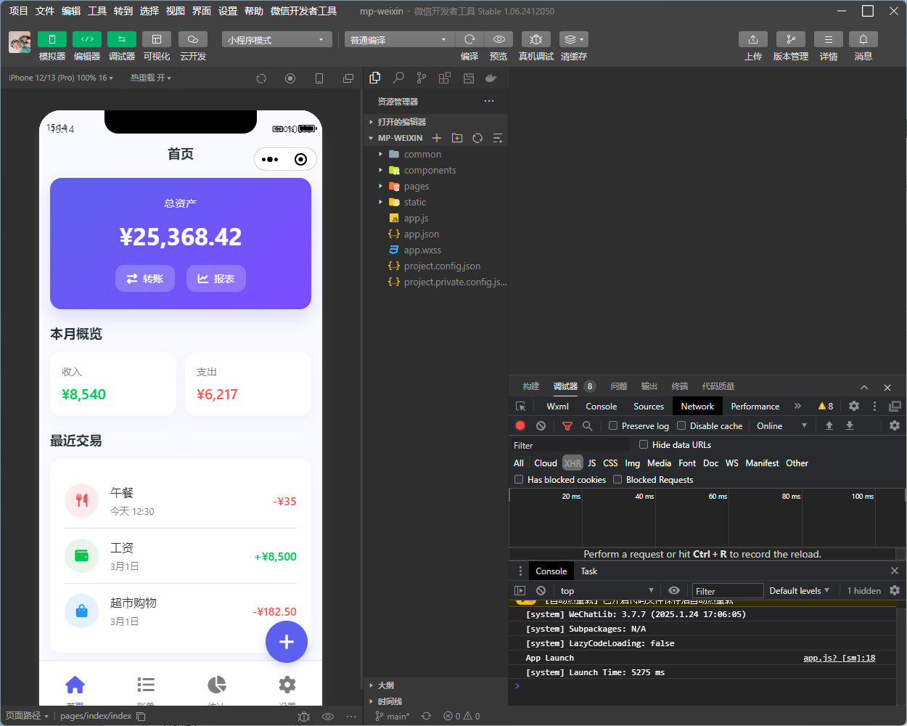
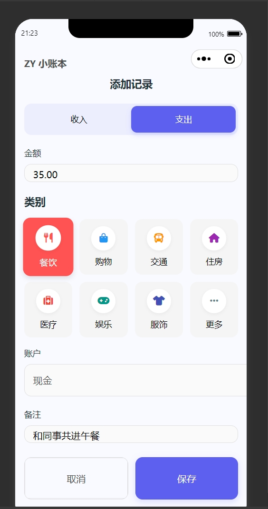
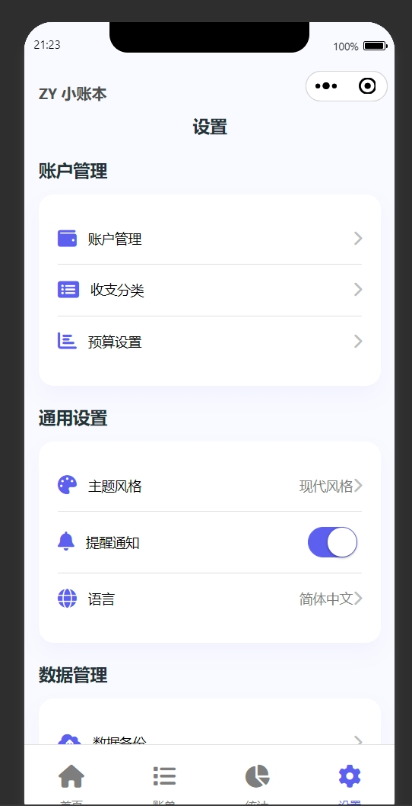

# 关于我用Claude 3.7 Sonnet模型直接生成小程序

# 前言

最近AI一直是很火的话题，`Deepseek`也是一夜爆火，但是实际使用下来发现`Deepseek`好像和其他大模型一样，并没有什么厉害之处，而且官网经常服务器繁忙。

当我使用`Claude 3.7 Sonnet`之后才算是被惊讶到，在此之前我也是在微信公众号看到很多文章是`Claude 3.7`很厉害，我本着不信的原则去使用了一下，发现代码能力肯定是强于`Deepseek`的。为什么我这么肯定呢，请看下文介绍。

# AI提示词

> 我想开发一个记账小程序，现在需要输出原型图（带颜色），请通过以下方式帮我完成小程序所有原型图片的设计。1、思考用户需要记账小程序实现哪些功能2、作为产品经理规划这些界面3、作为设计师思考这些原型界面的设计4、使用html在一个界面上生成所有的原型界面，可以使用FontAwesome等开源图标库，让原型显得更精美和接近真实我希望这些界面是需要能直接拿去进行开发的

`DeepSeek\Claude 3.5\Claude 3.7`提示词相同，但是之前问的时候没有加上**（带颜色）**所以 `DeepSeek\Claude 3.5`是原型图是没颜色的。

# `DeepSeek`生成记账程序原型图

这是用`DeekSeek`生成出来的，可以说和我自己写的简直一模一样，当然我这里没有硬黑，不过当时还有一段小插曲，提示服务不可用。

# Claude 3.5

`Claude 3.5`生成出来的算不上很惊艳，但是至少看得过去。

# Claude 3.7

## 第一版

`Claude 3.7`生成的第一版明显比3.5好看很多，就算是去掉颜色也比3.5和`Deepseek`强！

## 第二版

在第一版的基础上我加上了现代化风格，提示词如下

> 上次让你生成的 ‘我想开发一个记账小程序，现在需要输出原型图（带颜色），请通过以下方式帮我完成小程序所有原型图片的设计。1、思考用户需要记账小程序实现哪些功能2、作为产品经理规划这些界面3、作为设计师思考这些原型界面的设计4、使用html在一个界面上生成所有的原型界面，可以使用FontAwesome等开源图标库，让原型显得更精美和接近真实我希望这些界面是需要能直接拿去进行开发的’的html原型图，在不改变功能的情况下修改页面风格，修改为现代风。

可以说这个效果已经是非常惊讶了，并且生成出来的不是图片而是`html`代码，但是我明明说的小程序，为什么会让他生成`html`代码呢，因为生成`html`可以直观的看到效果，但是肯定是不能直接在小程序中使用的，那么继续让`Claude 3.7`优化。

提示词：

> 上次叫你用html生成了原型界面，但是这是个记账小程序，对于微信小程序来说html并不行，所以我想使用uniapp来实现小程序开发，根据昨天的html界面，你能将他转换成uniapp+vue的页面吗？

最好在小程序运行的效果如图：

可以看到和原型图几乎一样，不过眼尖的人可以看到头部的信息是重叠的，你可以继续选择问他让他优化一下，这是因为他自定义的头部和小程序头部冲突了，我因为略懂小程序知识也就没往下问，手动将小程序头部修改一下就可以了。

## 最终效果图

这里只放了部分截图

# 结尾

不得不说现在`Ai`是越来越厉害，虽然我只生成了小程序的静态页面，但我如果继续问下去，让`Ai`生成后端我觉得也是可行的，有兴趣的朋友可以自己去试试。

那么如何使用`Claude 3.7`，使用3.7目前来说是需要消费的，但是可以通过邀请朋友注册享受体验资格，邀请得越多提问的次数越多，感兴趣的可以私信我~，顺便帮博主拉拉次数。