# Claude+CC Switch+CC-Connect+飞书使用教程

## 简介 📖

本文介绍如何使用[CC Switch](https://www.ccswitch.io/zh/)切换[Claude](https://www.anthropic.com/)终端对接的供应商，让`Claude Code`可以对接[Deepseek](https://platform.deepseek.com/)、[智谱](https://bigmodel.cn/pricing)等国内模型。

本文后半段介绍如何用[CC-Connect](https://github.com/chenhg5/cc-connect)让飞书对接上本地电脑上的`Claude Code`。

## 前置条件 🛠️

安装如下工具：

- [Node.js](https://nodejs.org/zh-cn)

  - 安装确保勾选 "**Add to PATH**"（自动添加到环境变量）

- Claude Code

  - ```sh
    npm install -g @anthropic-ai/claude-code
    ```

- CC-Connect

  - ```sh
    npm install -g cc-connect
    # 验证
    cc-connect --version
    ```

- [CC Switch](https://www.ccswitch.io/zh/)

## CC Switch 🔄

### 配置CC Switch ⚙️

这里以智谱为例，安装好后打开`CC Switch`，界面如下:

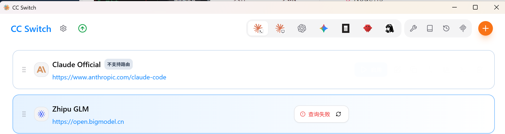

点击页面添加按钮，选择**自定义配置**或者`Zhipu GLM`都行。

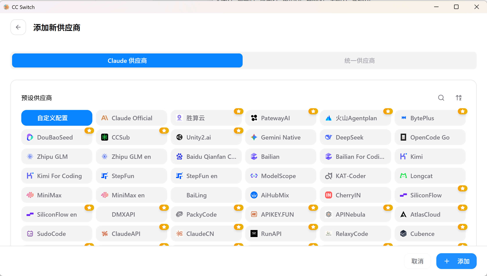

主要是`API Key`和请求地址要填写正确，`API Key`在智谱开放平台注册账号后获取https://bigmodel.cn/apikey/platform。

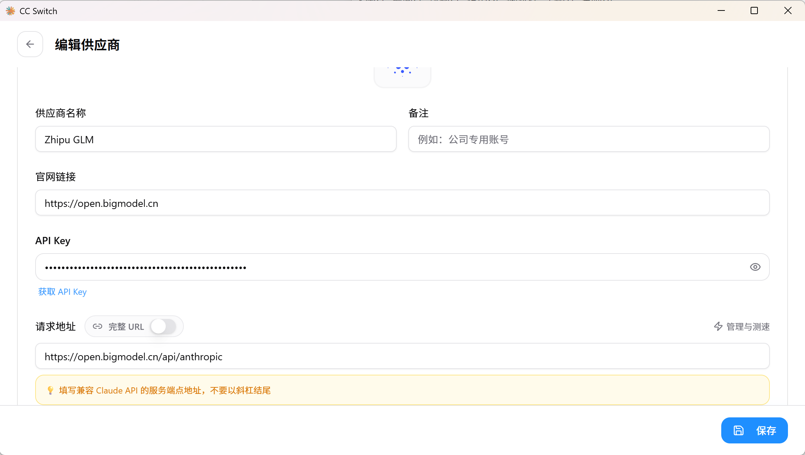

然后下面就是填写对应模型名称，因为注册的时候送了很多`glm-4.6v`的`token`，所以我这是用的是`glm-4.6v`。

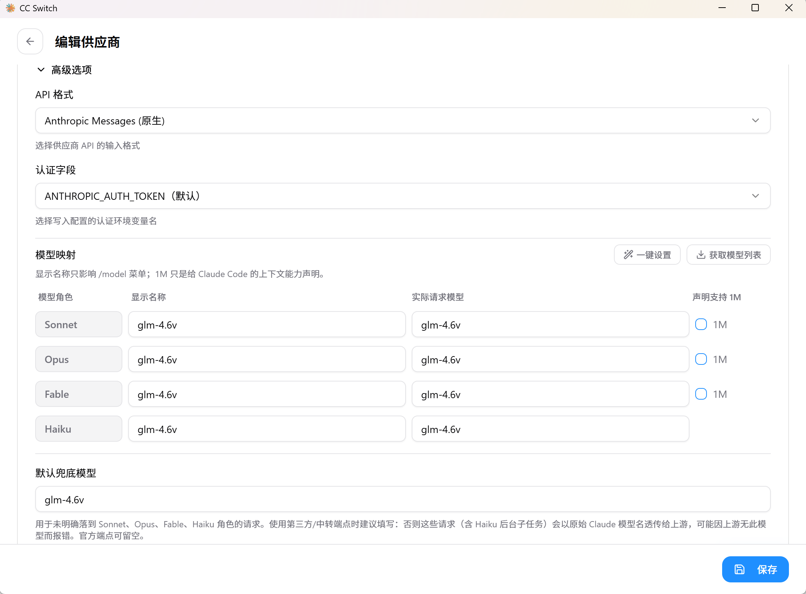

在界面上点击检测连通按钮可以测试连通性 ✅

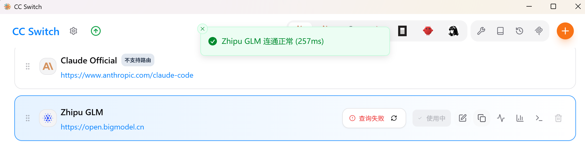

### 使用Claude Code 💻

接下来在项目目录打开`cmd`,输入`claude`就好了。

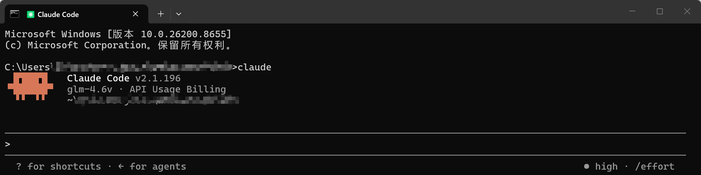

## CC-Connect 🔗

### 配置CC-Connect 🧩

安装好`CC-Connect`后，运行`cc-connect`和`cc-connect web`。

```sh
cc-connect
cc-connect web
```

web运行的默认端口是9820：http://localhost:9820/。

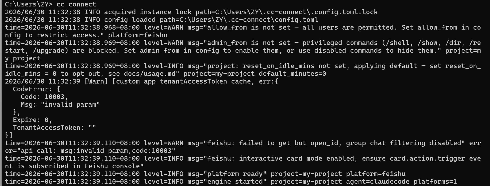

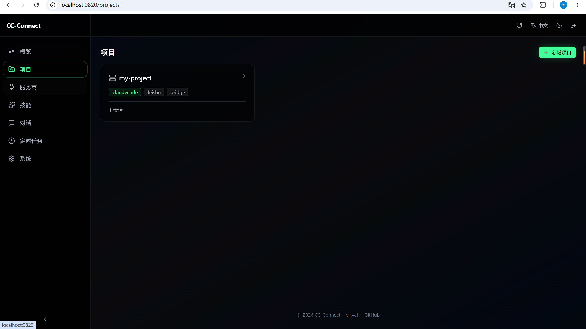

web运行后打不开再次输入`cc-connect`重新运行下。

*注意：`cc-connect`运行的终端不要关闭* ⚠️

### 设置服务商 🏪

在web界面添加服务商，之前安装过`CC-Switch`，可以直接导入。

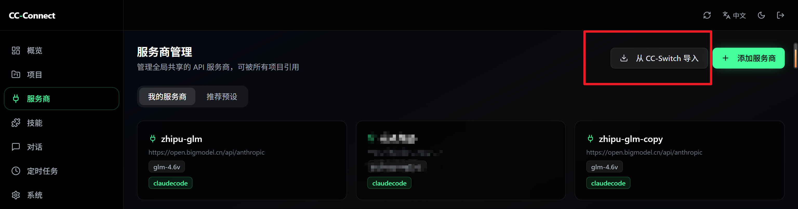

### 设置项目 📁

添加一个项目，然后点击创建好的项目，设置服务商，选择提供方。提供方就是我们刚刚`CC-Switch`导入的供应商。

然后再设置里面设置**工作目录**就好了。

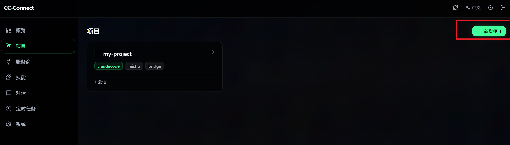

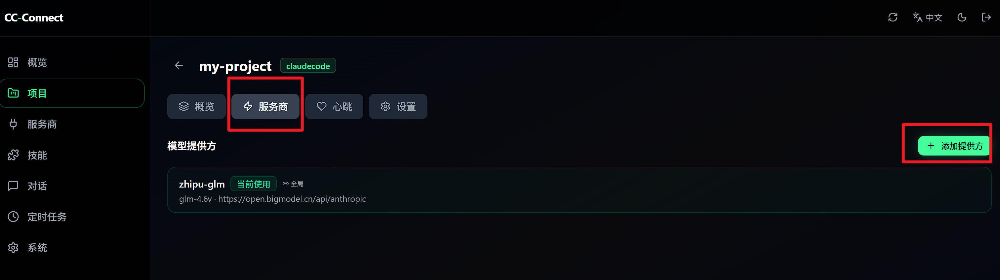

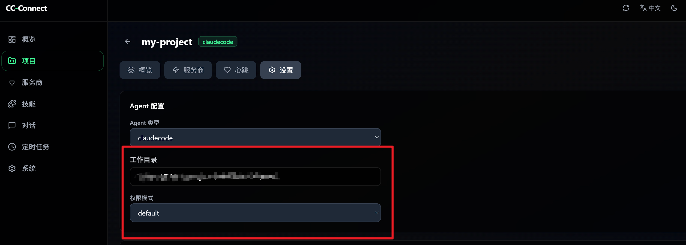

## 飞书 🐦

进入https://open.feishu.cn/飞书开放者平台，飞书最近新出了一个一键创建智能体的功能，直接使用这个就行了。

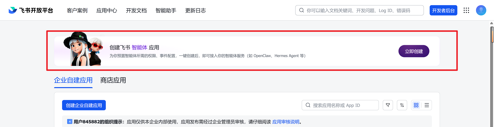

它会自动帮我们创建应用，将创建的应用的`App ID`和`App Secret`保存下来。🔑

打开cmd输入：

```sh
cc-connect feishu setup --project my-project --app App ID:App Secret
```

- my-project：对应`CC-Connect`创建的项目的名称。
- App ID和App Secret就对应飞书智能体应用的`id`和`sec`。

## 效果展示 ✨

在手机**飞书App**上与智能体对话：

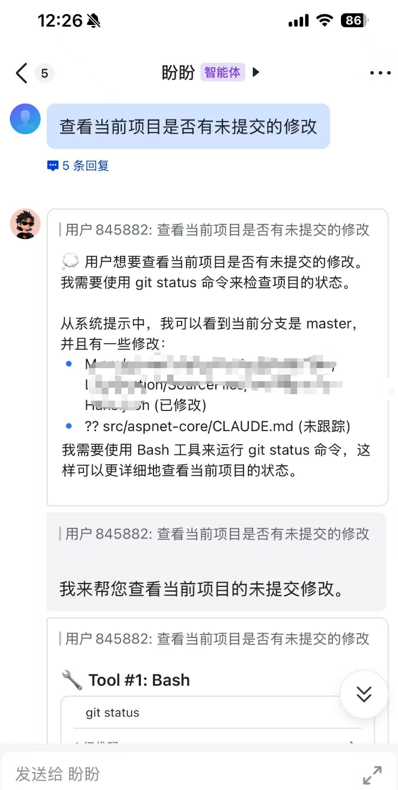

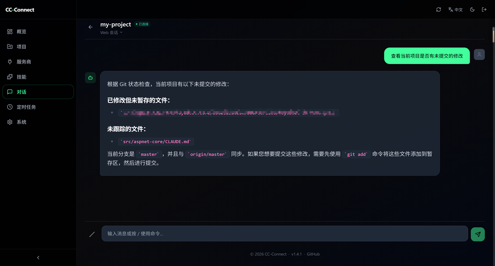

配置完成后，在手机**飞书 App** 里与智能体对话，电脑端 `CC-Connect Web` 界面会同步显示对话记录，实现随时随地使用本地配置好的 AI 模型。🎉

## 注意事项 ⚠️

- `cc-connect` 运行的终端窗口**不能关闭**，否则服务会中断，飞书将无法连接
- 如果 Web 界面（`http://localhost:9820`）打不开，需要重新执行 `cc-connect` 命令
- `Claude Code` 需要在项目目录下运行，不要在非项目路径执行
- `cc-connect feishu setup`命令中的项目名称（`--project`）必须与 `CC-Connect Web` 中创建的项目名称完全一致

## 总结 📝

本文介绍了，将本地 **Claude Code** 通过 **CC Switch** 切换到国产大模型（如智谱），再通过 **CC-Connect** 桥接到**飞书**，最终实现在手机上通过飞书与 AI 对话。

也可以使用其他模型，操作步骤是一样的。🚀