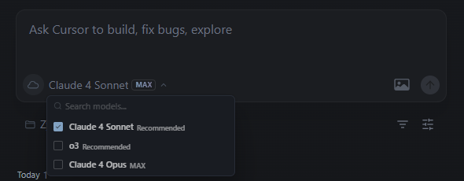
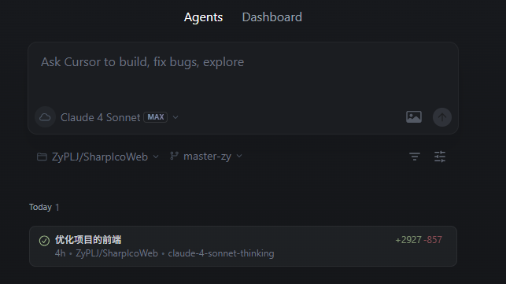
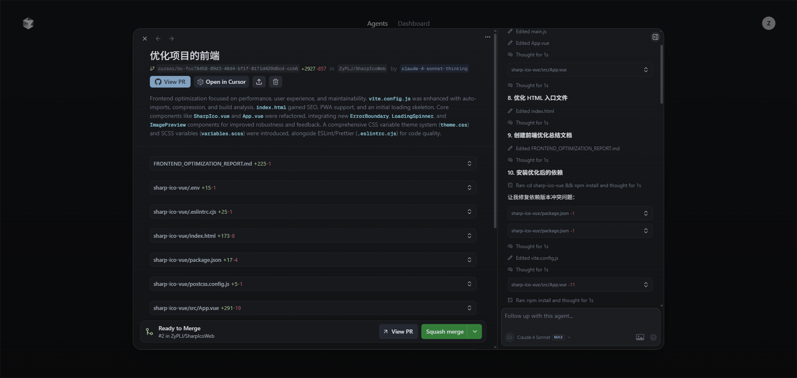
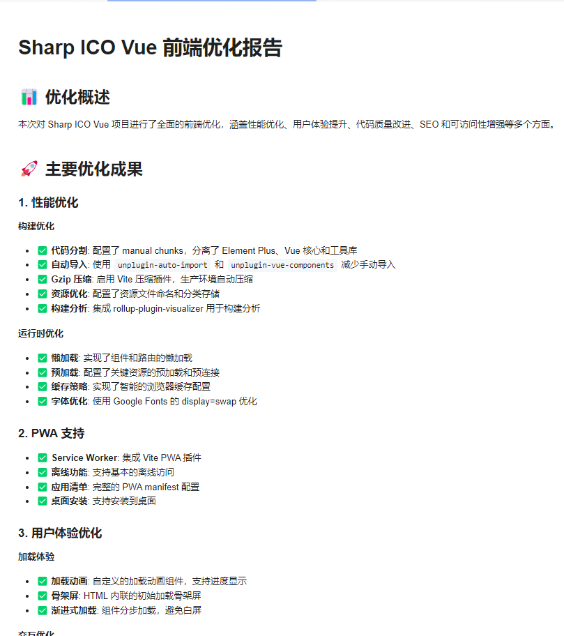

## 使用Cursor网页版优化SharpIcoWeb项目

## 前言

前些日子基于SharpIco开发了一个Web项目，更方便的进行图片转ico。

之前在第三方网站使用 `Glaude 3.7 Sonnet Think`模型优化了一次前端页面，效果还挺不错。

优化前：

优化后：

**项目地址**

https://github.com/ZyPLJ/SharpIcoWeb

https://github.com/star-plan/sharp-ico

**在线预览**

https://ico.pljzy.top/

## 官网地址

https://cursor.com/agents

## 开始使用

然后在网上冲浪的时候发现 `Cursor`网页版可以直接访问，不需要挂梯子，我也是马上体验了一下， 我这里使用的是 `Claude 4 Sonnet MAX` 模型。

image.png

需要注意的是 `Cursor`网页版需要绑定 `GitHub`账号，绑定成功后，选择仓库和仓库分支就可以开始让ai帮你写代码了，我这里选择了SharpIcoWeb项目的 `master`分支，让它帮我优化前端项目。

提问后，他会在下方生成一个任务列表

image.png

点击这个列表可以查看ai正在做什么操作，同时当任务结束后可以直接提 `PR`合并到仓库分支中去，也可以选择不提交 `PR`，他默认会在仓库建立一个分支。

并且他还会生成一份总结报告

image.png

## 总结

经过 `Curosr`优化后，界面和功能都有很大的提升，而且它生成代码竟然没有报错，生成了2900行代码，经过测试可以直接运行，不过还是有小瑕疵需要自己手动调整。总体来说是一次非常不错的体验。

bug：最后部署的时候发现，它给的分包策略有问题，会导致页面无法显示~

下面是优化后的截图

