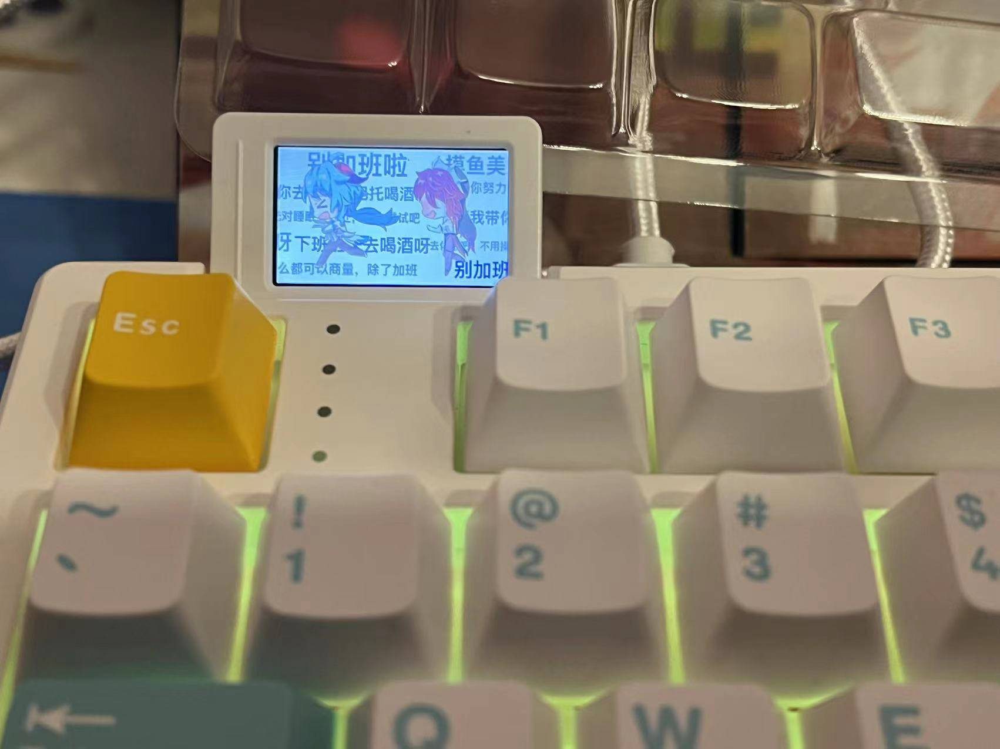
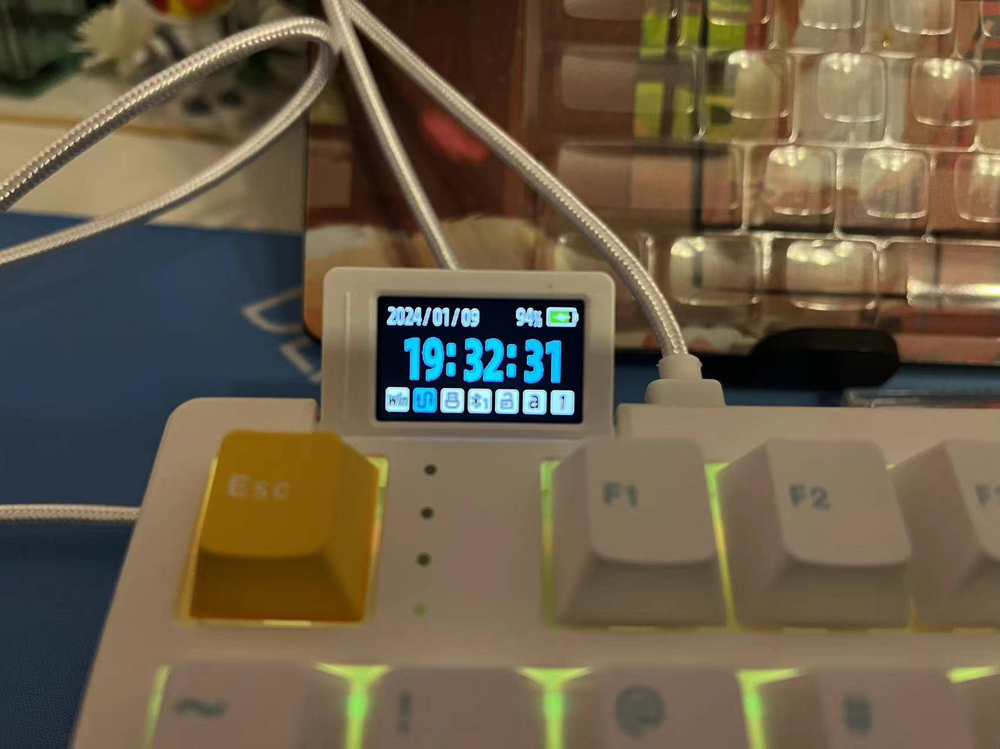
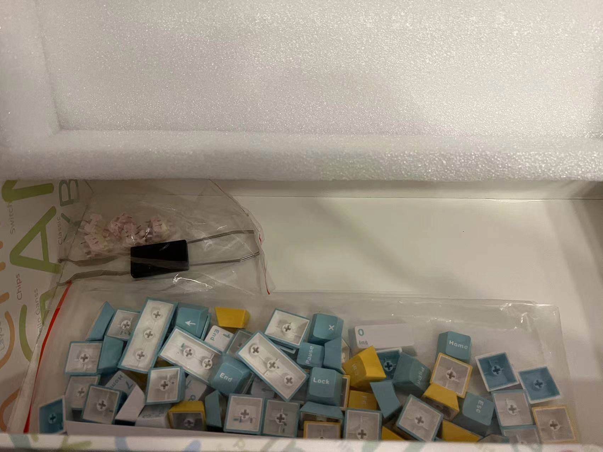
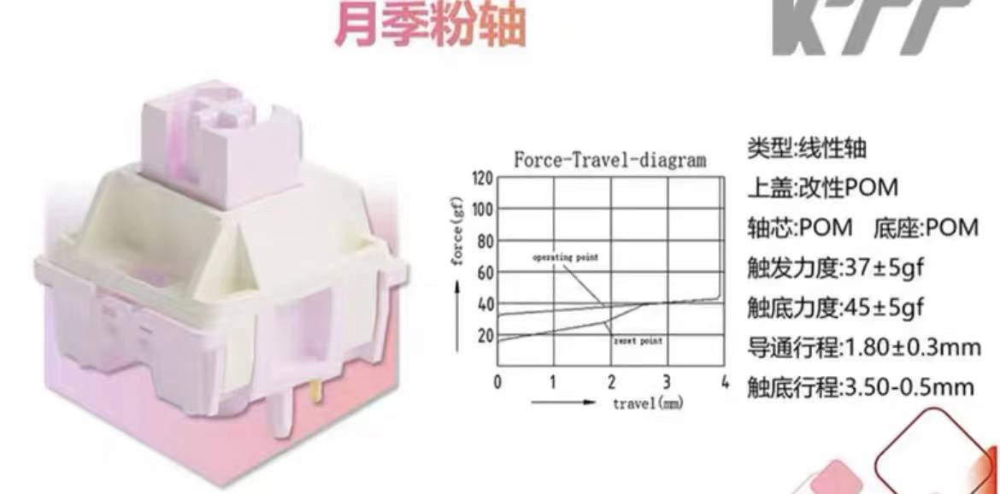
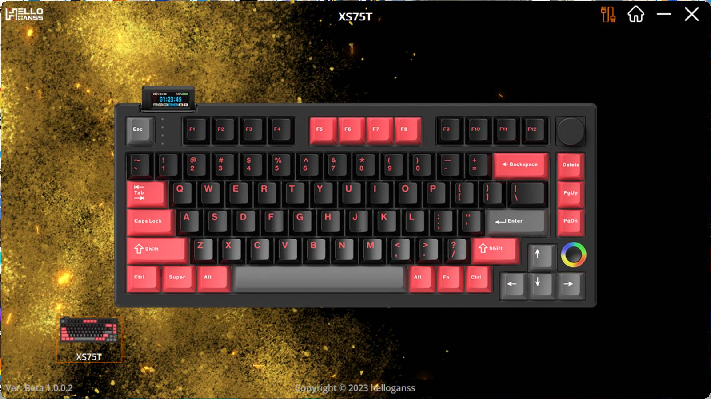
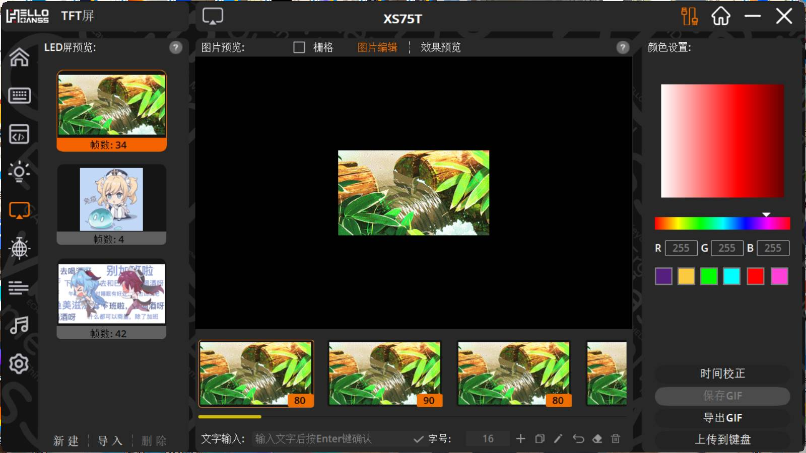
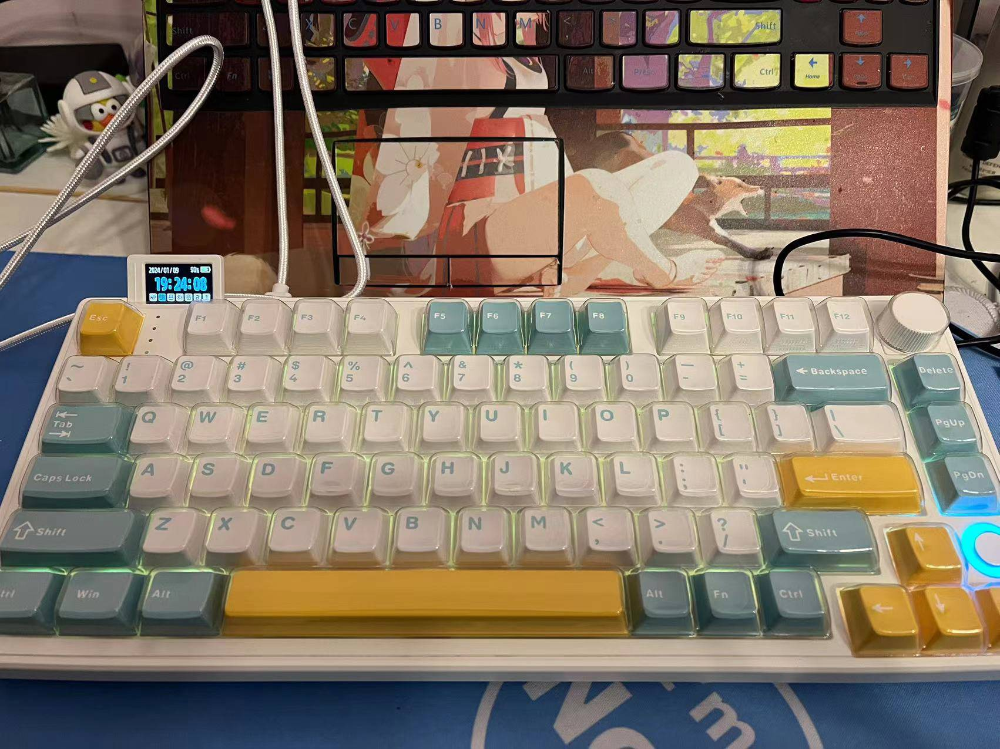

# HELLO GANSS XS 75T 键盘开箱

# 前言

也是入职.NET开发有一段时间了，写代码一直用的是公司配的笔记本电脑，键盘很硬。虽然我本身有一款珂芝K75键盘，但是我在家的时候也会打打游戏干嘛的，带去上班不是很方便，所以也是选择了再买一款键盘。

买这款键盘之前我也是看中了好几款，有：

- 狼途LT84
- 达尔优EK75
- 狼蛛F99

这几款的价位也是在200-500之间，也是属于我的能力范围内。最终因为一块小屏幕我选择了XS 75T，这块小屏幕可以查看时间，虽然没什么用，但是我就是喜欢这种花里胡哨的东西，并且可以通过驱动上传动图。话不多说看图：

# 配件

# 轴体参数

我选择的是月季粉轴，整个轴体按压很轻，适合码代码。

# 驱动预览

这里放出部分图片，作为一款300元价位的键盘，这款驱动的功能还是很不错的。可以自定义动图，灯光以及自定义宏。

# 正面图

