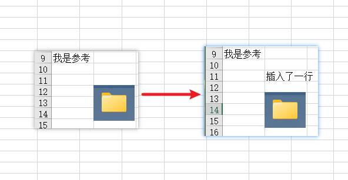

# 前言

在工作中经常会去导入或者导出Excel，那么我在工作中用的是NPOI库，很方便。不过在用的时候难免会出现问题，在这里记录一下这次需求遇到的问题。

不过目前用的NPOI库的版本很老，不知道最新版本是否有其他实现方式，注意甄别。

# 问题一，自动换行

如图所示：


需要设置`WrapText = true`才能让单元格中的内容自动换行

```C#
IFont fontfp = wb.CreateFont();
ICellStyle FontStyle = wb.CreateCellStyle();
FontStyle.WrapText = true; // 设置自动换行
```

# 问题二，函数问题

如图所示：


如果导出Excel是根据模版导出，模版中的函数可能会因为各种原因变成上图的样子，那么为了避免这种情况这里使用`SetCellFormula`为单元格设置函数,这里以`SUM`函数为例

```C#
IWorkbook workbook = new XSSFWorkbook();  
ISheet sheet = workbook.CreateSheet("Sheet1"); 
sheet.GetRow(1).CreateCell(1).SetCellFormula("SUM(A1:A2)")
```

# 问题三，插入行但图片位置不跟随

如图所示：



如果使用Office操作Excel插入行图片是会移动的，我插入一行，图片就会往下移动一行。但是如果使用代码操作，即使你插入行使用了`ShiftRows`移动行，但是图片就是不动。

那么，我的解决方案是图片不放到模版中，而是在进行模版导出的时候进行插入操作，当Excel数据插入后，再对图片进行插入，这样图片就可以在想要的位置中显示。

这里用GPT写了个函数，可以参考一下。当完成插入行的操作后再调用这个函数就行了。

```C#
/// <summary>  
/// 将图片插入到Excel的指定sheet中  
/// </summary>  
/// <param name="workbook">Excel工作簿</param>  
/// <param name="sheet">目标sheet</param>  
/// <param name="imagePath">图片路径</param>  
/// <param name="rowStart">起始行索引</param>  
/// <param name="rowEnd">结束行索引</param>  
/// <param name="colStart">起始列索引</param>  
/// <param name="colEnd">结束列索引</param>  
public void InsertImage(IWorkbook workbook, ISheet sheet, string imagePath, int rowStart, int rowEnd, int colStart, int colEnd, double scaleSize)
{
	// 读取图片文件  
	byte[] imageBytes = System.IO.File.ReadAllBytes(Server.MapPath(imagePath));

	// 添加图片到工作簿  
	int pictureIndex = workbook.AddPicture(imageBytes, PictureType.PNG);

	// 创建图形和锚定  
	IDrawing drawing = sheet.CreateDrawingPatriarch();
	IClientAnchor anchor = new XSSFClientAnchor (0, 0, 0, 0, co	lStart, rowStart, colEnd, rowEnd);

	// 创建并调整图片  
	IPicture picture = drawing.CreatePicture(anchor, pictureIndex);
	// 设置图片的新尺寸  
	picture.Resize(scaleSize);
}
```

# 总结

记录了

- 换行处理
- 函数处理
- 图片位置处理

3个问题，虽然都不是很难的问题，但是这里还是分享一下~，如果有问题欢迎指出。