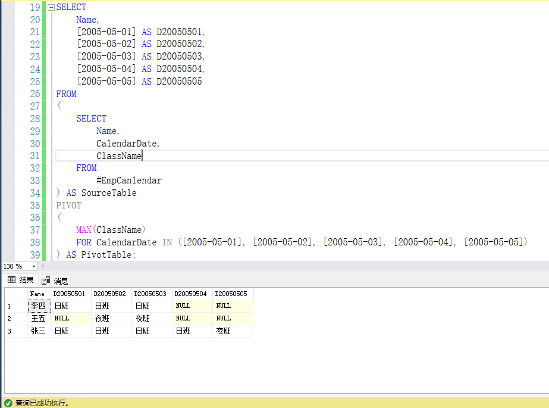
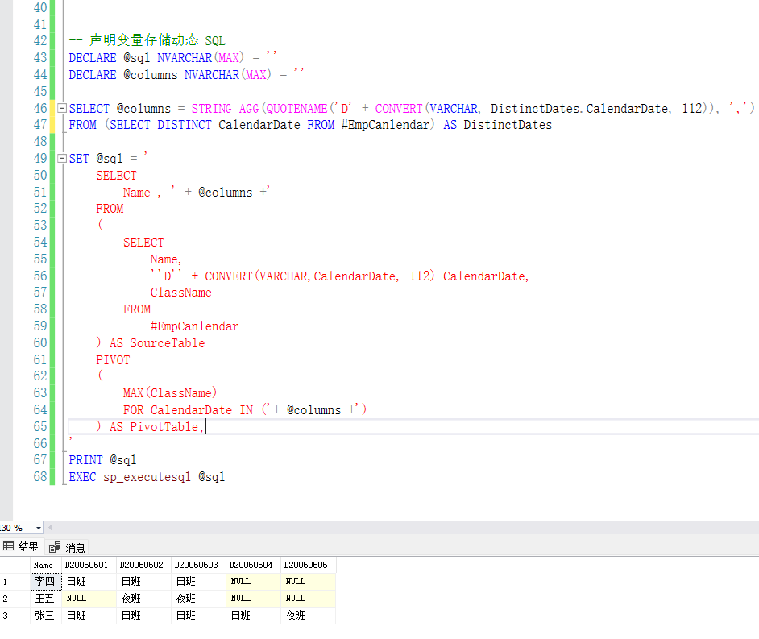

# SqlServer 中行转列PIVOT函数用法

## 前言

最近在面试的时候，碰到了手写`sql`的题目，这让我这个面向AI的程序员着实难看。只见我面露难色，绞尽脑汁的情况下，终于还是放弃了。

这道题目不难，但是由于平时几乎没有遇到行转列的情况，导致在手写时忘记了`PIVOT`函数怎么使用😩。

*<font color='gray' size='2'>面试准备不充分给自己找借口，菜就多练，不会写就别写。</font>*

## 题目描述

下面请看题：

假设有以下表 `EmpCanlendar`：

| Name | CalendarDate | ClassName |
| :--- | :----------- | :-------- |
| 张三 | 2005-05-01   | 日班      |
| 张三 | 2005-05-02   | 日班      |
| 张三 | 2005-05-03   | 夜班      |
| 李四 | 2005-05-01   | 夜班      |
| 李四 | 2005-05-02   | 日班      |
| ...  | ...          | ...       |

**输出结果：**

| Name | D20050501 | D20050502 | D20050503 | D20050504 | D20050505 |
| :--- | :-------- | :-------- | :-------- | :-------- | :-------- |
| 张三 | 日班      | 日班      | 日班      | 日班      | 夜班      |
| 李四 | 日班      | 日班      | 日班      | NULL      | NULL      |
| 王五 | NULL      | 夜班      | 夜班      | NULL      | NULL      |

## `PIVOT`函数简单介绍

> `PIVOT` 是 SQL Server 中的一种功能，用于将行数据转换为列数据（即行转列）。它通常用于将某一列的唯一值作为新列，并将对应的值填充到这些新列中。`PIVOT` 是数据透视表的一种实现方式，非常适合用于统计和报表场景。

### `PIVOT` 的基本语法

```sql
SELECT 
    [非透视列],
    [透视值1], [透视值2], ..., [透视值N]
FROM 
    (
        -- 子查询：提供原始数据
        SELECT [非透视列], [透视列], [值列]
        FROM 表名
    ) AS 源表
PIVOT 
(
    聚合函数(值列) -- 例如 SUM、COUNT、MAX 等
    FOR 透视列 IN ([透视值1], [透视值2], ..., [透视值N])
) AS 透视表
```

### 参数

1. **非透视列**：
   - 不需要转换的列，这些列的值将作为结果表的行标识。
2. **透视列**：
   - 需要转换为新列的列。
3. **值列**：
   - 需要填充到新列中的值。
4. **聚合函数**：
   - 对值列进行聚合操作，例如 `SUM`、`COUNT`、`MAX` 等。
   - 如果值列不需要聚合，可以使用 `MAX` 或 `MIN`。
5. **透视值**：
   - 透视列中的唯一值，这些值将成为新列的名称。

## 解题

### 测试数据准备

```sql
CREATE TABLE #EmpCanlendar(
	[Name] NVARCHAR(20) NULL,
	CalendarDate DATETIME NULL,
	ClassName NVARCHAR(10) NULL,
)
INSERT INTO #EmpCanlendar(Name,CalendarDate,ClassName)
VALUES
('张三','2005-05-01','日班'),
('张三','2005-05-02','日班'),
('张三','2005-05-03','日班'),
('张三','2005-05-04','日班'),
('张三','2005-05-05','夜班'),
('李四','2005-05-01','日班'),
('李四','2005-05-02','日班'),
('李四','2005-05-03','日班'),
('王五','2005-05-02','夜班'),
('王五','2005-05-03','夜班')
```

### 非动态`sql`

适用于日期范围固定，或者日期列较少的情况

```sql
SELECT 
    Name,
    [2005-05-01] AS D20050501,
    [2005-05-02] AS D20050502,
    [2005-05-03] AS D20050503,
    [2005-05-04] AS D20050504,
    [2005-05-05] AS D20050505
FROM 
(
    SELECT 
        Name, 
        CalendarDate, 
        ClassName
    FROM 
        #EmpCanlendar
) AS SourceTable
PIVOT
(
    MAX(ClassName)
    FOR CalendarDate IN ([2005-05-01], [2005-05-02], [2005-05-03], [2005-05-04], [2005-05-05])
) AS PivotTable;
```

**查询结果**



### 动态`sql`

适用于日期范围不固定，或者日期列较多的情况

**SQL Server 2017**及以上版本：

```sql
-- 声明变量存储动态 SQL
DECLARE @sql NVARCHAR(MAX) = ''
DECLARE @columns NVARCHAR(MAX) = ''

SELECT @columns = STRING_AGG(QUOTENAME('D' + CONVERT(VARCHAR, DistinctDates.CalendarDate, 112)), ',')
FROM (SELECT DISTINCT CalendarDate FROM #EmpCanlendar) AS DistinctDates

SET @sql = '
	SELECT 
		Name , ' + @columns +'
	FROM
	(
		SELECT 
			Name,
			''D'' + CONVERT(VARCHAR,CalendarDate, 112) CalendarDate,
			ClassName
		FROM
			#EmpCanlendar
	) AS SourceTable
	PIVOT
	(
		MAX(ClassName)
		FOR CalendarDate IN ('+ @columns +')
	) AS PivotTable;
'
PRINT @sql
EXEC sp_executesql @sql
```

**SQL Server 2017**以下版本

```sql
SELECT @columns = STUFF(
    (
        SELECT DISTINCT ',' + QUOTENAME('D'+ CONVERT(VARCHAR, CalendarDate, 112))
        FROM #EmpCanlendar
        FOR XML PATH('')
    ),1, 1, ''
)
```

**查询结果：**



## 扩展

### `STUFF`函数简单介绍

`STUFF` 是 SQL Server 中的一个字符串函数，用于删除字符串的一部分并在指定位置插入新的子字符串。它的主要作用是修改字符串的内容，通常用于拼接或替换字符串中的某些部分。

#### `STUFF` 函数的语法：

```sql
STUFF(原始字符串, 开始位置, 删除长度, 新子字符串)
```

#### 参数

1. **原始字符串**：
   - 需要修改的字符串。
   - 可以是字符型（`CHAR`、`VARCHAR`、`NVARCHAR` 等）的列、变量或表达式。
2. **开始位置**：
   - 指定从原始字符串的哪个位置开始删除和插入。
   - 位置从 1 开始计数。
3. **删除长度**：
   - 指定要删除的字符数。
   - 如果为 0，则不删除任何字符，仅插入新子字符串。
   - 如果大于原始字符串的长度，则从开始位置删除到字符串末尾。
4. **新子字符串**：
   - 要插入的新字符串。
   - 如果为空字符串 `''`，则仅删除字符，不插入新内容。

#### 可用于

- **删除字符**：从指定位置开始删除一定长度的字符。
- **插入字符**：在删除字符的位置插入新的子字符串。
- **替换字符**：通过删除和插入操作，可以实现字符串的替换。

### `STRING_AGG`函数简单介绍：

`STRING_AGG` 是 SQL Server 2017 及更高版本中引入的一个聚合函数，用于将一组字符串值连接成一个单独的字符串，并使用指定的分隔符分隔每个值。它是 SQL Server 中处理字符串拼接的强大工具，特别适合将多行数据合并为一个字符串。

#### `STRING_AGG` 的基本语法

```sql
STRING_AGG(表达式, 分隔符)
```

#### 参数

1. **表达式**：
   - 需要拼接的字符串列或表达式。
   - 可以是 `VARCHAR`、`NVARCHAR`、`CHAR` 等字符类型。
2. **分隔符**：
   - 用于分隔每个字符串值的字符或字符串。
   - 可以是任意字符串，例如 `,`、`;`、`-` 等。

### `QUOTENAME`函数简单介绍

在SQL Server中，`QUOTENAME()`函数用于将一个标识符（如表名、列名等）包围在方括号中，以防止引起语法错误或与关键字冲突。

#### `QUOTENAME`函数的语法：

```Sql
QUOTENAME ( 'character_string' [ , 'quote_character' ] )
```

#### 参数

`'character_string'`：是要包围的标识符，可以是表名、列名等

`'quote_character'`：是可选参数，用于指定用于包围标识符的字符，默认为方括号（[ ]）。

## 参考链接

- 深入浅出：`SQL Server` 中的 `PIVOT` 与 `UNPIVOT` 用法详解：https://blog.csdn.net/houbincarson/article/details/145483265
- `QUOTENAME (Transact-SQL)` ：https://learn.microsoft.com/zh-cn/sql/t-sql/functions/quotename-transact-sql?view=sql-server-ver16
- `SQL Server`中`quotename(`)函数怎么使用：https://www.cnblogs.com/luyj00436/p/18453443
