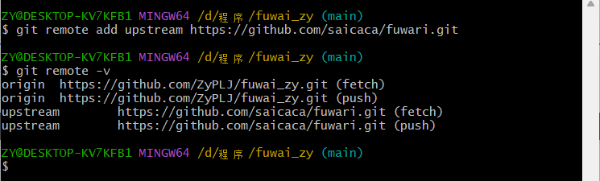
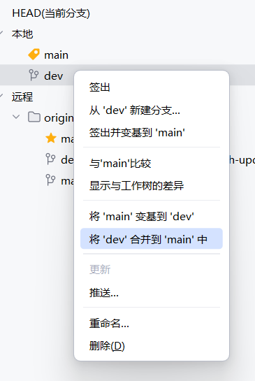
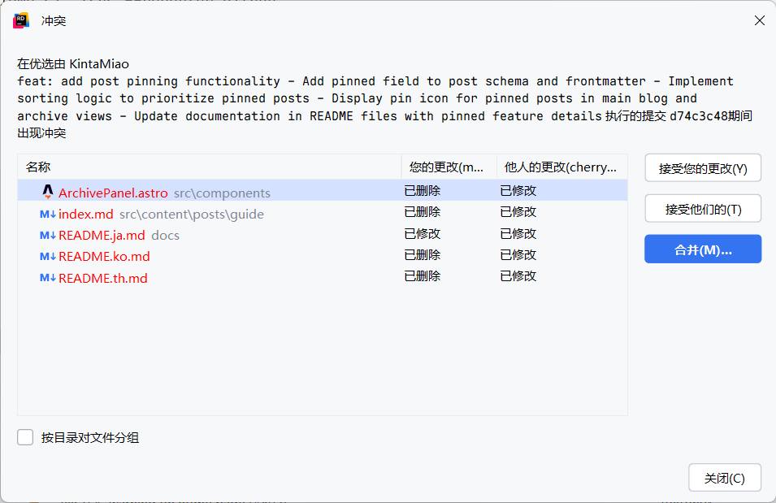

# 记录一次未合并的PR分支合并到本地

## 前言

最近一直再折腾博客，我发现[fuwari](https://github.com/saicaca/fuwari)有很多实用的功能没有被作者合并，例如文章固定的功能，简而言之就是置顶。

PR地址：[PR433](https://github.com/saicaca/fuwari/pull/433) https://github.com/saicaca/fuwari/pull/433

通过vercel提供的预览地址：https://fuwari-yags-git-fork-kintamiao-main-zephyirdgmailcoms-projects.vercel.app/ 发现这个置顶还不错。

想着给自己的博客也整上，那么下面就开始操作。

## 第一步：添加远程仓库

在开始拉取PR前，需要先添加原作者的仓库作为远程仓库。

```git
git remote add upstream https://github.com/saicaca/fuwari.git
```

添加后可以验证一下是否添加成功。

```git
git remote -v
```



## 第二步：拉取PR

```git
git fetch upstream pull/433/head:dev
```

- `433` 是 PR 编号
- `dev` 是本地创建的分支名


## 第三步：合并

合并这里我在Rider中合并，图形化操作方便一点。



## 无法合并

如果因为你的主分支和原作者的主分支不一样，那么可能无法直接合并，需要单独将置顶功能的提交单独拎出来合并。

首先查看dev提交历史，找到置顶功能合并的id。

然后应用提交，在Rider就能出现合并的操作提示了。

```git
 git log dev
 git cherry-pick d74c3c483f0a4105155d38e9d780be83b07d0a1c
```



接下来进行手动合并就行了。

## 效果展示

可以看到第一篇文章有一个置顶图标了。


