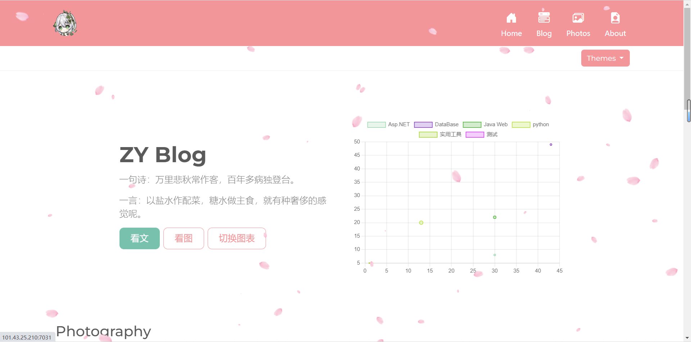
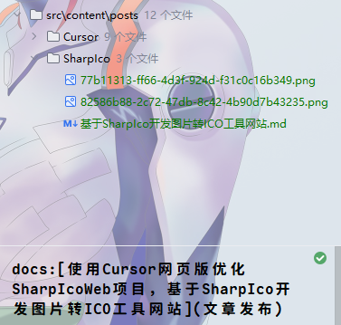

# 说说我把运行3年的个人博客网站换了~

## 前言

这是一篇宣传我的新博客的文章，阅读原文跳转友链申请页面，欢迎互换友链~

之前的文章讲了我把现在的博客网站换成了基于`Astro`开发的`Fuwari`静态博客模版。

[基于Astro开发的Fuwari静态博客模版配置CICD流程](https://blog.pljzy.top/posts/astro/%E5%9F%BA%E4%BA%8Eastro%E5%BC%80%E5%8F%91%E7%9A%84fuwari%E9%9D%99%E6%80%81%E5%8D%9A%E5%AE%A2%E6%A8%A1%E7%89%88%E9%85%8D%E7%BD%AEcicd%E6%B5%81%E7%A8%8B/)

- 旧站：[ZY知识库-pljzy.top](https://www.pljzy.top)
- 新站：[ZY知识库-blog.pljzy.top](https://blog.pljzy.top)

旧站依然使用顶级域名正常运行，目前还没有关闭旧站的想法，新站部署在`blog`子域名下。

## 为什么要换？

### 博客前世



旧站还是我在上大学的时候使用开源的[StarBlog](https://github.com/Deali-Axy/StarBlog)博客二次开发部署的。

[StarBlog](https://github.com/Deali-Axy/StarBlog)博客是一个适合`.Net`初学者的博客系统，里面有很多常用的技术栈，非常适合学习。

我也是在这个博客中学到了很多知识，当时也是花了点时间基于这个博客修改了很多代码，不过当时我写的代码没有规范，现在维护起来很麻烦😅。

但是旧站的功能还是挺完善的，经过我的锦上添“花”，也是完成了最终博客如今的摸样。

这个博客文章发布是用配套的后台管理系统去管理的，这里就不细讲了。


### 换站原因

导致我换掉旧博客采用新博客的原因，主要是因为旧博客静态资源的问题，加载非常慢，访问过我旧站的人应该能够感受到，因为我在旧博客里面放了很多图片，加上大部分图片都没有用`cdn`加速。如果没有遇到`DNS`解析慢的问题话，估计也得花个10秒左右才能加载完整个首页。

刚好我在使用[开往](https://www.travellings.cn/)随机跳转到了同样使用新博客模版的博客网站，第一眼我就喜欢上了这个主题。

也是在第一时间去`Github`下载了[fuwari](https://github.com/saicaca/fuwari)模版，开始部署这个新博客网站。

原作者开发时还并未完成评论系统的开发，所以我在新博客上加上了 [Twikoo](https://twikoo.js.org/frontend.html)评论系统，目前使用情况良好。

### 博客今生


对于音乐的执着，我将旧站的`APlayer`音乐播放器也搬到了新博客，这也是一种传承吧😂

对于新博客，因为这是个静态博客，没有后端加上首页图片不多，访问起来速度是很快的。

同时我也对一些较大的静态文件使用了`CDN`，在没有`DNS`解析问题的情况下，`1S-2S`就能完成页面加载。

虽然新博客没有后台系统，但是发布文章也是很方便的，搭配上`GitHub Action`可以实现`CICD`流程。

只需提交文章，然后`push`到`Github`上就可以自动完成文章发布。




## 文章搬迁

对于文章搬迁也不算太麻烦，只需要将我之前的文章目录拷贝到新博客文章目录下，然后在`md`格式的文章开头添加预览信息就行了。

```markdown
---
title: 基于Astro开发的Fuwari静态博客模版配置CICD流程
published: 2025-07-30
description: 同往常一样，上班摸鱼的时候，就喜欢逛逛随机逛逛别人的博客，然后有一个博客的主题让我有点心动。我自己也是部署了博客的，我目前的博客网站是：[ZY的博客](https://pljzy.top/)，已经安稳运行了800多天。
tags: [Docker, CICD, 博客]
category: 杂七杂八
draft: false
pinned: false
---
```

我这里有个习惯，我的文章图片都是相对路径(图片和文章在同一目录下)，所以搬迁起来不用考虑图片位置的问题。如：

```markdown

```

当然用对于有的图床搬迁起来更容易。

## 总结

旧站依然在运行，不过我会把心思花在新站上了。

如果想部署同款博客，欢迎在本文章下评论留言，我会解答你的问题。

## 相关链接

- 旧站：[ZY知识库-pljzy.top](https://www.pljzy.top)-https://www.pljzy.top
- 新站：[ZY知识库-blog.pljzy.top](https://blog.pljzy.top)-https://blog.pljzy.top
- StarBlog开源博客：[StarBlog](https://github.com/Deali-Axy/StarBlog)-https://github.com/Deali-Axy/StarBlog
- Fuwari博客模板：[fuwari](https://github.com/saicaca/fuwari)-https://github.com/saicaca/fuwari
- Astro框架：[Astro](https://astro.build/)-https://astro.build/

