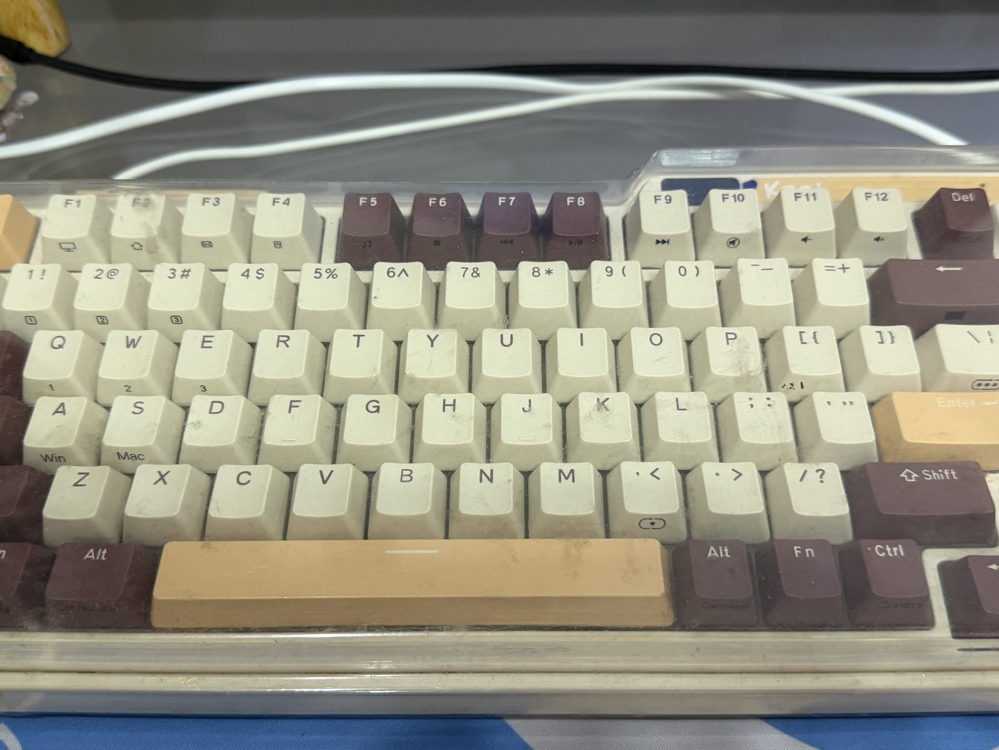
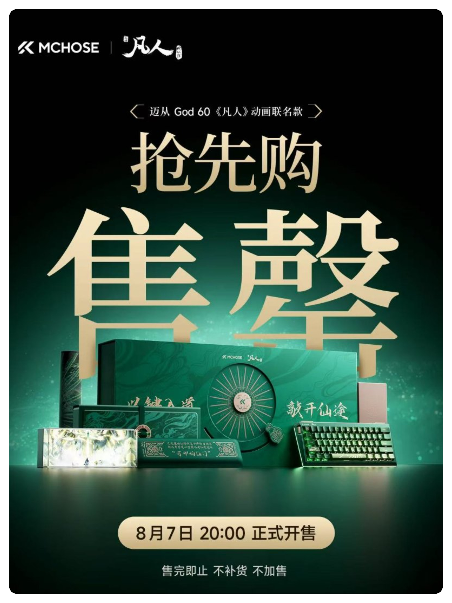
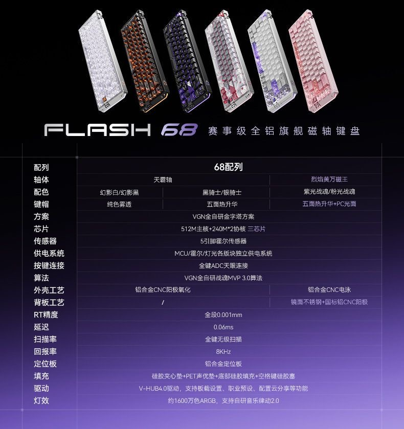
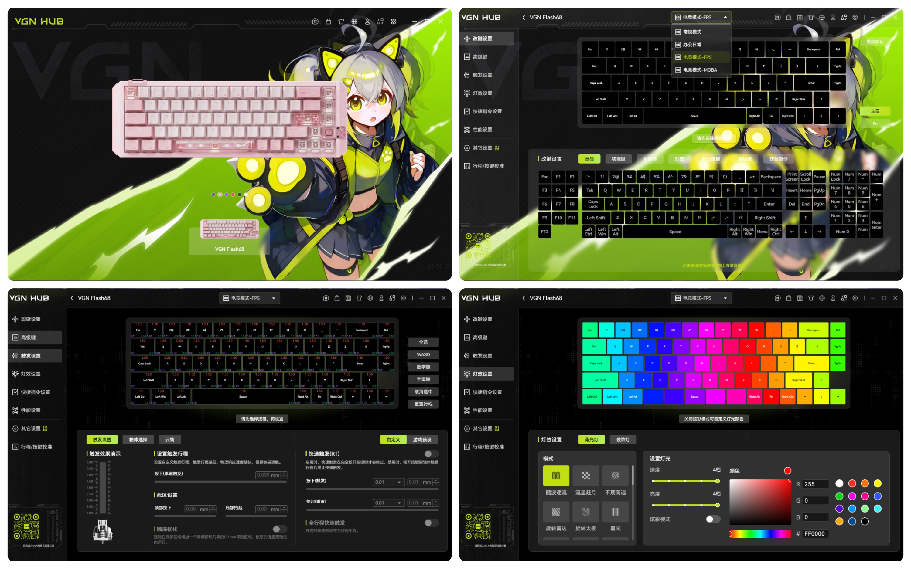
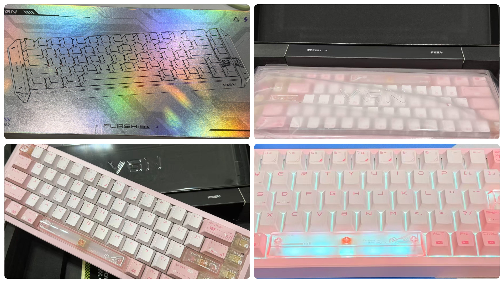

# VGN 闪电68 磁轴键盘开箱 ⌨️

## 前言

距离上次换键盘过了5个月了，上次换的是矮轴键盘，用于工作，这次换个磁轴放家里打游戏。

- [AESCO A83 Air 矮轴键盘开箱 - ZY知识库](https://blog.pljzy.top/posts/aesco-a83-air矮轴键盘开箱/aesco-a83-air矮轴键盘开箱/)

我在家里用的键盘还是大学时买的**珂芝K75**机械键盘，如图，很久没清理了，有点脏 😅

这次也算看了好几款键盘，最开始是想买凡人修仙传联名的那款迈从磁轴键盘，但是价格有点小贵要**1299**，还是没有选择，各位道友有入手的吗？

不过这质感看起来没话说，属于那种耐看型，整体也是采用**绿色+金色**，对应韩立的木属性灵气和金雷竹。

## 参数 📋

扯远了，回归本篇的主题，**VGN闪电68**，来看看键盘的整体参数。

不过我对磁轴并没有过多的了解，只知道用来打游戏延迟低 ⚡

## 驱动页面展示 🖥️

驱动软件还是很不错的，有些键盘的驱动软件做得是一言难尽，**VGN** 的这款还行，里面有个**触发设置**可以设置按键的触发行程。

## 开箱展示 📦

产品自带有拔键器、数据线、保修卡、防尘罩、3个备用轴体，这些没拍进去。

我买的是**粉光战魂**配色 🌸，因为我看网上说**烈焰黄轴**比较好，但是相比于紫色我还是比较喜欢粉色这款，所以就入手了。

不过这**68配列**还是第一次用，少了**F1-F12**按键，用来办公的话感觉不是很习惯，但是打游戏我觉得挺好 🎮

## 总结

- 老键盘用了好几年，想着换一把打游戏用的，最后选了这款磁轴
- 迈从联名款要1299有点贵 💸，没舍得，改选了性价比更高的VGN闪电68
- 68配列第一次用，少了F1-F12，办公不太习惯，打游戏没什么影响
- 驱动软件比想象中好用