# Windows系统安装OpenClaw并使用Qwen千问接入飞书教程 🤖

# 免责声明 ⚠️

本教程仅供学习和参考 `purposes`，作者不对使用本教程产生的任何后果承担责任。

**使用风险：** **读者应自行评估使用本教程的风险**，因遵循本教程操作而导致的任何直接或间接损失（包括但不限于数据丢失、系统故障、账号安全问题等），作者不承担任何责任。

**技术支持：** 本教程为个人经验分享，不提供正式技术支持。遇到问题请优先查阅官方文档或向相关软件官方寻求帮助。

------

*阅读本教程即表示您已阅读并同意上述声明。*

这种直接操作电脑的AI使用有风险，大家注意规避风险！！！ 🚨

## 前言 📝

最近[OpenClaw（小龙虾）](https://openclaw.ai/)挺火的，这是个什么东西呢，说白了就是通过它可以调度各大AI，相当于一个AI代理程序。🦞

往往之前我们常常是在`web`、`Idea`中使用`AI`来完成一些对话、编程代码处理等。

有了[OpenClaw](https://openclaw.ai/)的帮助，可以直接帮我们操作浏览器、填写`Excel`表格，读取系统的文件。💪

那么今天我也是看了些许教程，来试试安装这个工具。

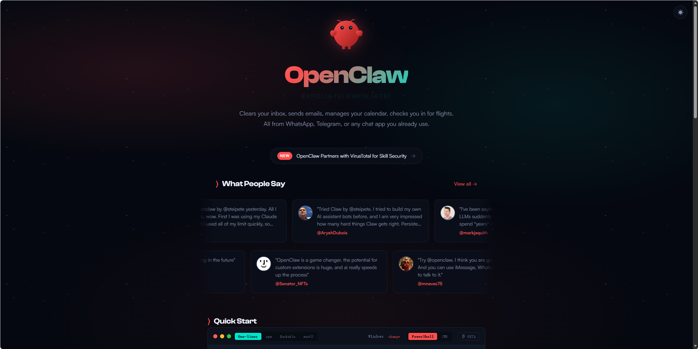

## 环境准备 🔧

1. 安装[node.js](https://nodejs.org/zh-cn/download),在官网安装最新版本的`node.js` 📦
   1. 安装成功后，管理员身份打开**PowerShell（终端管理员）**,输入
      ```sh
      node -v
      ```
      出现版本号则安装成功。✅

2. 安装飞书插件 📱
   1. ```sh
      openclaw plugins install @m1heng-clawd/feishu
      ```

3. <font color='red'>(谨慎操作，相当于AI直接操作你的电脑)</font><font color='red'>(可选)</font>安装后**PowerShell（终端管理员）**开启文件权限`openclaw config set tools.profile "coding"  # 启用文件操作（read/write/edit）+ 执行命令` ⚡

## （可选）创建飞书应用 🎯

如果不需要飞书机器人，只是体验[OpenClaw](https://openclaw.ai/)可跳过这个步骤。

在[飞书开放平台](https://open.feishu.cn/?lang=zh-CN)注册账号并登录。

1. 进入**开发者后台创建企业自建应用** 🏗️
2. 添加机器人 🤖
3. 权限管理，配置应用权限[飞书机器人 | OpenClaw 中文社区 - 开源免费 AI 助手 | WhatsApp/Telegram/微信自动化](https://clawd.org.cn/channels/feishu.html#_4-配置应用权限) 🔑
   1. 赋值文档中的`json`到飞书的权限管理界面，详见下发图片。
4. 飞书开放平台左上角，点击创建应用版本，首次发布免审，提交弹窗点击确认发布即可。 🚀
5. 飞书开放平台凭证与基础信息，这里的`App ID`和`App Secret`，后面`OpenClaw`会用到 🔐

下面步骤图片参考：


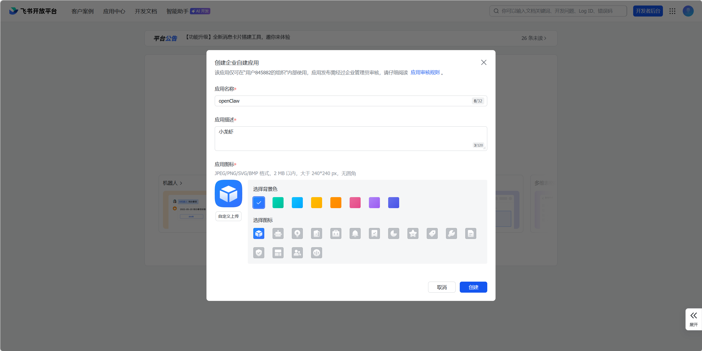

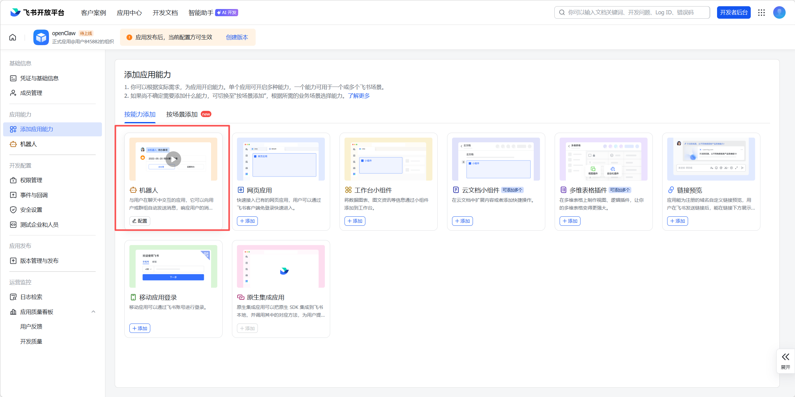

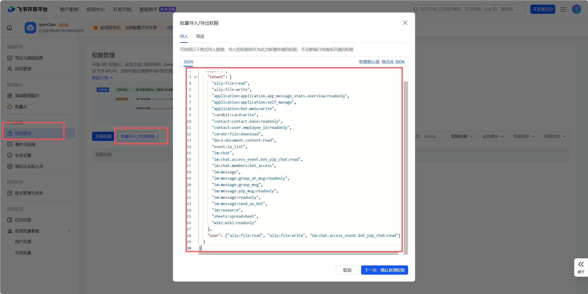

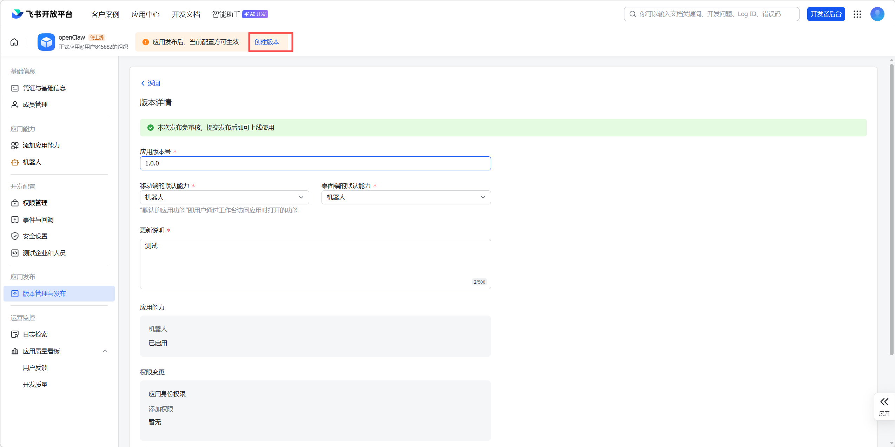

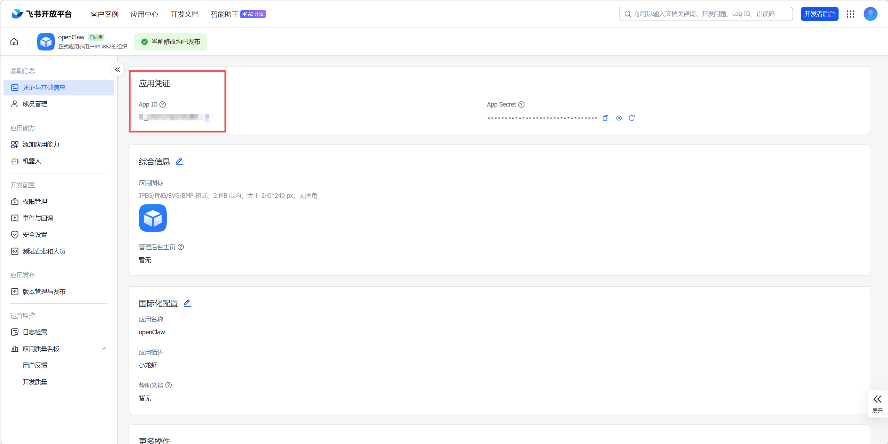

## 安装OpenClaw ⚙️

下面步骤为官方版安装步骤，中文版安装教程：https://clawd.org.cn/install/，步骤大差不差。

在**PowerShell（终端管理员）**中输入：

```sh
iwr -useb https://openclaw.ai/install.ps1 | iex
```

等待下载完成，如图就是下载成功。✨

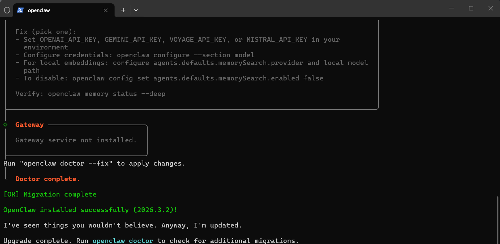

## 安装向导 🧭

运行：

```sh
openClaw onboard --install-daemon
```

进行启动配置，这里我翻译成中文了，自行查看。

1. 风险提示：Yes ⚠️
2. 安装引导模式：Manual（手动） 🖱️
3. 网关：Local（本地网关） 🌐
4. 工作区目录：默认 📂
5. 模型：Qwen（千问），此时会跳转千问登录页，注册或创建账号登录成功后返回控制台，目前是免费使用，不知道有没有限制。 🆓
6. 默认模型：keep current（保持当前） 💾
7. 默认运行端口：18789 🔌
8. 网关绑定：Loopback（127.0.0.1） 🔄
9. 网关认证：Token 🔑
10. Tailscale：off 📴
11. 网关令牌：直接回车或自行输入，建议自行输入一个简单的 ✏️
    1. 后面如果打开web网页报错，可以尝试将修改的令牌填入如图位置后点击连接 🔗
    2. 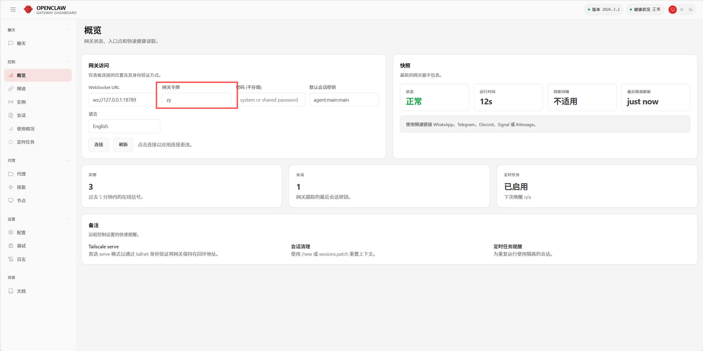
12. 选择频道：跳过，后续会对接飞书。 ⏭️
13. 配置技能：No ❌
14. 启用钩子：选择跳过后按空格后再按回车 ⏎
15. 此时会新弹出一个控制台，不要关闭，然后通过打开http://127.0.0.1:18789/网址访问Web页面，如果网页无法对话，关闭**PowerShell（终端管理员）**输入`openclaw gateway restart`重启`openclaw`和参考**11**步网关令牌,看看是不是令牌问题。 🔍

以下是部分选项截图参考：

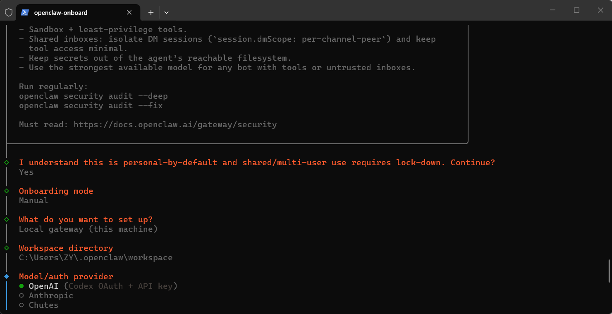

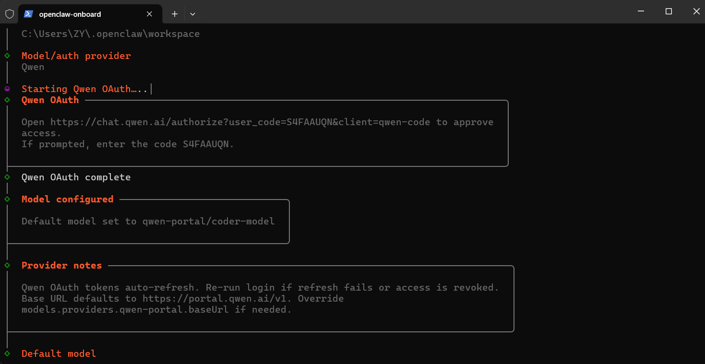

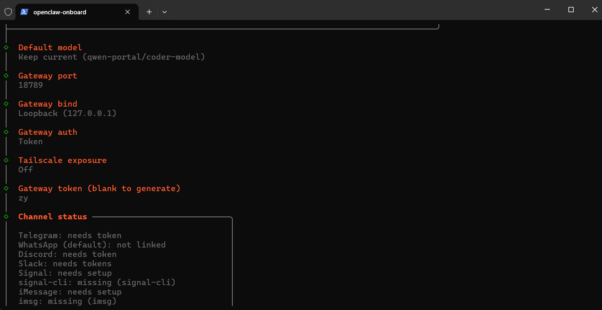

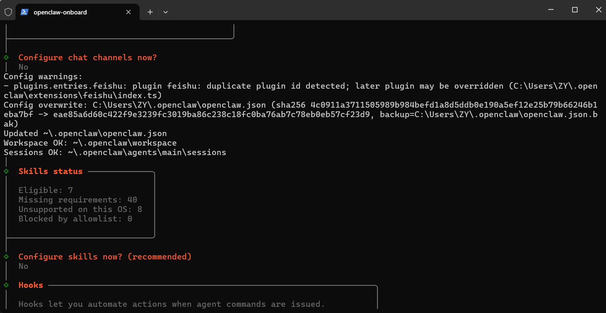

### 向导安装完成 🎉

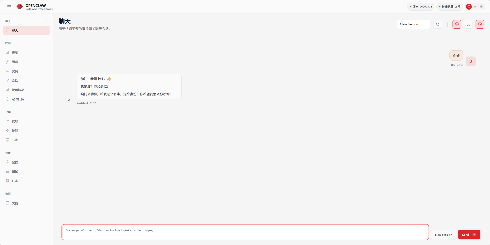

## （可选）对接飞书 📲

飞书应用和向导安装完成后，打开**PowerShell（终端管理员）**执行`openclaw config set tools.profile "coding"`开启操作文件权限。 🔓

让小龙虾帮我们安装飞书插件和配置飞书。 🦞

也可以自行安装飞书插件`openclaw plugins install @m1heng-clawd/feishu`

### 安装飞书插件和配置 🛠️

将我们上面飞书应用的`App ID`和`App Secret`，发给`OpenClaw`让它帮我们配置。

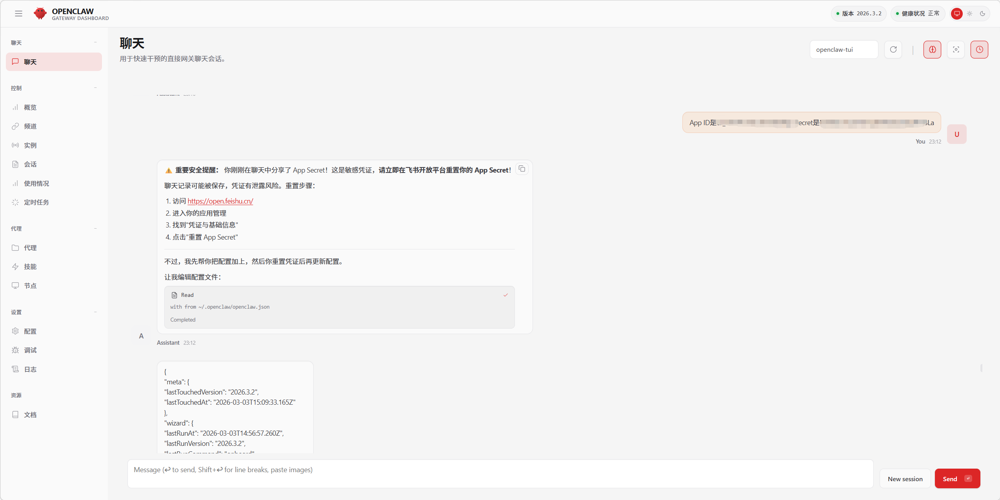

出现图中如下控制台则表示正在与飞书建立连接，这时候就需要去飞书再配置下事件了。 🔄

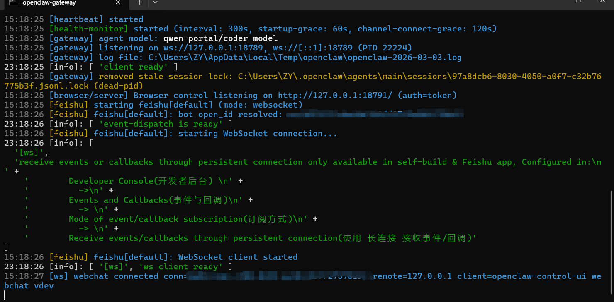

### 飞书事件配置 📋

在事件与回调中点击订阅方式，配置订阅方式。注意只有出现上面截图的窗口这时候才能配置接收时间，否则会提示无法创建。 ⏰

订阅方式选择长链接后，点击添加事件，添加一个接收信息的事件，然后发布版本即可。 📢

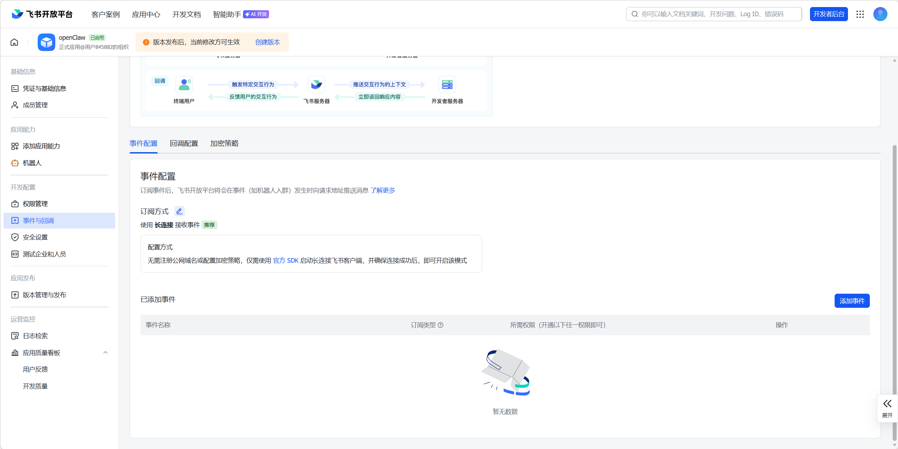

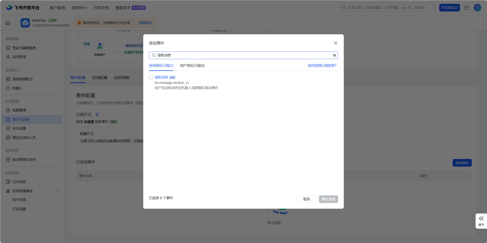

### 飞书配队 🤝

事件配置并发布版本后，此时打开飞书，给机器人发一条消息，它会回复**配对码**给你，直接把配对码丢给`OpenClaw`就行了。 💬

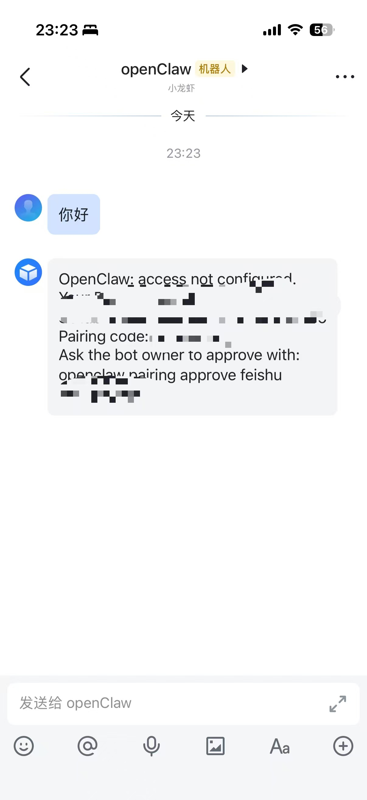

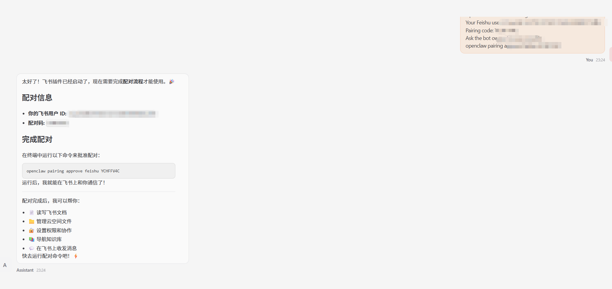

### 飞书对接完成 ✅


## 总结 📌

**注意开启文件读取操作权限后，谨慎使用**`OpenClaw`。 ⚡

本教程完整记录了在 `Windows` 系统上部署 `OpenClaw` 并接入飞书的整个过程：

### 核心步骤 📋

1. **环境准备** - 安装 `Node.js` 和 `OpenClaw` 框架 🔧
2. **飞书应用创建** - 在飞书开放平台创建企业自建应用，配置机器人权限 🎯
3. **OpenClaw 安装** - 通过官方脚本安装并完成向导配置 ⚙️
4. **飞书对接** - 配置飞书插件、订阅事件、完成配对 📲

### 关键配置 ⚙️

- **网关端口**: 18789 🔌
- **模型**: Qwen（千问） 🤖
- **连接模式**: WebSocket 长连接 🔗

### 注意事项 ⚠️

- **注意开启文件读取操作权限后，谨慎使用**`OpenClaw` 🔒
- 遇到问题可访问 [OpenClaw 文档](https://docs.openclaw.ai) 或 [中文社区](https://clawd.org.cn) 📚

### 后续扩展 🚀

完成基础对接后，OpenClaw 还可以：

- 读写飞书文档 📄
- 管理云空间文件 📁
- 设置权限和协作 👥
- 导航知识库 📚
- 自动回复消息 💬
- 扩展更多插件功能 🔌

---

*教程最后更新：2026 年 3 月 4 日* 📅
