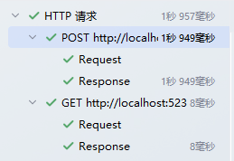

# dotnet Minimal APIs实现动态注册端点

## 前言

之前使用.Net的Minimal Apis框架开发了[SharpIcoWeb](https://github.com/ZyPLJ/SharpIcoWeb)图片转ico项目，也是初次使用这个最小Api框架，使用下来的感受就是小项目用起来非常舒服，很轻量。

在之前的项目中，我都是手动去注册端点，比如我创建了一个端点类`IcoEndpoints`

```c#
public static class IcoEndpoints
{
    public static void MapIcoEndpoints(this WebApplication app)
    {
        var group = app.MapGroup("/api");
        group.MapGet(...)
    }
}
```

然后我会在`Program.cs`中注册这个端点类

```c#
app.MapIcoEndpoints();
```

那么如果不想每个端点类都通过手动去注册，就可以使用动态注册的方法，动态注册的原理是通过反射和扩展方法来完成注册。

## 动态注册

本文就是使用基于接口的自动注册，还可以根据约定端点类命名、特性、标记去实现注册。

文件层级结构如下：

```markdown
SharpIcoWeb
├── Endpoints
│   ├── Internal
│   │   ├── EndpointExtensions.cs
│   │   ├── IEndpoint.cs
│   ├── IcoEndpoints.cs
│   ├── testEndpoints.cs
├── Program.cs
```

### 接口类

首先目录创建完成后，去创建`IEndpoint`接口类，让每个端点类就去实现这个接口。

注意：`static abstract`接口成员需要`C# 11+ (.NET 7+)` 支持

```c#
public interface IEndpoint
{ 
    static abstract void MapEndpoints(IEndpointRouteBuilder app);
}
```

### 端点类

测试端点类

```c#
public class TestEndpoints : IEndpoint
{
    public static void MapEndpoints(IEndpointRouteBuilder app)
    {
        app.MapGet("/test", async (context) =>
        {
            await context.Response.WriteAsync("Hello, World!");
        });
    }
}
```

图片转Ico端点类

```C#
public class IcoEndpoints: IEndpoint
{
    public static void MapEndpoints(IEndpointRouteBuilder app)
    {
        var group = app.MapGroup("/api");

        // 上传图片文件并返回文件名
        group.MapPost("/uploadDownload", UploadDownload)
            .DisableAntiforgery();

        // 获取图片信息
        group.MapGet("/getImageInfo/{filename}", GetImageInfo);

        // 下载文件
        group.MapGet("/downloads/{fileName}", DowloadFile);

        // 上传图片文件并返回文件名和不同尺寸的ICO文件的ZIP文件
        group.MapPost("/uploadDownload/sizes", UploadDownloadSizes)
            .DisableAntiforgery();
    }
}
```

### 扩展方法

```c#
public static class EndpointExtensions
{
    public static void MapAllEndpoints(this IEndpointRouteBuilder app)
    {
        var endpointTypes = Assembly.GetExecutingAssembly()
            .GetTypes()
            .Where(t => typeof(IEndpoint).IsAssignableFrom(t) && !t.IsInterface && !t.IsAbstract);

        foreach (var type in endpointTypes)
        {
            type.GetMethod(nameof(IEndpoint.MapEndpoints))?
            .Invoke(null, new object[] { app });
        }
    }
}
```

### Program.cs

```C#
app.MapAllEndpoints();
```

完成上述配置就可以实现自动注册端点类了。

### 测试访问

```http
@SharpIcoWeb_HostAddress = http://localhost:5235

### 上传文件并转换为ICO（带尺寸参数）
POST {{SharpIcoWeb_HostAddress}}/api/uploadDownload/sizes
Content-Type: multipart/form-data; boundary=WebAppBoundary

--WebAppBoundary
Content-Disposition: form-data; name="file"; filename="1.png"
Content-Type: image/png

< ./1.png
--WebAppBoundary
Content-Disposition: form-data; name="sizes"

16,32,48,64,128

### 测试端点类访问
GET {{SharpIcoWeb_HostAddress}}/test

```



可以看到新建的test接口也是可以正常访问的。

## 总结

实现端点类的自动注册需要使用反射和扩展方法来完成。

`static abstract`接口成员需要`C# 11+ (.NET 7+)` 支持

可以思考一下如何将服务和端点一起注册

```c#
builder.Services.AddScoped<IFileService, FileService>();
```