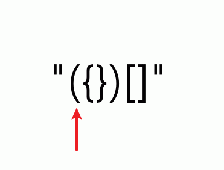
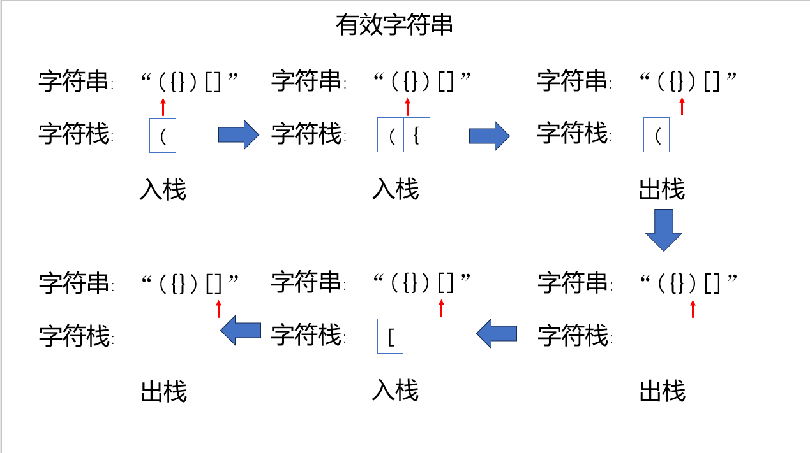
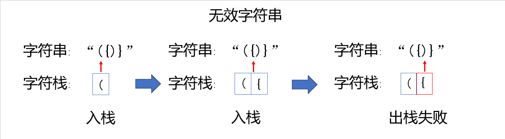

# 有效的括号(简单)

leetcode：https://leetcode.cn/problems/valid-parentheses/description/

# 前言

防止脑袋生锈，做一下leetcode的简单算法题，难得也做不来哈哈。

*大佬绕道，小白可看。*

# 题目描述

给定一个只包括 `'('`，`')'`，`'{'`，`'}'`，`'['`，`']'` 的字符串 `s` ，判断字符串是否有效。

有效字符串需满足：

1. 左括号必须用相同类型的右括号闭合。
2. 左括号必须以正确的顺序闭合。
3. 每个右括号都有一个对应的相同类型的左括号。

**示例 1：**

**输入：**s = "()"

**输出：**true

**示例 2：**

**输入：**s = "()[]{}"

**输出：**true

**示例 3：**

**输入：**s = "(]"

**输出：**false

**示例 4：**

**输入：**s = "([])"

**输出：**true

**提示：**

- `1 <= s.length <= 104`
- `s` 仅由括号 `'()[]{}'` 组成

# 题目解析

通过题目描述可以举例哪些是有效字符串，哪些是无效字符串，如：

有效字符串

1. `"()"`
2. `"({})"`
3. `"()[]"`

无效字符串

1. `"(]"`
2. `"({)}"`
3. `")"`

不难发现即使字符串中有闭合但是顺序不对也是属于无效字符串。

# 解题思路

右括号不一定出现在左括号下一位

`"([{}])"`

左右括号必须以正确的顺序闭合：

<font color='blue'>`"({})"`</font>

<font color='red'>`"({)}"`</font>

字符串中会存在有效的括号对也会有无效的括号对了，如：

<font color='blue'>`"({})({})"`</font>

<font color='red'>`"({})({)}"`</font>

尝试将有效的括号对一一消除掉

<font color='blue'>`"()({})"`</font> => <font color='blue'>`"({})"`</font>=><font color='blue'>`"()"`</font>=><font color='blue'>`""`</font>

<font color='red'>`"()({)}"`</font>=><font color='red'>`"({)}"`</font>

如果是有效的字符串最终会得到空字符串，反之则是无效字符串。

## 伪代码

```
遍历字符串:
	如果是左括号:
		等待遍历到与之对应的右括号
	如果是右括号:
		查看是否有与之对应的左括号
			如果有，则消除
			如果没有，当前字符串无效
```

## 动图



## 初步总结

通过前面的解题思路和动图可以发现，最后遍历到的左括号，最先匹配到有效的右括号。

这可以看作为**“后进先出”**的栈。后加入的元素最先被处理。

# 后进先出的栈

## 栈的定义

栈（Stack）是一种数据结构，遵循后进先出（LIFO, Last In First Out）的原则。也就是说，最后插入栈中的元素最先被取出。栈可以用来存储数据、管理函数调用、实现撤销操作等。

栈的主要操作包括：

1. **压入（Push）**：将一个元素添加到栈顶。
2. **弹出（Pop）**：移除并返回栈顶的元素。
3. **查看栈顶（Peek/Top）**：返回栈顶的元素但不移除它。
4. **检查栈是否为空（IsEmpty）**：判断栈中是否还有元素。

# 开始解题

## 图片详解

```
遍历字符串:
	如果是左括号:
		入栈
	如果是右括号:
		查看栈顶元素
			如果是对应的左括号则出栈
			如果不是，当前字符串无效
```





## 代码实现

```c#
public bool IsValid(string s) {
	Stack<char> stack = new Stack<char>();
	foreach (char c in s)
	{
		switch(c)
		{
            case '{':
            case '[':
            case '(':
            	stack.Push(c);
            	break;
			case '}':
				if(stack.Count == 0 || stack.Pop()!= '{')
					return false;
				break;
			case ']':
				if(stack.Count == 0 || stack.Pop()!= '[')
				return false;
				break;
			case ')':
				if(stack.Count == 0 || stack.Pop()!= '(')
					return false;
				break;
		}
	}
	return stack.Count == 0;
}
```

# 复杂度分析

- 空间复杂度：O(n)
- 时间复杂度：O(n)

# 结果展示


# 其他解法

```c#
public bool IsValid(string s) {
	int length = s.Length/ 2;
	for (int i = 0; i < length; i++) {
		s = s.Replace("()", "").Replace("{}", "").Replace("[]", "");
	}
	return s.Length == 0;
}
```

# 相关链接

- https://leetcode.cn/problems/valid-parentheses/description/

