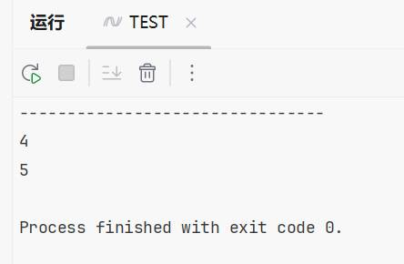

# C# LINQ基础差集计算

# 前言

最近开发的时候遇到个需求，接口参数为表的主键集合，用接口传递过来的参数去数据库查询数据，然后返回数据库不存在的数据。

举个例子

集合 1,2,3,4,5

数据库 1,2,3

通过查询语句查询，能从数据库查询出1,2,3来，然后与参数对比发现4,5是不存在与数据库的，那么要返回出来。这时候就可以用到LINQ的`Except`方法。

# 简介

在C#中，LINQ的`Except`方法用于从第一个集合中移除存在于第二个集合中的所有元素，创建一个新的集合。

# 实践

```c#
static void Main(string[] args)
{
    List<int> list = [1, 2, 3, 4, 5];//模仿接口参数
    List<int> list2 = [1, 2, 3];//模仿数据库返回数据

    var result = list.Except(list2);
    foreach (var item in result)
    {
    	Console.WriteLine(item); 
    }
}
```

