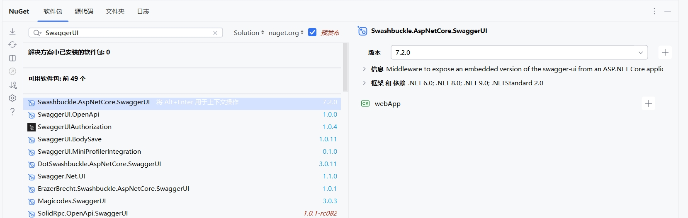
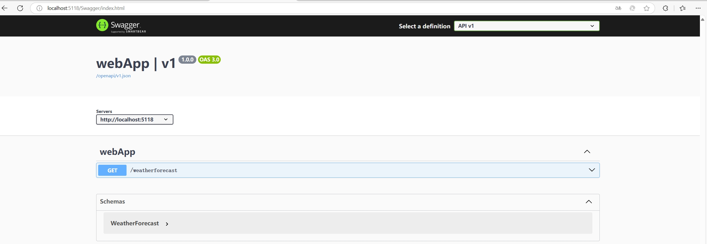
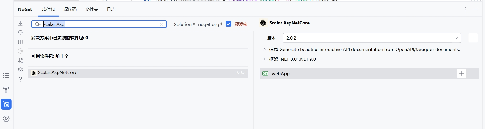
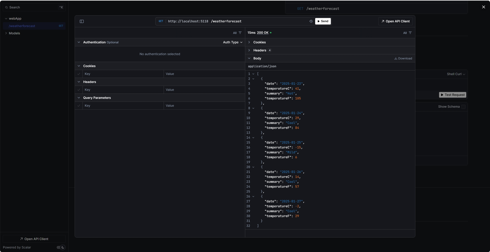
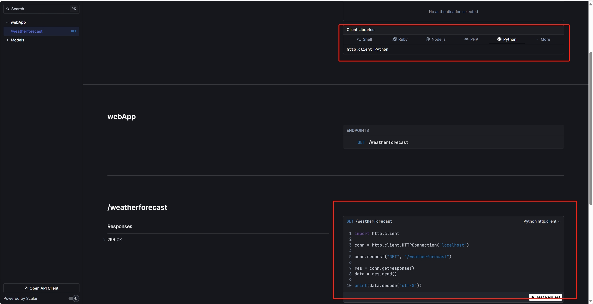

# .NET9 没有Swagger怎么办？

# 前言

在.NET9中，在创建Web API项目时，Swagger的使用与.NET8略有不同。.NET9不再内置Swagger，而是生成`OpenApi`标准的`Json`文件。如果想在.NET9中使用Swagger，需要手动安装，并配置Swagger。

# 在.NET9中使用Swagger

## 安装包

首先安装`Nuget`包

```sh
Install-Package Swashbuckle.AspNetCore.SwaggerUI
```



## 配置

然后再`Program.cs`文件中配置`Swagger`

```c#
if (app.Environment.IsDevelopment())
{
    //...
    app.UseSwaggerUI(opt => opt.SwaggerEndpoint("/openapi/v1.json", "API v1"));
}
```

## 访问

安装和配置完成后就可以访问Swagger了

访问地址：`http://localhost:端口/Swagger`



# Swagger替换成Scalar

Scalar对比Swagger拥有更加活跃的社区。来看看如何在.NET9中使用Scalar来替代Swagger。

## 安装

```C#
NuGet\Install-Package Scalar.AspNetCore -Version 2.0.2
```



## 配置

```C#
if (app.Environment.IsDevelopment())
{
    app.MapOpenApi();
    //app.UseSwaggerUI(opt => opt.SwaggerEndpoint("/openapi/v1.json", "API v1"));
    app.MapScalarApiReference();
}
```

## 访问

Scalar访问地址为：`http://localhost:端口/Scalar`



Scalar好玩的新功能，它可以根据接口生成Api请求的代码模版。



# 总结

在.NET9中有相比于Swagger UI 有更好的工具，如Scalar。Scalar有更多的功能，可以尝试使用。