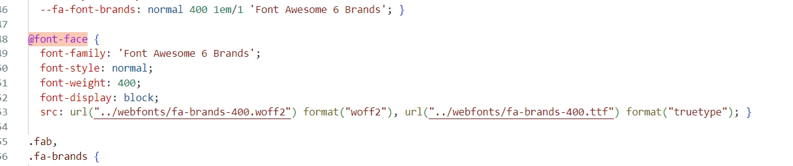
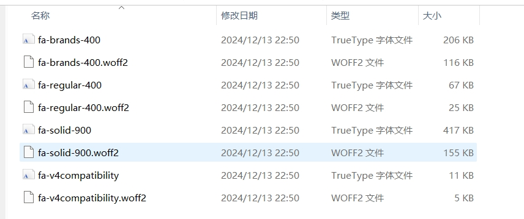
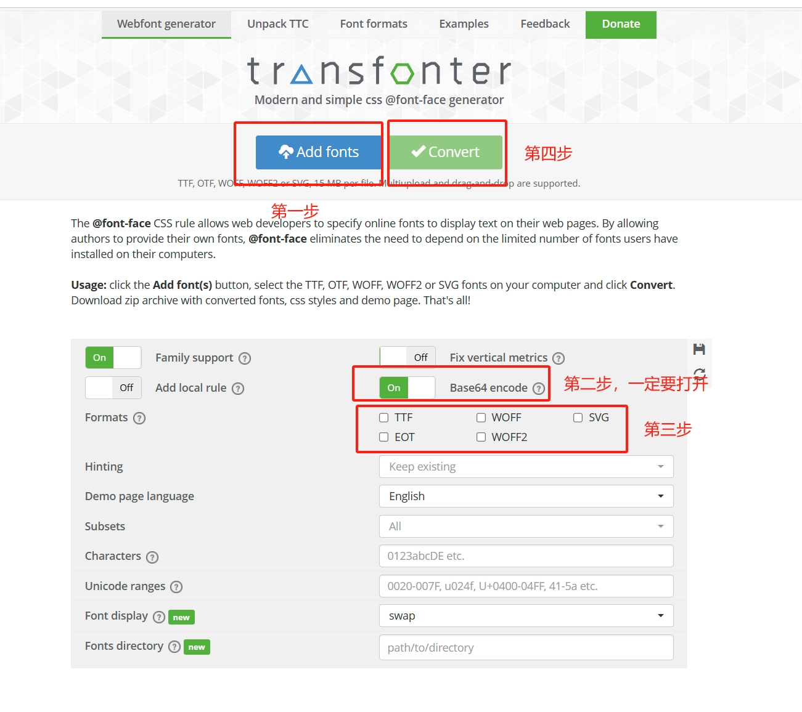
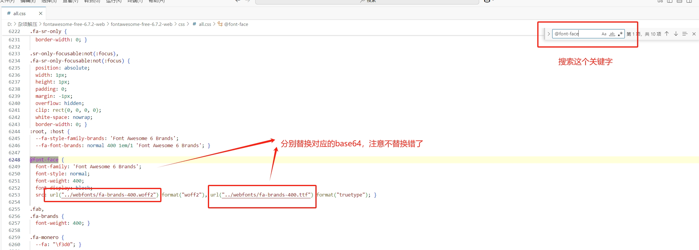
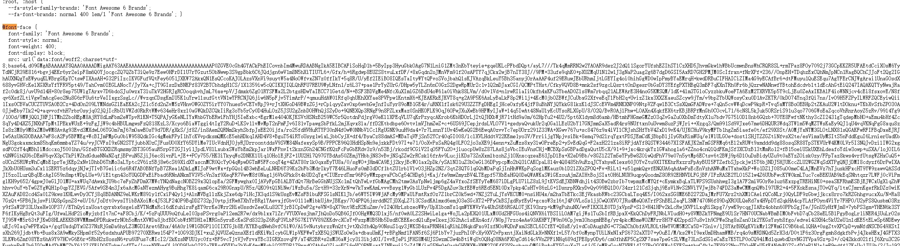

# 解决`uniapp`使用`Font Awesome`图标无法显示问题

# 前言

在平时的`Vue`项目中使用`Font Awesome`图标时很方便，只需要引入即可，但是在小程序里面使用却无法显示，并且提示<font color='red'>[渲染层网络层错误]</font>。

- Font Awesome下载 [Download Font Awesome Free or Pro | Font Awesome](https://fontawesome.com/download)

# 原因

导致报错的原因：小程序无法解析字体文件

在下载的`Font Awesome ` `css`文件中使用字体是如下方式导入的：



这种方式，小程序无法识别。

# 解决方案

`fontawesome-free-6.7.2-web\webfonts`文件夹下的字体文件



我们只需要将字体文件转换为`base64`文件即可

打开这个网站：[https://transfonter.org/ ](https://transfonter.org/) 

<font color='red'>注意事项：ttf字体文件勾选TTF，woff2字体文件勾选WOFF2</font>



第四步点击后会生成一个压缩包，下载压缩包，将`stylesheet.css`文件中的`src` 中的`url`替换`Font Awesome`的all.css文件中对应的字体文件引入，具体看图：



替换后应是：



**有好几个字体文件都需要一一替换！！！**

建议：

`base64`很长，推荐从`stylesheet.css`文件复制的时候，只复制`url`中单引号的内容去`all.css`替换

```css
url('base64.....') format("woff2")
url("../webfonts/fa-brands-400.woff2") format("woff2")
```

# 结尾

记得在`App.vue`中引入一下`css`

```vue
<style>
/* 导入字体图标 替换成你的自己路径 */  
@import '/src/static/css/all.css';
</style>
```

*<font size='2'>参考链接</font>*

- *<font size='2'>https://blog.csdn.net/weixin_46858417/article/details/137469883</font>*

