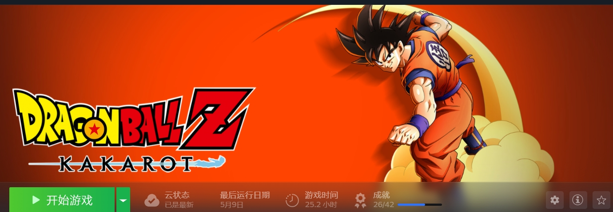
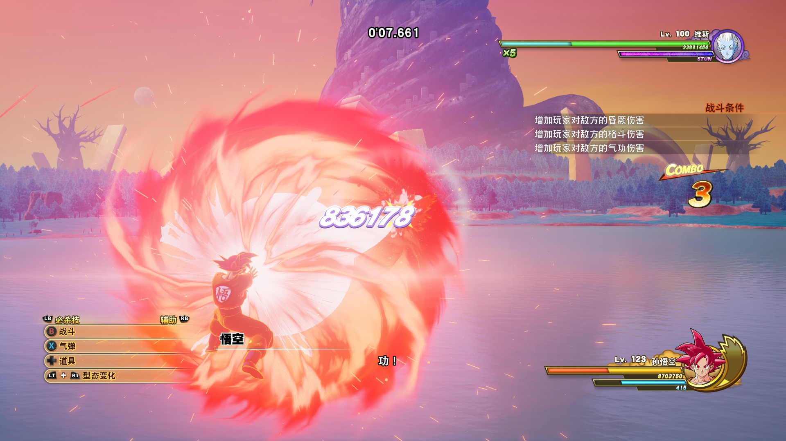

# 游戏人生-七龙珠Z卡卡罗特

# 近况

从入职到现在也工作了大约7个月了，我的博客已经很少更新技术文章了，主要原因有：

1. 工作太忙，压力比较大
2. 没有学习到新技术
3. 休息时间不够

作为一名小厂程序员，每天的工作量还是很饱和的，然后同事也是比较内卷，5.30的下班时间硬是6.00才开始陆续走人。间接性的导致我每天下班之后没有学习新技术的欲望，然后公司实行的是每月安排2周单休制，如果遇到调休，可能一个月遇不到双休了，比如这次五一虽然得到了5天休息，但是5月份照常安排2周单价加上一周补班，这个月是没有双休了。在这样的工作时长下也是导致我技术文章产出为0的原因之一。

公司用到的技术也不是很新，总的来说是上班没学到新技术，下班不想学，目前是这个状态，等毕业之后也许会学习新技术，毕业答辩也是压力之一。

# 前言

回到正题，那么为了缓解我的压力，我也是迷上了玩游戏，从我入手这款游戏，一共游玩了25个小时，按照每天2小时的游玩时长，我也是玩了大概12天。

这款游戏在不打折的情况下是需要**298RMB**去购买的，然后我是在打折的时候去买的，然后我也是够买了**龙珠Z：卡卡罗-新力量觉醒集DLC**，也就是可以变身为超赛神。然后当时一共花了170拿下。

# 游戏介绍

游戏类型：动作角色扮演

内容主题：格斗、开发世界、角色扮演

游戏平台：PC

发行日期：2020年1月17日（PC）

游戏角色：孙悟空、贝吉塔、孙悟饭、比克、特兰克斯、悟天克斯、克林、天津饭、孙悟天......

游戏背景：游戏剧情改编自《[龙珠Z](https://baike.baidu.com/item/龙珠Z/3105302?fromModule=lemma_inlink)》，并采用线性剧情讲述了四个篇章：赛亚人篇、那美克星篇、人造人篇、魔人布欧篇，玩家将根据剧情走向扮演相应的主角进行游玩。

总的来说就是会带你走一变龙珠Z的剧情，然后游戏里面是有很多支线任务的，除了主线剧情还可以体验到支线的剧情，游戏是开放世界，可以在大世界打击小怪进行升级、也可以采矿、钓鱼、收集材料制作料理，游戏内容还说很丰富的。

# 游戏体验

对于没有看过龙珠Z的人来说，这款游戏可以让你沉浸式体验龙珠Z的剧情。对于看过龙珠的人来说，你可以体验到变身超级赛亚人暴打弗利萨、魔人布欧。

我这里就只放几张模糊的截图了，第一张图片是DLC里面的内容，可以看到悟空已经可以变身为超赛神了。

# 游玩推荐

格斗类游戏，我还是推荐用手柄去玩，当然这只是个人推荐。

我这边正常来说走完本体所有剧情，偶然会碰到一次无法过关的情况，但是整体来讲还说可以轻松过关的，不需要特意的去提升等级。跟着剧情走基本能过。

然后游戏很多部分我都没有完全体验，我比较喜欢快节奏，当我打完本体剧情才知道，角色可以升级技能，这也是导致我打boss一次不过的原因之一。

如果你想入手这款游戏，我建议将**超赛神的DLC**一同入手，它可以让你快速升级到300级满级，这是我目前发现升级最快的方法，就是用悟空挑战200级的维斯。用挑战得到的神水快速升级。

Z球，后期升级技能主要材料，当等级达到255级+，可以通偷懒的方式快速获得Z球，这个就自行看攻略吧。

# 总结

游戏内容丰富，建议搭配DLC游玩，不过建议等打折入手~

# 其他链接

[龙珠Z：卡卡罗特_百度百科 (baidu.com)](https://baike.baidu.com/item/龙珠Z：卡卡罗特/23758985?fr=ge_ala) 

[小宇《七龙珠：卡卡罗特》4090画质拉满︱全DLC流程通关](https://www.bilibili.com/video/BV1Hk4y1W7Bz/?p=69&share_source=copy_web&vd_source=fce337a51d11a67781404c67ec0b5084)