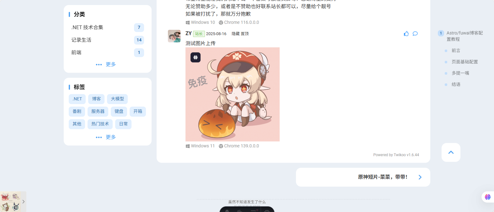
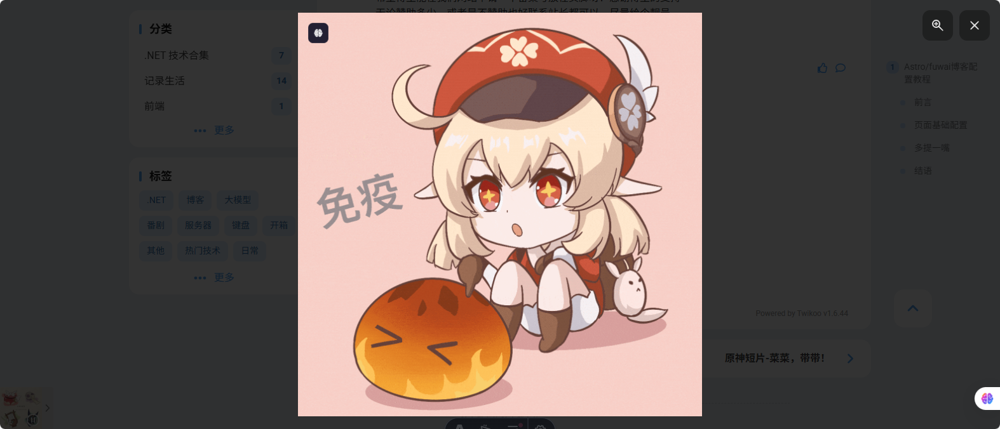

# 博客篇：TwiKoo实现评论图片点击放大 🖼️✨

## 前言 💬

之前博客写过一篇配置文章，里面有讲解如何集成`TwiKoo`评论系统。

[Astro/fuwai博客配置教程](https://blog.pljzy.top/posts/astrofuwai/astrofuwai博客部署教程/)

不过`TwiKoo`默认是不支持图片点击放大的，但是[fuwari](https://github.com/saicaca/fuwari)主题默认是支持图片点击放大的。

那么这就非常好实现了💡，也不需要引入其他的插件了🙌。

## 开始实现 🛠️

### 修改配置文件 ⚙️

通过阅读代码发现[fuwari](https://github.com/saicaca/fuwari)主题是用的`PhotoSwipe`插件实现的图片点击放大🔍。

具体代码在`src/layouts/Layout.astro`文件中配置：

```js
function createPhotoSwipe() {
	lightbox = new PhotoSwipeLightbox({
		gallery: ".custom-md img, #post-cover img, .tk-content img",
		...
	)}
}
```

首先需要在`gallery`中添加`TwiKoo`评论区域`img`标签图片所在的父元素`ID`或者`class`属性。

我这里就直接在原本基础上加上了：`.tk-content img` 🧩。

但是由于我们的评论组件是 **动态加载** 的⚡，所以想让图片点击生效还需要添加一行代码，将`createPhotoSwipe`方法绑定到`window`对象上。

```js
function createPhotoSwipe() {
	lightbox = new PhotoSwipeLightbox({
		gallery: ".custom-md img, #post-cover img, .tk-content img",
		...
	)}
}

(window as any).createPhotoSwipe = createPhotoSwipe;

...
```

### 修改评论组件 💻

虽然实现了点击放大🖱️，但是鼠标移入图片的时候，鼠标应该变为放大镜🔎，所以还需要修改评论组件，添加样式。

需要在`script`代码里面动态添加上样式代码🎨：

```js
// 动态创建样式并添加到页面
const style = document.createElement('style');
style.textContent = `
                        .tk-content img {
                            cursor: zoom-in;
                            transition: opacity 0.2s ease;
                        }
                        .tk-content img:hover {
                            opacity: 0.9;
                        }
                     `;
document.head.appendChild(style);
console.log("动态样式已添加到页面");
```

然后在评论组件`init`方法中的`onCommentLoaded`事件中调用刚刚为`window`对象绑定的方法⚙️。

```js
twikoo.init({
    envId: commentConfig.twikoo.envId,
    el: '#tcomment',
    region: commentConfig.twikoo.region,
    path: location.pathname,
    lang: commentConfig.twikoo.lang,
    onCommentLoaded: function() {
        console.log('Twikoo comments loaded successfully');
        if (window.createPhotoSwipe){
            window.createPhotoSwipe();
        }
    }
});
```

这样就完成了评论组件里面图片的点击放大功能 🎉。

## 效果展示 👀





------

## 总结 📝

对于[fuwari](https://github.com/saicaca/fuwari)主题的博客，在集成[twikoo](https://twikoo.js.org/frontend.html#通过-cdn-引入)后，
想在评论区实现图片点击放大，只需要修改`Layout.astro`文件和**评论组件**就行了💪。

当然这只是其中一种方式，还有很多方式可以实现评论区图片点击放大 🌈，有更多更好的实现方式可以在评论区留言~ 💬

## 参考链接 🔗

- 本博客 `Github` 地址：https://github.com/ZyPLJ/fuwai_zyplj
- 原作者开源地址：https://github.com/saicaca/fuwari
- `Astro/fuwai` [博客配置教程](https://blog.pljzy.top/posts/astrofuwai/astrofuwai%E5%8D%9A%E5%AE%A2%E9%83%A8%E7%BD%B2%E6%95%99%E7%A8%8B/)