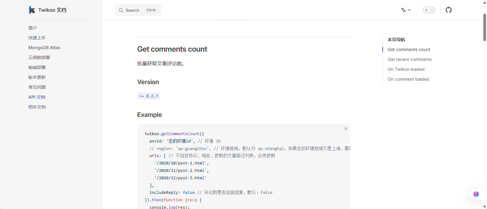

# 博客篇：文章列表添加评论数显示

## 前言

目前博客文章列表只会显示字数和阅读时间，不会显示评论数,不过博客接入了[twikoo](https://twikoo.js.org/frontend.html)评论系统，我翻了翻官方文档，发现有提供获取评论数的`API`接口。如图：



那么事情就变得简单起来了，只需要调用这个接口，然后把返回的数据渲染到对于的文章列表上即可。

## 说说缺点

不过依赖于外部插件，对于`Astro`框架的静态博客不是很友好，会拖慢网站加载速度，虽然可以忽约不计，但是多少有点影响。

目前博客集成第三方主要就是[twikoo](https://twikoo.js.org/frontend.html)、[友链朋友圈](https://blog.liushen.fun/posts/4dc716ec/)、[lsky图床](https://docs.lsky.pro/)，对于友链朋友圈和图床我都是单开一个页面，实际对博客的影响非常小，即使服务崩溃也不会影响网站正常运行。

为了尽可能的达到对这些第三方集成完美控制，我都有在`config.ts`做开关配置，可以配置是否开启这些功能或页面。

## 主要代码

### PostCard 页面

`src->components->PostCard.astro`

在阅读时长旁边添加**评论数**显示元素。

```js
import { commentConfig } from "src/config";

<!-- word count, read time and comment count  -->
<div class="text-sm text-black/30 dark:text-white/30 flex gap-4 transition">
    <div>
        {remarkPluginFrontmatter.words} {" " + i18n(remarkPluginFrontmatter.words === 1 ? I18nKey.wordCount : I18nKey.wordsCount)}
    </div>
    <div>|</div>
    <div>
        {remarkPluginFrontmatter.minutes} {" " + i18n(remarkPluginFrontmatter.minutes === 1 ? I18nKey.minuteCount : I18nKey.minutesCount)}
    </div>
    {commentConfig.enable && (
        <>
            <div>|</div>
            <span class="comment-count" data-path={url}>
                <span>0</span>
                <span>{i18n(I18nKey.commentsCount)}</span>
            </span>
        </>
    )}
</div>
```

### twikoo-loader

`public->lib->twikoo-loader.js`

新建一份`twikoo-loader.js`文件，请求`API`和渲染操作都在这个文件中完成。

```js
// public/lib/twikoo-loader.js

(function () {
	if (window.__twikooLoaderInitialized) return;
	window.__twikooLoaderInitialized = true;

	let twikooLoadTimer;

	// 加载评论数量
	const loadTwikooCommentCount = () => {
		if (!window.twikoo) return;

		const commentEls = document.querySelectorAll(".comment-count[data-path]");
		if (commentEls.length === 0) return;

		const paths = Array.from(commentEls)
			.map((el) => el.dataset.path)
			.map((path) => path.split("/").map(encodeURIComponent).join("/"));

		// 从全局配置获取Twikoo参数
		const twikooConfig = window.commentConfig?.twikoo || {};

		window.twikoo
			.getCommentsCount({
				envId: twikooConfig.envId || "选填",
				region: twikooConfig.region || "选填",
				urls: paths,
				includeReply: true,
			})
			.then((res) => {
				res.forEach((item) => {
					const el = document.querySelector(
						`.comment-count[data-path="${decodeURIComponent(item.url)}"] span:nth-child(1)`,
					);
					if (el) el.textContent = `${item.count}`;
				});
			})
			.catch(console.error);
	};

	// 确保 Twikoo 加载
	const ensureTwikooLoaded = () => {
		clearTimeout(twikooLoadTimer);
		twikooLoadTimer = setTimeout(() => {
			if (window.twikooLoaded) {
				loadTwikooCommentCount();
			} else if (!window.twikooLoading) {
				window.twikooLoading = true;
				const script = document.createElement("script");
				script.src =
					"https://registry.npmmirror.com/twikoo/1.6.44/files/dist/twikoo.min.js"; // 国内默认CDN
				script.onload = () => {
					window.twikooLoaded = true;
					loadTwikooCommentCount();
				};
				document.head.appendChild(script);
			}
		}, 200);
	};

	// 绑定事件（只绑定一次）
	const bindEvents = () => {
		const safeReload = () => ensureTwikooLoaded();
		document.addEventListener("astro:page-load", safeReload);
		document.addEventListener("swup:page:view", safeReload);
	};

	// 初始化
	ensureTwikooLoaded();
	bindEvents();
})();

```

这个`js`文件主要完成的操作就是根据官方文档所描述的配置`getCommentsCount`方法，发送请求，然后将返回的数据渲染到页面上。需要注意的是`script.src`的值需要自己调整，我这里是使用的官方推荐的国内`cdn`。

通过-`cdn`-引入：[前端部署 | Twikoo 文档](https://twikoo.js.org/frontend.html#通过-cdn-引入)

### Config

`src->Config.ts`

在配置文件中添加评论组件的相关配置，这个之前在集成[twikoo](https://twikoo.js.org/frontend.html)就添加过了[astrofuwai配置教程](https://blog.pljzy.top/posts/astrofuwai/astrofuwai%E5%8D%9A%E5%AE%A2%E9%83%A8%E7%BD%B2%E6%95%99%E7%A8%8B/)。

主要注意`envId`的配置就行了，我是私有部署的，所以我这里填的是我部署的评论系统后端的`ip|域名`地址。

修改`enable`为`false`就能关闭评论，包括评论数展示。

```js
export const commentConfig = {
	enable: true,
	provider: "twikoo",
	twikoo: {
		envId: "https://api.pljzy.top", // 部署的项目地址
		region: "",
		lang: "zh-CN",
	},
};

```

### Layout 页面

最后在`Layout`页面导入并使用`twikoo-loader.js`。

```js
import { commentConfig } from "src/config";


{commentConfig.enable && (
  <>
    <script is:inline define:vars={{ commentConfig }}>
	  window.commentConfig = commentConfig;
      // 动态加载 Twikoo Loader（保证执行顺序）
      const script = document.createElement('script');
      script.src = '/scripts/twikoo-loader.js';
      script.defer = true; // 延迟到 HTML 解析后执行
      document.head.appendChild(script);
    </script>
  </>
)}
```

## 实现效果


## 总结

对于文章添加评论数显示，主要代码逻辑在`twikoo-loader.js`中完成，然后只需在母版页中导入并使用即可。

为了可以控制评论组件和评论数是否显示，可以直接修改`Config.ts`中的`enable`属性。

## 相关链接

- 评论系统：[twikoo](https://twikoo.js.org/frontend.html)
- 本博客配置教程：[astrofuwai配置教程](https://blog.pljzy.top/posts/astrofuwai/astrofuwai%E5%8D%9A%E5%AE%A2%E9%83%A8%E7%BD%B2%E6%95%99%E7%A8%8B/)

