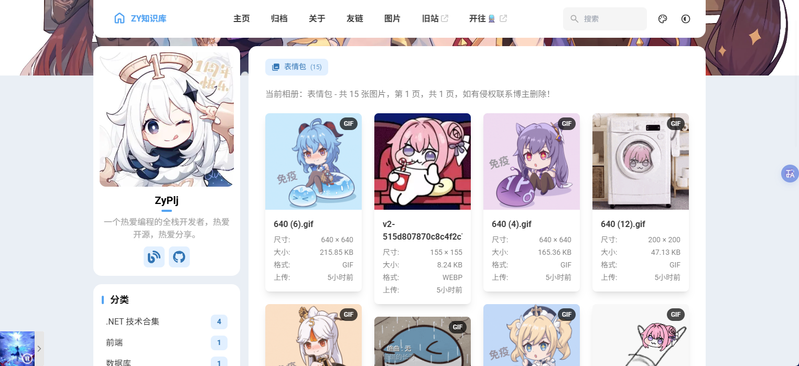
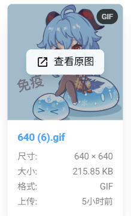
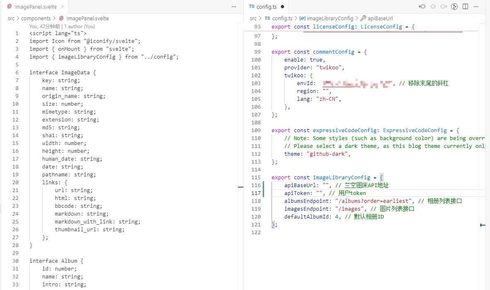

# 博客篇：新增图片页面

## 前言

换博客之后，也是折腾了挺多功能，比如评论、友链页面、文章置顶等等。和我之前的旧博客比起来还是少了些功能。想着加一个图片页面出来，说干就干，用`Cursor`给博客添加了个图片页面，用于展示图片。当然图片使用的是[兰空图床](https://docs.lsky.pro/)来存放的。

不得不说`Cursor`还是挺给力的，几乎10分钟不到就完成我想要的效果，不过还是有点小细节需要自己去改改。

图片页面直达地址：https://blog.pljzy.top/images/

## 页面截图

可以通过鼠标移入图片来查看原图。

## 相关代码

博客新增的功能已同步更新到我的`Github`仓库：

- https://github.com/ZyPLJ/fuwai_zyplj

这个仓库和我博客部署的仓库几乎是一模一样的，只是删除了一些配置而已。

图片页面主要就是添加了一个图片`Svelte`组件页面，然后在`config`配置文件中添加了一些必要的配置。

文章开头就说过，使用了[兰空图床](https://docs.lsky.pro/),所以需要配置`Api`地址和`token`才能让图片页面正常显示。

兰空图床怎么部署这里就不讲了，博主使用的是`Docker`部署在自己的服务器上的。

## 结语

这个页面开发起来不难，几乎全部是`Cursor`去完成的，主要也是对接兰空图床提供的接口就行了,唯一的不足就是，`token`可能会泄露，所以要在图床上面设置好限制，不然遇到坏人就会把服务器搞崩,目前就这样了，后续看能不能再优化一下安全性。

不过我的这些修改好像违背了静态博客的初衷，哈哈，不过`Astro`框架用着挺爽的，可以在同一个项目里混合用 `React + Vue + Svelte`。

如果看到喜欢的图片，欢迎自取~