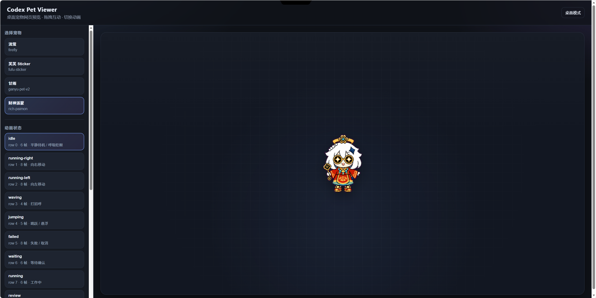
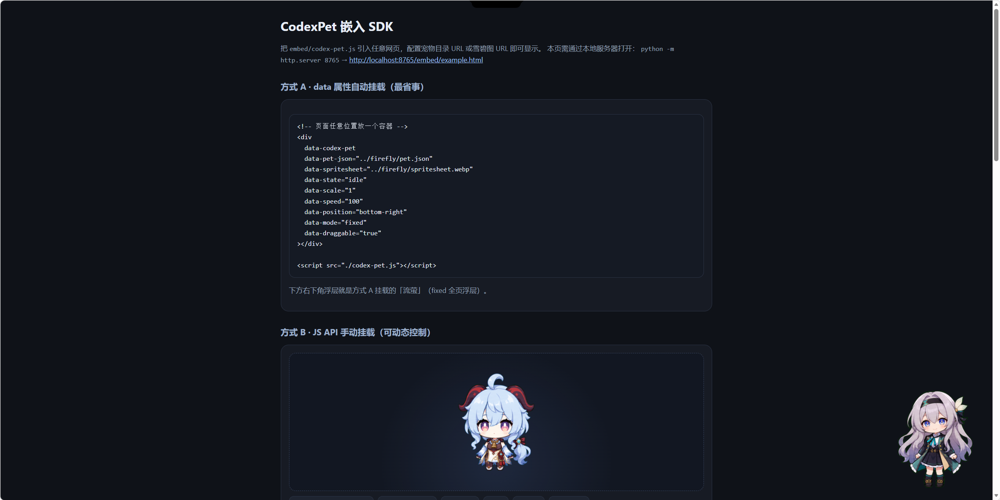
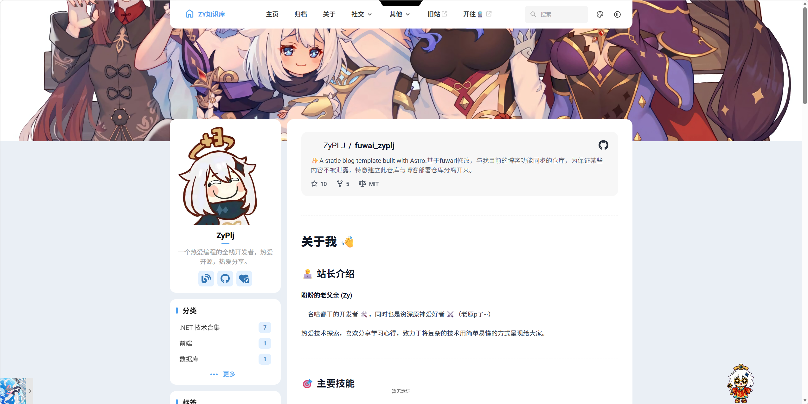

# 博客篇：给博客加上桌面宠物 🐾

## 前言 ✍️

博客魔改清单又可以加一项了。这次不是页面、也不是导航，而是右下角那只会动的**桌面宠物**。



效果很简单：

1. 全站右下角浮着一只小角色（默认财神派蒙）
2. 可以拖动位置
3. 点击会切换动画状态
4. 站内页面切换时**不会闪一下重载**——和音乐播放器一样，跟着整页活着

资源来自 Codex 桌面宠物包，外面封装了一个无依赖的 `embed/codex-pet.js`，正好适合嵌进静态站。

仓库还是我这套 Fuwari 魔改：

https://github.com/ZyPLJ/fuwai_zyplj 

https://github.com/ZyPLJ/WebCodexPet 宠物代码地址。

如果你只是想“看一眼效果”，直接打开WebCodexPet地址，拉取代码并运行；下面写的是**怎么接到自己的站上**。



------

## 设计取舍：为什么要学音乐播放器 🎵

本站用了 Swup 做页面过渡，只替换 `main` 和 `#toc`。  
如果宠物挂在页面内容区里，每次点链接都会被换掉，动画、位置、状态全丢。

所以挂载策略和音乐播放器对齐：

| 点 | 做法 |
|---|---|
| 挂载位置 | `Layout.astro` 的 `body` 上，Swup 容器之外 |
| 定位模式 | `mode: "fixed"` 浮在视口 |
| 生命周期 | 用 `window.__sitePetBooted` / `window.sitePet` 做单例 |
| 配置入口 | `siteConfig.pet`，和 `musicPlayer` 一样可开关 |

一句话：**宠物不是“页面组件”，是“站点级浮层”**。

------

## 资源目录 📦

把 SDK 和宠物包丢进 `public`：

```text
public/
  lib/
    codex-pet.js              # Embed SDK
  pets/
    firefly/                  # 流萤
      pet.json
      spritesheet.webp
    fufu-sticker/             # 芙芙
      pet.json
      spritesheet.webp
    ganyu-pet-v2/             # 甘雨
      pet.json
      spritesheet.webp
    rich-paimon/              # 财神派蒙
      pet.json
      spritesheet.webp
```

每个角色目录两个文件就够：`pet.json`（元数据 / 可选动画表）+ `spritesheet.webp`（雪碧图，约 1.5～2.5MB）。

雪碧图约定一般是 `1536×1872`，`8×9` 格，单格 `192×208`，行对应 `idle / running-right / waving ...` 等状态。

------

## 配置：`src/types/config.ts` + `src/config.ts` ⚙️

### 类型

在 `SiteConfig` 里加 `pet`：

```ts
pet: {
  enable: boolean;
  /** 角色目录名：firefly | fufu-sticker | ganyu-pet-v2 | rich-paimon */
  id: string;
  /**
   * 雪碧图 CDN 完整 URL；留空则用本地 /pets/<id>/spritesheet.webp
   * CDN 需 CORS，否则 canvas 裁切会失败
   */
  spritesheet?: string;
  scale?: number;
  speed?: number;
  position?:
    | "bottom-right"
    | "bottom-left"
    | "top-right"
    | "top-left"
    | "center";
  margin?: number;
  state?: string;
  draggable?: boolean;
  clickCycle?: boolean;
};
```

### 实际配置

`src/config.ts`：

```ts
pet: {
  enable: true,
  // 可选: "firefly" | "fufu-sticker" | "ganyu-pet-v2" | "rich-paimon"
  id: "rich-paimon",
  // 雪碧图 CDN；留空走本地
  spritesheet: "https://cdn.pljzy.top/spritesheet.webp",
  scale: 0.5,
  speed: 120,
  position: "bottom-right",
  margin: 20,
  state: "idle",
  draggable: true,
  clickCycle: true,
},
```

想换角色就改 `id`；想关宠物就 `enable: false`。

------

## 挂载：`src/layouts/Layout.astro` 🧩

核心逻辑（简化版）：

```js
if (window.__sitePetBooted) return;
window.__sitePetBooted = true;

const base = "/pets/" + petId + "/";
const sheet =
  typeof petSpritesheet === "string" && petSpritesheet.trim()
    ? petSpritesheet.trim()
    : base + "spritesheet.webp";

const config = {
  petJson: base + "pet.json",
  spritesheet: sheet,
  mode: "fixed",
  position: petPosition,
  scale: petScale,
  speed: petSpeed,
  state: petState,
  margin: petMargin,
  draggable: petDraggable,
  clickCycle: petClickCycle,
  zIndex: 40, // 别压死播放器列表和弹层
  onReady(inst) {
    window.sitePet = inst;
  },
};

function mount() {
  if (window.sitePet || !window.CodexPet) return;
  window.sitePet = window.CodexPet.mount(document.body, config);
}

if (window.CodexPet) {
  mount();
} else {
  const script = document.createElement("script");
  script.src = "/lib/codex-pet.js";
  script.async = true;
  script.onload = mount;
  document.head.appendChild(script);
}
```

要点：

1. **脚本只加载一次**，实例只挂一次
2. **`mode: "fixed"`** 挂到 `document.body`，Swup 换页碰不到它
3. **`spritesheet` 优先 CDN**，空则回退本站路径
4. **`pet.json` 仍走本站**（几 KB），大图才走 CDN

完整代码在仓库 `src/layouts/Layout.astro` 末尾，和音乐播放器脚本挨着。

------

## 关于 CDN 与 CORS 🌐

雪碧图 2MB 左右，放源站在服务器带宽一般的时候会拖首屏。我把图挂到了：

```text
https://cdn.pljzy.top/spritesheet.webp
```

要注意一件事：SDK 会把图画到 **canvas** 上裁帧，跨域图片必须带 CORS，例如：

```http
Access-Control-Allow-Origin: *
```

否则浏览器会把 canvas 标脏，宠物加载失败，控制台里一般能看到相关报错。

本地开发时 `spritesheet` 留空，直接用 `/pets/<id>/spritesheet.webp` 最省事。

------

## 运行时小玩法 🎮

打开控制台：

```js
// 当前实例
sitePet

// 切换动画
sitePet.setState("waving")
sitePet.setState("running")
sitePet.setState("idle")

// 看看有哪些状态
sitePet.listStates()

// 换一只（需本站有对应目录）
sitePet.load({ src: "/pets/firefly/" })

// 显隐
sitePet.hide()
sitePet.show()
```

点击宠物本身也会 `clickCycle` 切状态；拖动时会走左右跑的动画。

------

## 踩坑记录 🪤

1. **别挂在 `main` 里**  
   Swup 会整块替换，宠物状态必丢。

2. **z-index 别用 SDK 默认的天价层级**  
   默认接近 `2147483000`，容易盖住 APlayer 列表、评论框、弹层。我压到 `40`，按自己站情况调。

3. **`pet.json` 注意 BOM**  
   有的包自带 UTF-8 BOM，个别环境下 `JSON.parse` 会炸。入库前清一下更稳。

4. **跨域雪碧图必须 CORS**  
   见上文，这是 CDN 方案的硬条件。

5. **和音乐播放器抢右下角**  
   目前宠物 `bottom-right` + `margin: 20`，播放器也是右下。觉得挤就改 `position: "bottom-left"`，或把 `margin` 加大。

------

## 小结 📝



这次改动不大，但体验很明显：

- 静态站也能有“活物”
- 页面切换不闪、不重载
- 角色 / 缩放 / CDN 全走 `siteConfig.pet`，不用改组件逻辑

如果你也在用 Fuwari / Astro + Swup，直接抄上面的挂载思路就行：  
**站点级浮层，单例，容器外，配置化。**

代码已合进 `main`，欢迎围观或自己魔改一只更合适的角色 ✨
