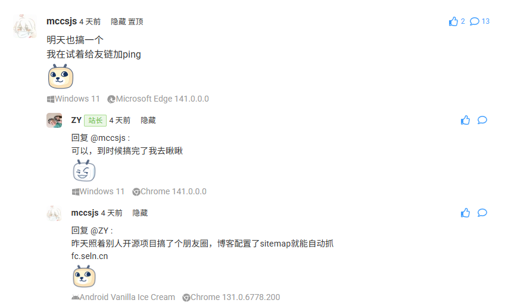
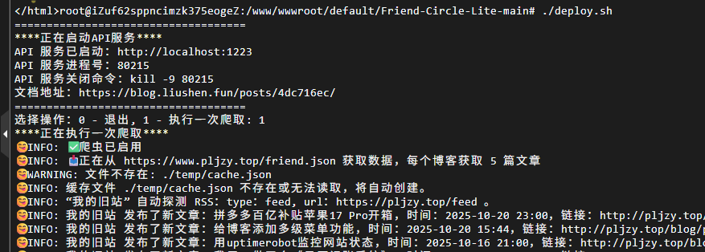
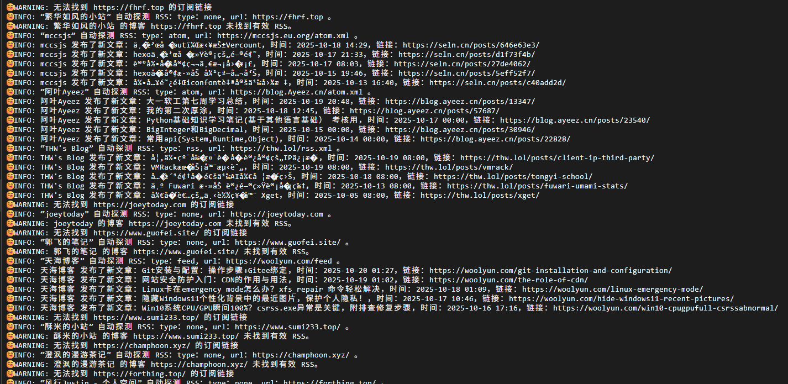
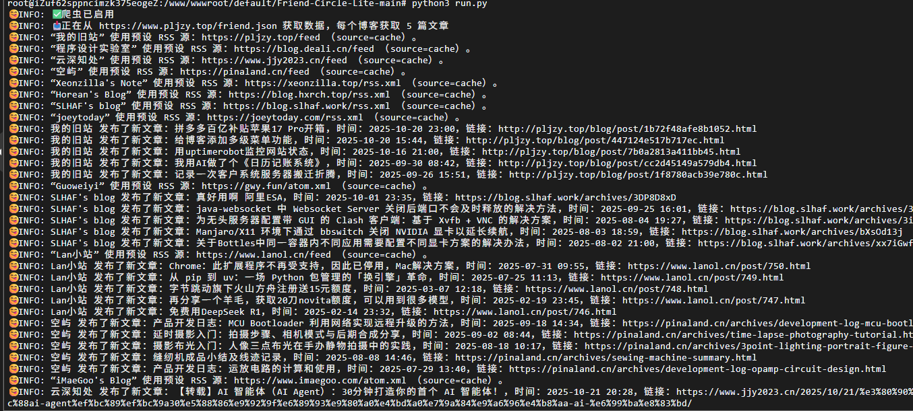
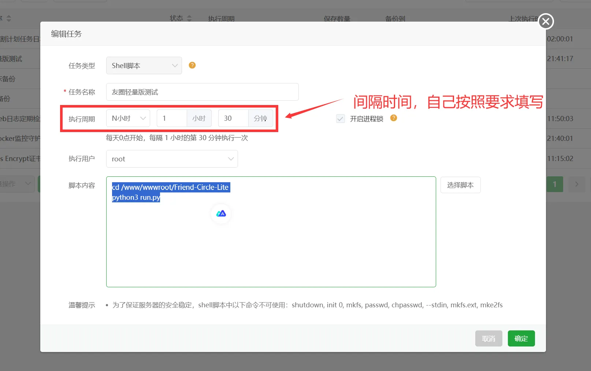
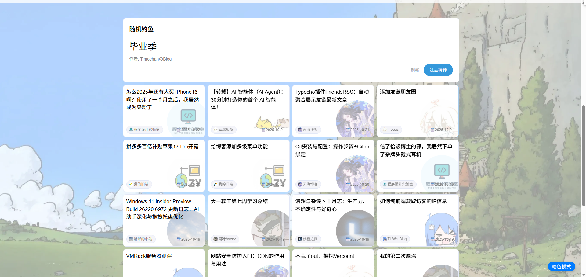

# 博客篇：给博客添加上友链朋友圈页面 🌐

## 前言 ✍️

最近工作不忙，也是对博客文章进行爆肝 💪，已经连续几天发布新文章了。
这次也是和 [**mccsjs**](http://mccsjs.eu.org/) 博主聊的甚欢 😄，也是得知有友链朋友圈这个功能页面。



https://seln.cn/posts/7dc9a0a2/，当时看了一下这个页面，发现还挺有意思 🤩，那我也是迫不及待地开始为自己的博客添加这个页面。

我的友链朋友圈页面是基于 https://github.com/willow-god/Friend-Circle-Lite 开源项目实现。

------

## 开始部署 🚀

### 拉取项目 📥

首先 `clone` 项目，我这里是从 `Github` 创建新的模版再 `clone` 的，因为我部署时发现了小问题做了点修改。

```sh
git clone https://github.com/ZyPLJ/Friend-Circle-Lite.git
```

然后参考原作者文档进行下一步操作：
[https://blog.liushen.fun/posts/4dc716ec/#%E8%87%AA%E9%83%A8%E7%BD%B2](https://blog.liushen.fun/posts/4dc716ec/#自部署)

我是自部署的，部署在我的 `Debian 12 liunx` 服务器上 🖥️

------

### 前置条件 ⚙️

需要有一份目前博客的友链 `friend.json` 文件，且格式如下：

```json
{
  "friends": [
    [
      "清羽飞扬",
      "https://blog.liushen.fun/",
      "https://blog.liushen.fun/info/avatar.ico"
    ],
    [
      "ChrisKim",
      "https://www.zouht.com/",
      "https://p.liiiu.cn/i/2024/06/27/667d880789765.webp"
    ],
    [
      "Akilar",
      "https://akilar.top/",
      "https://p.liiiu.cn/i/2024/04/06/661170950f7a2.png"
    ],
    ……
  ]
}
```

------

### 修改配置文件 🧩

修改项目根目录的 `config.yaml` 文件，我这里主要是修改了爬虫相关配置。
主要是配置 `json_url` 爬取地址，对应上面前置条件的 `friend.json` 文件。

```yaml
# 爬虫相关配置
# 解释：使用request实现友链文章爬取，并放置到根目录的all.json下
#   enable:             是否启用爬虫
#   json_url:           请填写对应格式json的地址，仅支持网络地址
#   article_count:      请填写每个博客需要获取的最大文章数量
#   marge_result:       是否合并多个json文件
spider_settings:
  enable: true
  json_url: "https://www.pljzy.top/friend.json"
  article_count: 5
  merge_result:
    enable: false
    merge_json_url: "https://blog.pljzy.top"
```

------

### 安装包 📦

前提条件：服务器有安装 `python3` 🐍
接下来安装必要的包：

```sh
pip install -r ./requirements.txt
pip install -r ./server/requirements-server.txt
```

如果上述执行不成功，用下方的命令 👇

```sh
pip install -r ./requirements.txt --break-system-packages
pip install -r ./server/requirements-server.txt --break-system-packages
```

------

### 部署 API 🔧

如果环境配置完毕，你可以进入目录路径 `cd Friend-Circle-Lite` 后直接运行 `deploy.sh` 脚本启动 `API` 服务：

```bash
chmod +x ./deploy.sh
./deploy.sh
```

选择操作那里，第一次执行的话输入 `1`。



检测是否部署成功 ✅

```sh
curl 127.0.0.1:1223
```

这样就可以访问项目自带的朋友圈页面啦 🎉

------

### 小插曲 🎭

在爬取的时候出现了乱码问题 😅，刚刚在拉取项目时说过我做了点修改，就是为了修复这个问题。



问题不大，用 `AI` 稍微修改下爬取部分的代码 🤖，下面是修改后爬取，没有乱码问题了。



------

### 定时任务 ⏰

然后就跟着原作者的教程，添加定时任务即可。



------

## 集成到 Fuwari 🌸

上面友链朋友圈部署成功后，会有一个项目默认的页面，如果不想折腾的话，可以直接用上面部署的页面。

服务器部署的话我是用 `Nginx` 反向代理指向服务器 `ip:1223`，然后防火墙添加出入站规则就能访问到了 🔒。

有很多部署办法可以访问到网站，这个就看自己喜欢哪种办法了 😎。

这是我自己部署的 👉 https://pljzy.top:1224/



当然我是属于喜欢折腾的 🔧，我自己也在博客里面添加了个友链朋友圈页面。

https://blog.pljzy.top/feed/


如果有喜欢的可以拉取我的仓库参考着做修改 👉
https://github.com/ZyPLJ/fuwai_zyplj

## 参考链接 🔗

- [**mccsjs**](http://mccsjs.eu.org/) 博客
- [Friend-Circle-Lite](https://github.com/willow-god/Friend-Circle-Lite) 开源项目
- [Friend-Circle-Lite](https://blog.liushen.fun/posts/4dc716ec/#%E8%87%AA%E9%83%A8%E7%BD%B2) 部署教程
- [fuwai_zyplj](https://github.com/ZyPLJ/fuwai_zyplj) 本博客仓库