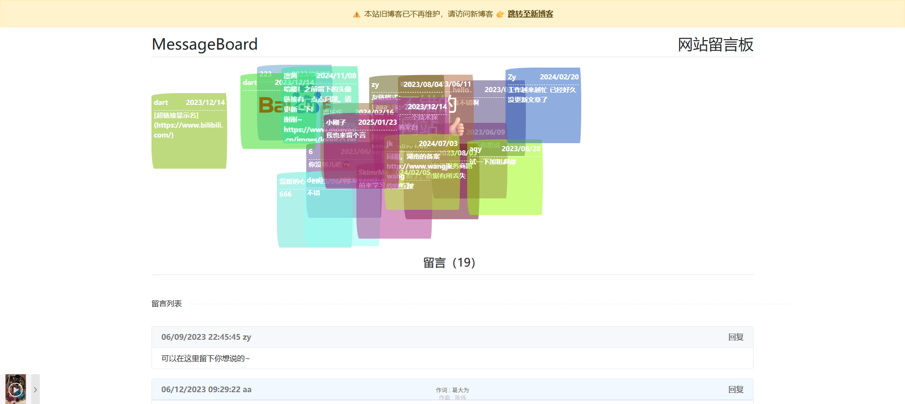
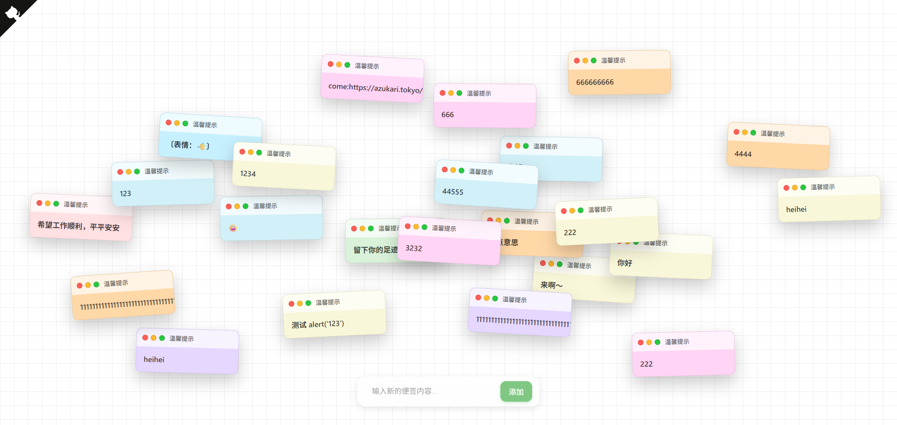

# 可以提交内容的便签墙来了

## 前言

上一篇文章发布了一篇：[有趣的便签墙](https://blog.pljzy.top/posts/%E6%89%BE%E5%88%B0%E4%B8%80%E4%B8%AA%E6%9C%89%E8%B6%A3%E7%9A%84%E4%BE%BF%E7%AD%BE%E5%A2%99%E7%BD%91%E7%AB%99/%E6%89%BE%E5%88%B0%E4%B8%80%E4%B8%AA%E6%9C%89%E8%B6%A3%E7%9A%84%E4%BE%BF%E7%AD%BE%E5%A2%99%E7%BD%91%E7%AB%99/)

发现有很多人都觉得挺有趣的，那么也是有人提问能不能输入，当时那篇文章的是一个静态网站，是没有后端的，所以是没办法输入并在便签墙显示。

我也是挤了点时间出来，非常快速的搭建了一个后端服务，然后稍微前后端对接了一下，然后又稍微操作一下部署到服务器上，最终也是成功完成部署，话不多说展示地址：

Github：https://github.com/ZyPLJ/NoteWeb

快速访问：https://www.pljzy.top/noteweb

## 多提一嘴

突然发现我的老博客的留言板和这个便签墙功能挺类似的，哈哈。这里放一个地址，感兴趣的可以去看看，老博客已经不维护了~

快速访问：https://pljzy.top/MsgBoard



## 技术栈

### 前端

- HTML5
- CSS3
- JavaScript (原生)

### 后端

- ASP.NET Core 9.0
- Entity Framework Core
- SQLite

## 项目结构

```markdown
NoteWeb/
├── Entity/
│   ├── Model/
│   │   └── Note.cs         # 便签数据模型
│   ├── MyDbContext.cs      # 数据库上下文
│   └── MyDbContextDesignFac.cs
├── wwwroot/                # 静态资源
│   ├── img/                # 图片资源
│   └── index.html          # 前端页面
├── Program.cs              # 应用入口和API定义
├── appsettings.json        # 应用配置
└── noteweb.db              # SQLite数据库文件
```

## 效果展示



## 注意事项

由于是赶鸭子上架，后端只是写了2个接口，一个查询一个新增，且没做**关键词校验**、**限流**，所以请大家**文明发言**。

然后其他**项目详情**请移步 [GitHub](https://github.com/ZyPLJ/NoteWeb)

- 本项目尚未完结，有许多bug！！！
- 文明发言~