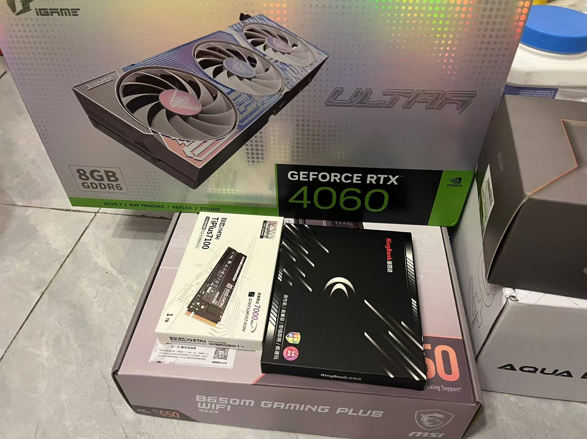
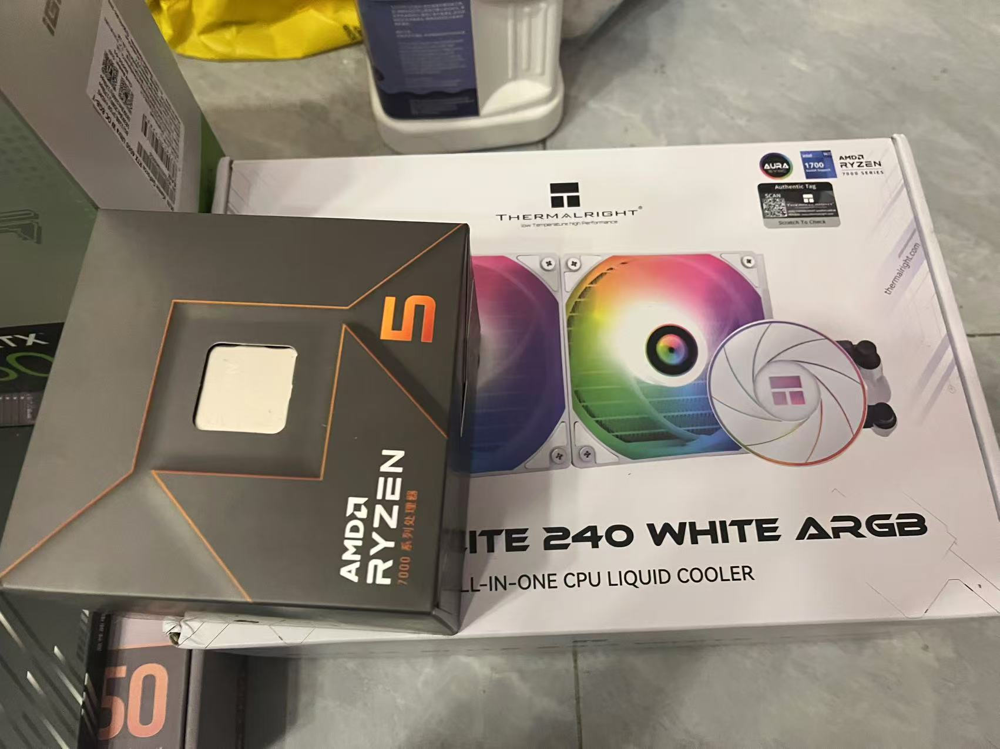
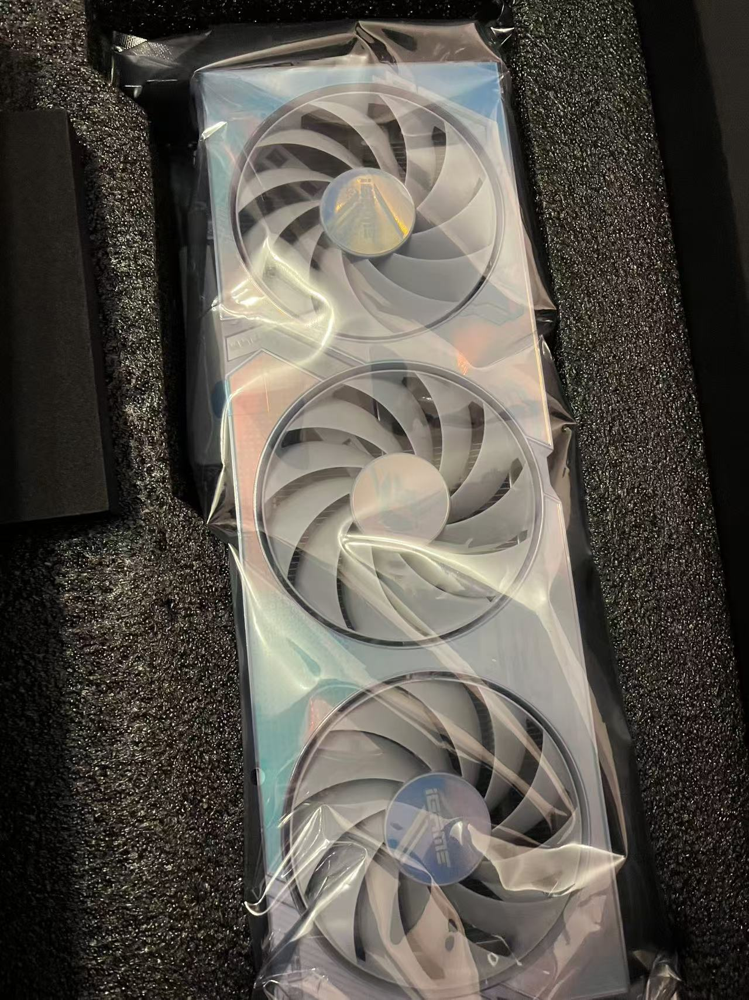
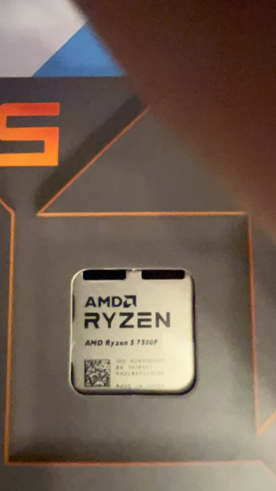
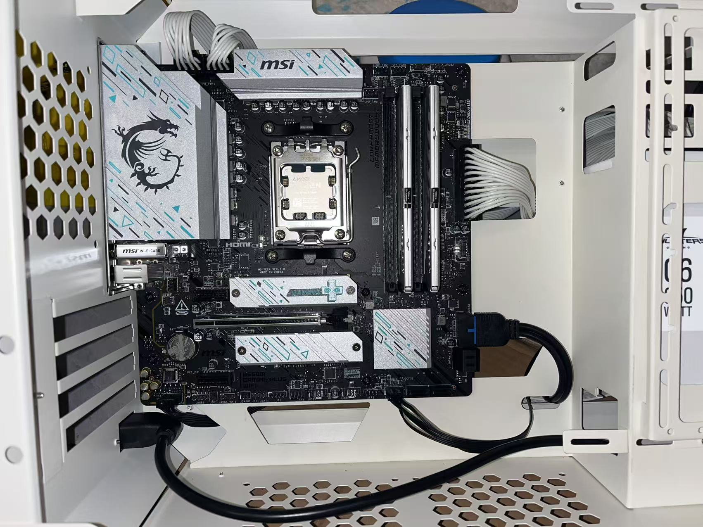
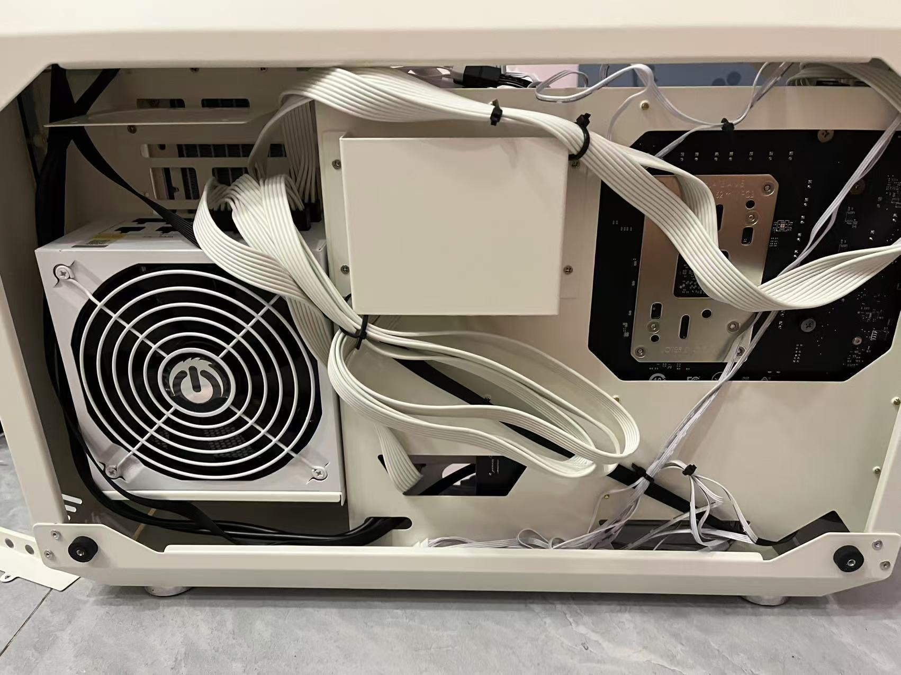
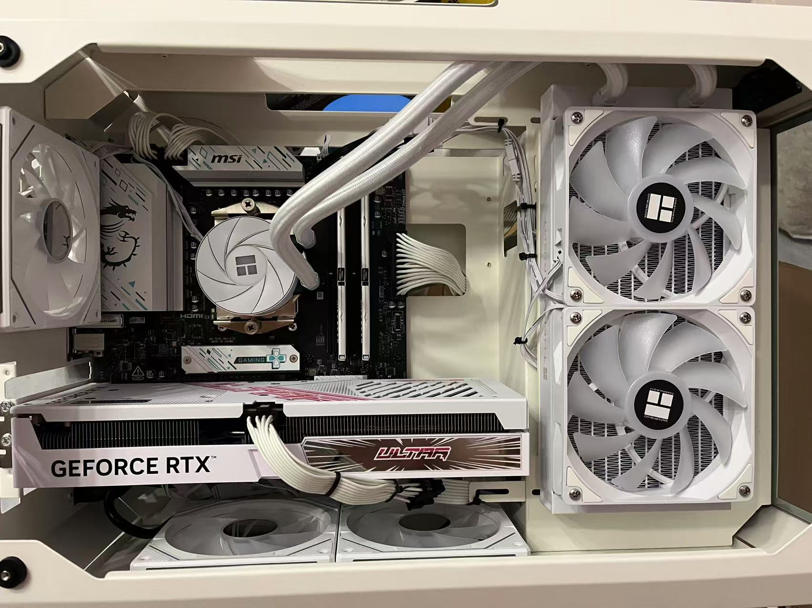
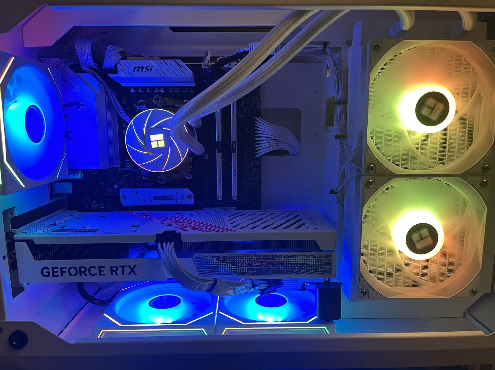
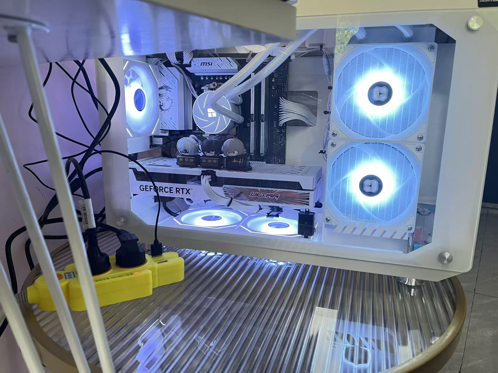
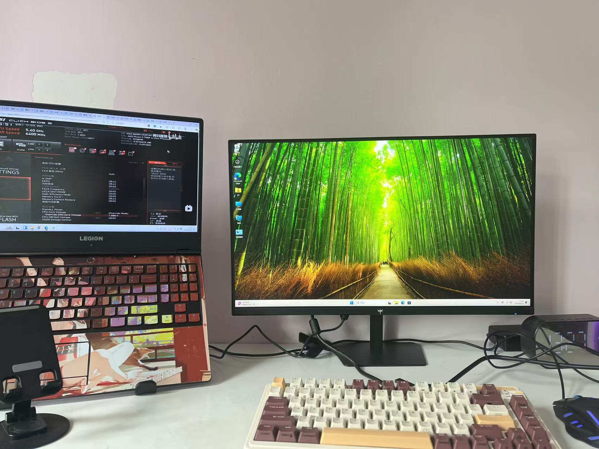

# 小白装机-装机篇

## 前言

[选配篇](https://pljzy.top/blog/post/60f2b0fa0e8491c9.html) https://pljzy.top/blog/post/60f2b0fa0e8491c9.html

上一篇文章讲了我是如何选择装机配置的，这篇文章讲解一下如何进行装机，分享一下装机经验

由于装机过程未拍摄视频或照片，这里就简单分享下经验，我会将我参考的装机视频链接放在文章最下面。

## 安装步骤

我这里以我的机箱和配件来讲解装机步骤。

首先我是等配件全部到齐再进行装机。

第一步，安装CPU，把主板放在平面上，装的时候可以先洗个手去除一下手上的静电，以防击穿主板（也可以佩戴仿静电手套）。打开主板CPU盖板，检查主板CPU针脚有无弯曲，没问题后，CPU会有一个防呆三角形标识，将标识方向和主板标识方向一致，缓缓的放下CPU。放稳后，压下盖板，CPU保护盖会弹起。**如果没有弹起，在你确定cpu安装是正确的情况下，用手把保护盖取下来就行。**

第二步，安装内存条，我买了16G内存条2根，通常安装到主板的2,4通道，也就是第2和第4个插槽，插槽也有防呆口。将插槽一端的锁扣打开，内存条缺口和插槽缺口对齐放入，然后用手按住内存条两端用力往下压，锁扣会自动回弹回去。

第三步，安装硬盘，以45度对准硬盘接口插进去然后往下压，硬盘那里会有一个螺丝或者卡扣用于固定硬盘。装好之后有马甲的把马甲贴上按钮螺丝拧上

第四步，把电源线整理好放进机箱里面，然后把主板固定在机箱上面。

第五步，安装水冷或者风冷，把其他风扇也安装上去

第六步，插线，将Cpu供电、水冷、风扇等供电线插上，注意不要插错了，也不要暴力插

第七步，安装显卡，此时电脑已经把所有配件都装上了

## 装机图片分享

理线杂乱无章请忽略哈哈。长图：

# 超频

## cpu超频

我买的是AMD的CPU，并且主板供电可以跑满这颗cpu，默认频率是3.7，所以超频是必然的。不过不知道是体质问题还是电压没给够，第一次超频5.2直接开不了机，然后我重置了Blos之后重新超的5.1就能开机了。

## 内存条超频

这个比较简单，我直接在主板开启EXPO就行了，其他的参数我怕影响开机，因为第一次我是调过其他参数的，也可能是这个原因导致无法开机。

## 教程链接分享

- 水冷安装：https://www.bilibili.com/video/BV12T411p7oj/?spm_id_from=333.880.my_history.page.click 
- 机箱线：[接机箱线，电脑开关线_哔哩哔哩_bilibili](https://www.bilibili.com/video/BV1PA4y1d7yf/?spm_id_from=333.880.my_history.page.click) https://www.bilibili.com/video/BV1PA4y1d7yf/?spm_id_from=333.880.my_history.page.click
- 全模组电源接线：[全模组电源接线安装教程，细节分析电源接线方法！_哔哩哔哩_bilibili](https://www.bilibili.com/video/BV1WQ4y1N7dy/?spm_id_from=333.880.my_history.page.click) https://www.bilibili.com/video/BV1WQ4y1N7dy/?spm_id_from=333.880.my_history.page.click
- 微星主板供电线：[微星主板供电线安装教程_哔哩哔哩_bilibili](https://www.bilibili.com/video/BV13B4y1H7os/?spm_id_from=333.880.my_history.page.click&vd_source=f8b5615a803ba75e76e0cee5d4de22b6) https://www.bilibili.com/video/BV13B4y1H7os/?spm_id_from=333.880.my_history.page.click&vd_source=f8b5615a803ba75e76e0cee5d4de22b6
- 装机教程：[【装机教程】全网最好的装机教程，没有之一_哔哩哔哩_bilibili](https://www.bilibili.com/video/BV1BG4y137mG/?spm_id_from=333.880.my_history.page.click) https://www.bilibili.com/video/BV1BG4y137mG/?spm_id_from=333.880.my_history.page.click
- 装机教程：[【毛子电脑】爱国者星灿岚超详细装机走线教学，AMD主机装机 学不会电脑送你_哔哩哔哩_bilibili](https://www.bilibili.com/video/BV1pKxFeFEdf/?spm_id_from=333.880.my_history.page.click) https://www.bilibili.com/video/BV1pKxFeFEdf/?spm_id_from=333.880.my_history.page.click
- 系统安装(win11步骤一样)：[【装机教程】超详细WIN10系统安装教程，官方ISO直装与PE两种方法教程，UEFI+GUID分区与Legacy+MBR分区_哔哩哔哩_bilibili](https://www.bilibili.com/video/BV1DJ411D79y/?spm_id_from=333.880.my_history.page.click) https://www.bilibili.com/video/BV1DJ411D79y/?spm_id_from=333.880.my_history.page.click
