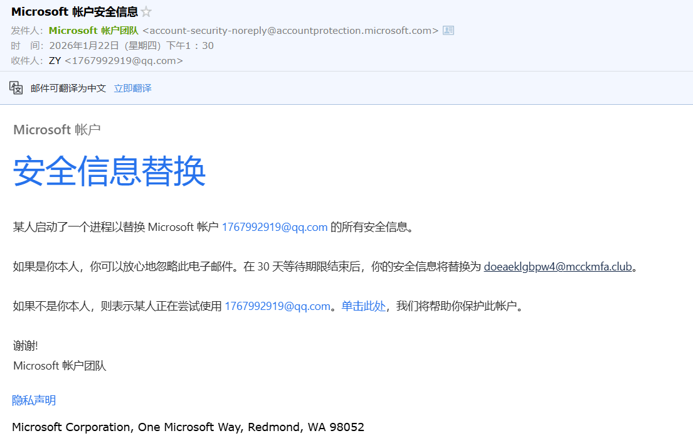

# 微软的安全漏洞-Microsoft账户安全信息

## 前言

新工作已经入职2个月了，第一个月很轻松，第二个月忙的飞起，也是没有时间管理博客写文章了。自从入职了新公司，博客园都没怎么打开过了，真的太忙了，我都感觉我工资要少了。😭

说回正题，上班的时候莫名奇妙受到微软官方的邮件，还好我点进去看了一下，如图：

总结一下就是任何人都可以修改你的Microsoft账户的安全信息，我也是百度了一下，发现2025年10月24日的时候有人向微软提交过这个问题，具体可以看这篇文章

- [我的Microsoft账户安全信息已被替换，邮箱也被替换了,微软存在重大BUG - Microsoft Q&A](https://learn.microsoft.com/zh-cn/answers/questions/5596086/microsoft-bug?page=1)
- https://learn.microsoft.com/zh-cn/answers/questions/5596086/microsoft-bug?page=1)