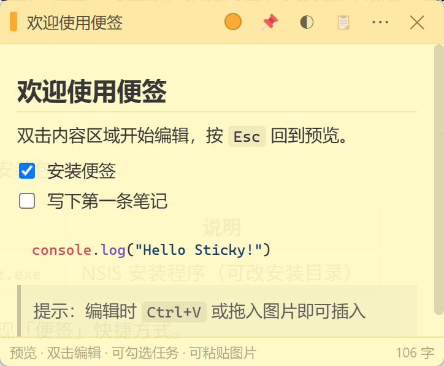

# 我做了一款贴在 Windows 桌面上的 Markdown 便签

## 简介

很多人的桌面其实缺一块「刚好够用」的空间：
既不想开 Notion / Obsidian 那种重应用，也不想用系统记事本写一堆没格式的草稿。

MarkdownNote（便签） 就是为这个场景写的：

它是 Windows 上的 多窗口 Markdown 桌面便签——
轻量、可置顶、颜色可选，默认预览，双击进入编辑，Esc 立刻回预览。

你可以用来：
  - 贴几条今日待办（- [ ] 可直接勾选，支持多层级）
  - 临时记会议要点、代码片段（代码高亮）
  - 粘贴 / 拖入截图，自动本地保存
  - 关掉窗口只是隐藏，数据还在；删错了去回收站恢复

不需要账号、不上传云端。
便签数据在本机 %APPDATA%/bianqian/，JSON 自动保存。

技术上用了 Electron + Vue 3 + CodeMirror + markdown-it，打包成 NSIS 安装包；从 **GitHub Releases** 下载MarkdownNote-Setup-*.exe 即可安装。

## 截图

|  便签预览  |   回收站   |  历史预览  |
| :--------: | :--------: | :--------: |
|  |  |  |

## 开源地址
https://github.com/ZyPLJ/MarkdownNote
  （MIT，欢迎 Star、提 Issue 和建议）