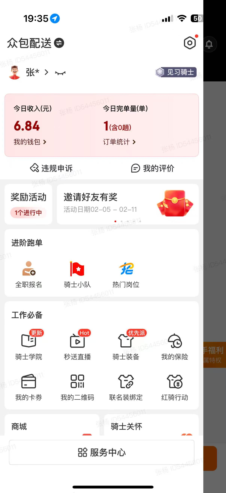

# 我入职京东了

## 前言 😅

好了，标题党了，实际上是入职京东众包外卖。🛵

事情的起因是上班太累了，不想自己做饭，然后下班的时候就点了份外卖，然后坐地铁回家（大约1个小时路程），都快到家了发现还是没人接单😤，这种情况不是一次二次了，只要是晚上点京东外卖就会出现没人接单的情况。

那么我也想看看为啥没人接单，就下载了**京东秒送App**📱，然后注册账号、实名认证，正当我满心欢喜能接单的时候（已经在app上看到自己的单了🎉），需要进行学习📚，花了大约1分多钟，终于可以接单了，也是马上把自己的单抢了🚀。

我点的是一份韩式炸鸡🍗，差不多9块钱，然后我这单配送费竟然高达6块💰，我自己也没电动车，出了地铁就扫了个共享电动车去拿外卖了。

不得不说这些商家的地址太隐蔽了😵，我围着导航的地点转了几圈都没看到，最后是打商家电话才知道的📞，商家真实地址离导航差不多有50米偏差，而且门店在小道里面。

我拿完单商家还问我怎么骑的共享电动车送外卖😲，我说：“点了半天没人就接单，我就自己下了个京东秒送自己接单了”，商家后面也说京东骑手不多，不过没卷的情况下京东外卖还是挺划算的。

看似挣了`6.84`💸，但扣除我的共享电动车`4.5`和保险`3`块，我还倒贴了。😭

