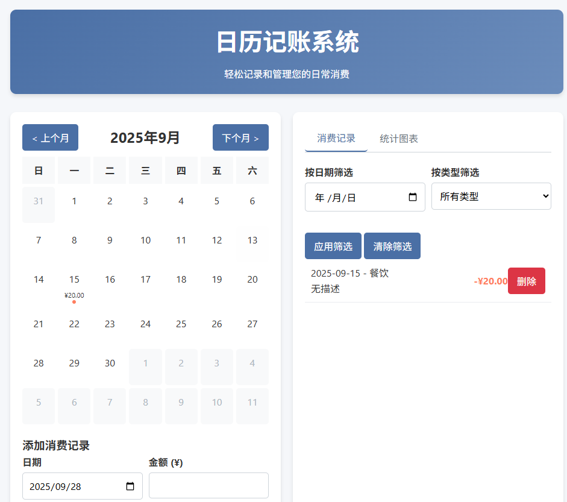
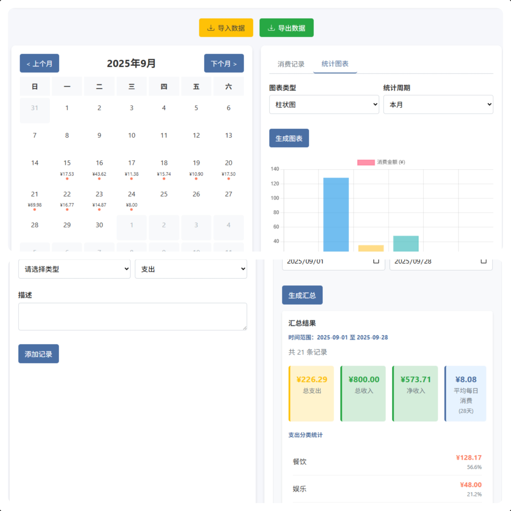
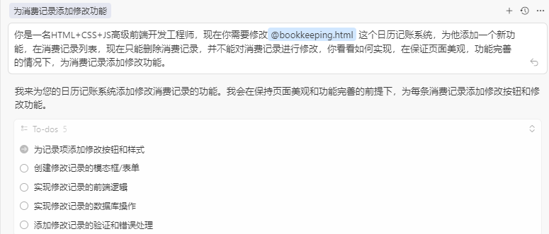
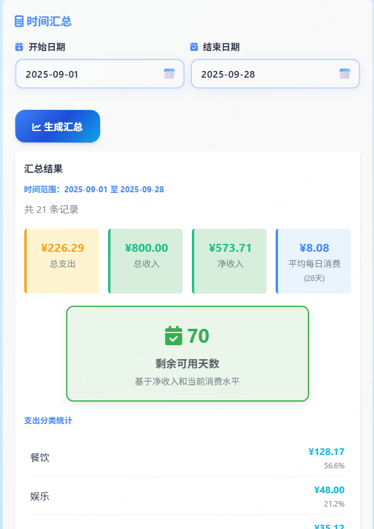

# 我用AI做了个《日历记账系统》📅💰

## 前言 ✨

说到**记账**🧾，之前我都是在手机上记账，用过很多记账软件，之前还写过一篇[苹果手机快捷指令numbers自动记账教程](https://blog.pljzy.top/posts/%E8%8B%B9%E6%9E%9C%E6%89%8B%E6%9C%BA%E5%BF%AB%E6%8D%B7%E6%8C%87%E4%BB%A4/%E8%8B%B9%E6%9E%9C%E6%89%8B%E6%9C%BA%E5%BF%AB%E6%8D%B7%E6%8C%87%E4%BB%A4numbers%E8%87%AA%E5%8A%A8%E8%AE%B0%E8%B4%A6%E6%95%99%E7%A8%8B/)，通过敲击背板，自动完成记账。后面用过一段时间发现还是满足不了我的需求😕，所以用了一段时间也就没用了。

后面，我也是用了新出的记账软件，这款软件也是能够通过敲击背板完成自动记账，同时还接入了`AI`🤖用来帮助记账，整体使用下来还是很不错的，不过也是用了一段时间就放弃了。主要原因是我每次下单的时候还需要敲击背板，很多时候会忘记🧠，然后到家要手动补记录，有时候也会误触导致运行记账指令😫。

## 开始创作 🎨

有了以上经历，我也是在上班摸鱼🐟的时候有了一个灵感💡，我为什么不做个网页版的记账网站呢，不需要很复杂，能够满足我自己的需求就行，说干就干🚀，直接把提示词丢给`Deepseek`，让他帮我完成编写。

提示词：

> 你是一个html、js、css精通的网页开发工程师👨‍💻，现在有个需求给你，你需要完成一个使用html+js+css实现的按照日历记账的系统。主要功能如下：
> 1.记账功能，选中日历中的某个日期，可以为该日期添加消费记录。
> 2.查询功能，可以查询每个时间的消费记录，可以根据日期、消费类型查询。
> 3.统计功能，统计各个日期的消费记录，形成图表。
> **目前可以将消费记录存放在浏览器存储中。**

初版使用的是`localStorage`存储，后面换成了`IndexedDB`🗄️，后续有时间可能会把存储抽象出来，可以轻松切换不同的存储。

### 初版效果 👀



整体效果还是不错的👍，主要使用方式也就是通过**选择日期**，然后添加**消费记录**。

初版的系统只支持记账、查询和统计功能，功能较少，而且样式不够美观。接下来我也是继续让`Deepseek`优化和添加功能🛠️

### 初版优化 ✨

> 现在添加一个消费记录导入和导出的功能
>
> 其他功能不变的情况下，能否增加一个按时间汇总得到这段时间内所有消费汇总后的金额的功能呢。



可以看到现在功能已经比较完全了✅，可以选择**时间段**进行**汇总计算**，并且支持导入、导出记录，样式上也进行了优化。

### 搭配Cursor优化 🔧

在使用`Deepseek`进行一系列优化后，感觉到达了拼接，后面我有使用了`Cursor`进行优化。

部分对话截图：



### 目前最终版本 🎯




我个人比较喜欢的功能就是这个**时间汇总**功能⏰，可以根据支出、收入计算**平均每日消费**和**剩余可用天数**。

最终版本也是采用了毛玻璃+透明背景的效果🎨，目前还没有适配手机端显示，后续会继续进行优化。

## 介绍 📖

上面讲了这么多创作历程，下面来介绍下这个**日历记账系统**。

日历记账系统是一个基于 `HTML + CSS + JavaScript` 的本地记账网页应用🌐，内置现代化 `UI`、日历视图、筛选与统计功能，数据默认存储在浏览器 `IndexedDB`，支持一键导入/导出 `JSON`。

### 功能特性 🌟

- 📅 日历视图：按月展示每日收支概览，带当日总支出提示点与金额汇总
- ➕ 一键添加记录：日期、金额、类型、收/支、描述
- 🔍 右侧筛选：按日期与类型快速筛选记录（与日历点击联动）
- 📊 数据统计：支持柱状图、折线图、饼图（使用 `Chart.js`）
- ⏱️ 时间汇总：任意日期范围的收入/支出/净收入、平均每日消费与“剩余可用天数”估算
- 💾 数据持久化：`IndexedDB` 本地存储；兼容历史 `localStorage` 数据并提供迁移进度反馈
- 📥📤 导入/导出：支持 `JSON` 文件导入与一键导出
- 🖥️ 纯前端：单个 `HTML` 文件即可离线使用

### 在线预览与使用 🚀

直接用浏览器打开 `bookkeeping.html` 即可使用（推荐 Chrome/Edge）🌐。

1. 点击日历的某一天，会自动：
   - 🎯 高亮所选日期
   - 🔄 同步右侧“按日期筛选”输入框
   - 📋 列表即时筛选为该日期
2. 填写“添加消费记录”区域并点击“添加记录”
3. 在“消费记录”页签中，可按日期和类型进行筛选；“清除筛选”恢复全部
4. 在“统计图表”页签中选择图表类型和统计周期，点击“生成图表”
5. 在“时间汇总”区域选择开始/结束日期并“生成汇总”

### 技术栈 ⚙️

- 🏗️ 原生 `HTML/CSS/JavaScript`（无构建依赖）
- 🗄️ `IndexedDB`（数据持久化）
- 📈 `Chart.js`（统计图表）
- 🎨 `Font Awesome`（图标）

### 项目结构 📁

```
Desktop/
├─ bookkeeping.html   # 应用主文件（包含样式与脚本）
└─ README.md          # 本说明文件
```

### 数据导入与导出 💾

- 📤 导出：点击“导出数据”生成包含全部记录的 `JSON` 文件
- 📥 导入：点击“导入数据”选择符合字段的 `JSON`，系统会校验并追加至现有数据
- 🔄 首次使用含有历史 `localStorage` 的旧版本数据时，会自动迁移至 `IndexedDB`，并显示迁移进度

数据记录的基本字段：

```
{
  "id": "时间戳字符串",
  "date": "YYYY-MM-DD",
  "amount": "字符串化的小数，保留两位",
  "type": "food|shopping|transport|entertainment|utilities|other",
  "category": "expense|income",
  "description": "可选描述"
}
```

### 开发与自定义 🛠️

- 💻 所有代码在 `bookkeeping.html` 中，便于复制与二次开发
- 🎨 `UI` 主题色在 `:root` CSS 变量中统一管理，可按需调整
- ➕ 如需扩展消费类型或字段，可在“添加记录”选择与渲染逻辑中同步调整

### 隐私与数据 🔒

- 🛡️ 所有数据均保存在本地浏览器 `IndexedDB` 中，不会上传到服务器
- ⚠️ 更换浏览器/设备或清理站点数据会导致本地数据不可用，请定期导出备份

### 兼容性 💻

- 🌐 现代浏览器（Chrome、Edge、Firefox 最新版）。旧版浏览器可能缺少 `IndexedDB` 或部分特性

## 结尾 🎉

最后欢迎大家使用这个系统👋，虽然这个系统是网页版，但是对于打工人👨‍💼来说我觉得网页版比手机版更好用，我平时记账都是上班摸鱼🐟或者提前到公司的时候就打开这个网站进行记账，很方便，这个也看个人习惯。

**项目地址**：

- 🌐 在线体验：[https://www.pljzy.top/bookkeeping.html](https://www.pljzy.top/bookkeeping.html)
- 💻 GitHub仓库：[https://github.com/ZyPLJ/bookkeeping](https://github.com/ZyPLJ/bookkeeping)

可以放心使用，数据存本地🔒，你甚至可以把`html`代码下载下来，在本地浏览器打开💾，或者直接克隆`GitHub`仓库到本地使用。

后续我也会对这个系统进行一系列优化，以完成我的记账需求。🔮