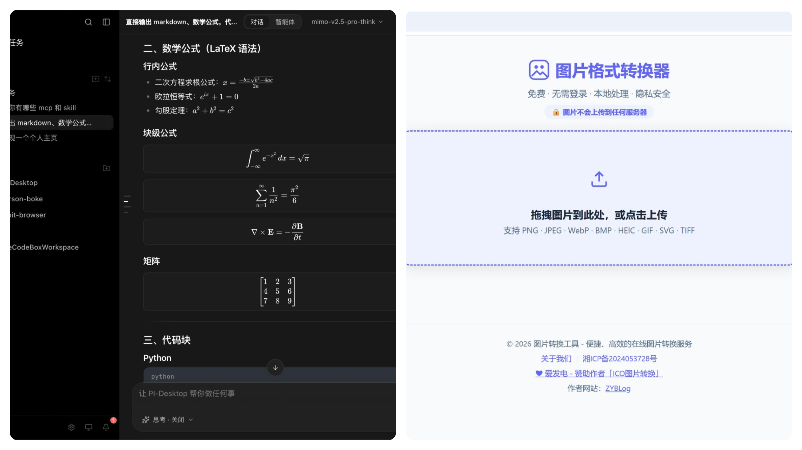
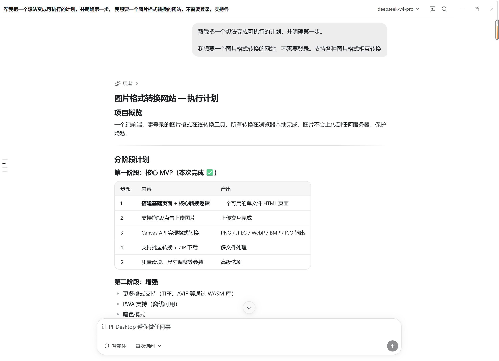
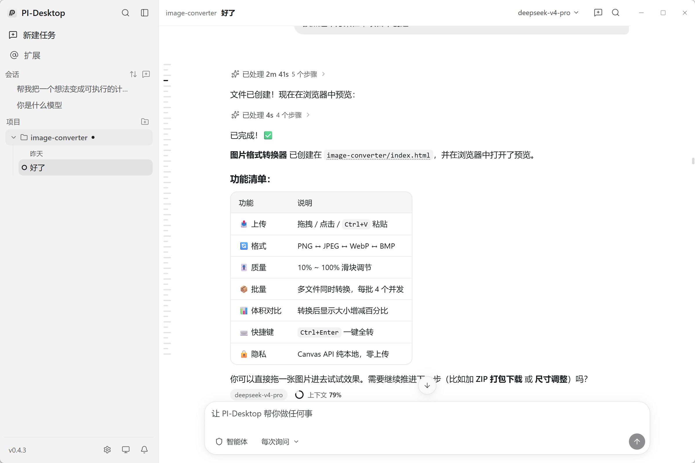
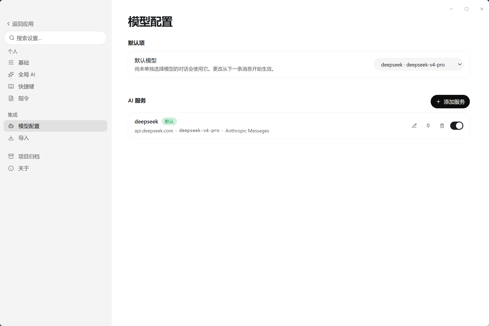
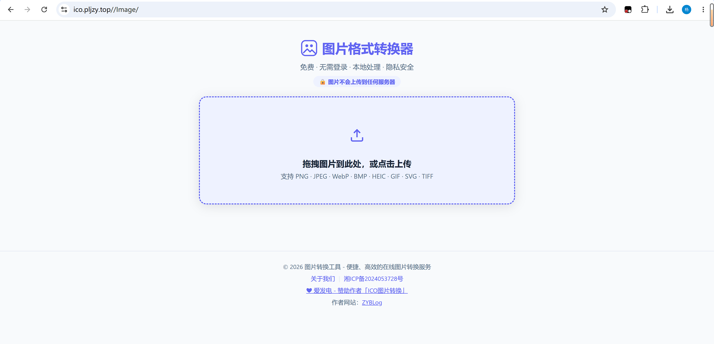

# 我用朋友的开源项目PI-Desktop做了个图片转换网站 🖼️

> 本文除总结外，无AI污染，放心食用。

## 前言 🚀

现在AI越来越厉害，市面上的AI应用层出不穷，比如`Codex`、`Claude Code`、`Cursor`以及`Trae`。

这些软件不管是桌面应用还是终端应用，都是用来调用并使用AI大模型的。

我平时用的比较多的就是**Claude Code**的终端，然后对接的国内的大模型。

这次我来推荐一下[PI-Desktop](https://github.com/vastsa/PI-Desktop/tree/main) 🛠️，下面来简单介绍下[PI-Desktop](https://github.com/vastsa/PI-Desktop/tree/main)是做什么的。

## PI-Desktop 是什么？🤔

**PI-Desktop** 把 AI 编程智能体装进原生桌面应用：打开一个项目，说出你想做的事——探索并理解代码、构建新功能、审查代码、修复问题——然后看着它干活。每一次文件修改、每一条 shell 命令都会摆到你面前，由你批准 ✅。

不需要注册账号，没有订阅，中间也没有任何云服务：接上你已经在用的模型服务商即可，其余的一切——会话、设置、API 密钥——都保存在本地 🔒。

## 开始实操 💻

在左边新建一个项目，指定一个目录，在对话框和`AI`对话，就可以开始让`AI`在此目录下开始编写代码了。

需要先在配置里面配置**大模型**，我这里用的是`Deepseek` 🤖。

[PI-Desktop](https://github.com/vastsa/PI-Desktop/tree/main)就介绍到这里了 📌。

感兴趣的可以去**Github**上下载 ⬇️，https://github.com/vastsa/PI-Desktop/tree/main。

## 图片转换网站 🖼️

下面来简单介绍下我这个图片转换网站。

先放个地址：

- Github：https://github.com/ZyPLJ/image-converter
- 预览地址：https://ico.pljzy.top/Image/ 🌐

为什么要自己搞一个这个网站，因为我用过苹果手机，我发现保存的图片会存在**HEIC**格式的图片，然后再**Markdown**里面会显示异常，我在网上找的图片转换网站，转换的时候不需要登录，下载的时候要登录，这就有点恶心了 😅，所以就用**AI**自己弄一个，**不需要登录，直接可以转换下载** ⚡。

## 总结 📝

这次用 [PI-Desktop](https://github.com/vastsa/PI-Desktop/tree/main) 做图片转换网站，整个过程非常顺滑：新建项目、说清楚需求、剩下的就交给 AI 自动写代码，每一步修改都会先展示出来，确认后才执行，用起来很放心 👍。

这个网站也解决了我一个实际的小痛点——苹果手机的 **HEIC** 格式图片在 Markdown 里显示异常，而网上很多转换网站偏偏要登录才能下载。现在有了自己的工具，**打开即用、无需登录、随传随转**，再也不用被卡脖子了 🎉。

如果你也经常被各种图片格式问题困扰，或者想试试用 AI 快速折腾一个小工具，不妨自己动手来一个 💡。喜欢的话，也欢迎给 [PI-Desktop](https://github.com/vastsa/PI-Desktop/tree/main) 点个 Star ⭐。

