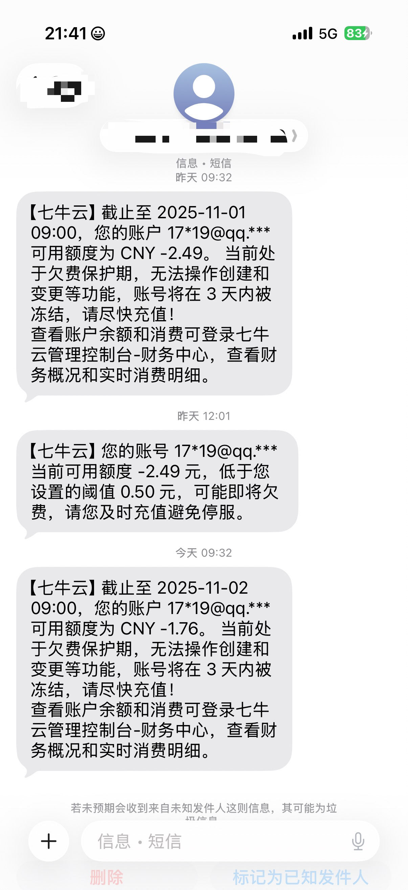
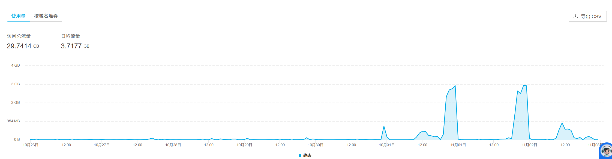
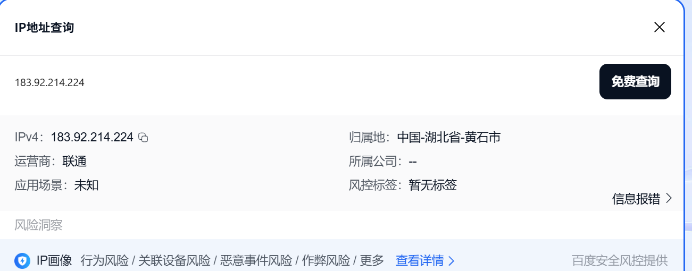

# 我的发！网站CDN被刷了 😱

## 前言

当我正沉浸在周末休闲时光的时候，一封欠费短信📱打扰了正在享受休闲时光的我。

当我打开手机，查看短信的时候，发现竟然是七牛云`CDN`欠费通知，当时第一反应是比较震惊的😳，因为我平时一个月`CDN`费用才2元不到，平时网站访问量不高，而且我只是部分静态文件放在`七牛云`上。

最主要的是我前几天才充值，莫名奇妙就欠费了，后面我通过查看网站访问量发现访问量并不是很多，这个时候我就已经确认是有人在刷我的`CDN`了💔。

然后我登录七牛云管理平台，发现**10月31号**和**11月1号**晚上**21:00-23:00**短短3个小时刷了**10G**流量，2天用了我`20G`📈。

## 短信截图

## 七牛云截图

可以看到平时正常来讲是几乎没有多少流量的，**31号**和**1号**突然就激增📊。

## 开始排查 🔍

通过查看七牛云的请求日志，发现是国内的`IP`在刷，`IP`具体的地址是**湖北黄石市**，当然有可能攻击者只是用的这个地方的`IP`进行攻击，不一定是这个地区的人。

不过很少有用国内`IP`进行攻击的，当然攻击者不只是这个`IP`进行盗刷，有其他网段的`IP`，不过都指向湖北黄石市📍。

## 开始处理 🛠️

其实我对`CDN`配置并不上心，也不是很懂这方面的配置，我之前对`CDN`只配置了`Referer` 防盗链，因为我的`CDN`主要是加速静态文件，然后我的对象存储服务是没有配置防盗链的，然后我这边也是加上了防盗链🔒。

然后将攻击者`IP`网段拉入了黑名单🚫，七牛云的`AI`给我的建议是将**对象存储**设置成私有访问，但是每次请求需要有`token`才行，我懒得配置，目前就先这样解决吧。

## 结尾

因为我的网站只是个人博客，对于一个访问量不高的博客来说`10G`流量已经算很多了，而且个人博客纯属是爱好，并不想投入太多的资金💸。

后续还被盗刷的话我就准备停用`CDN`了，一开始使用七牛云`CDN`的原因是我的服务器带宽太低了，想减少点静态文件的加载速度⚡。

