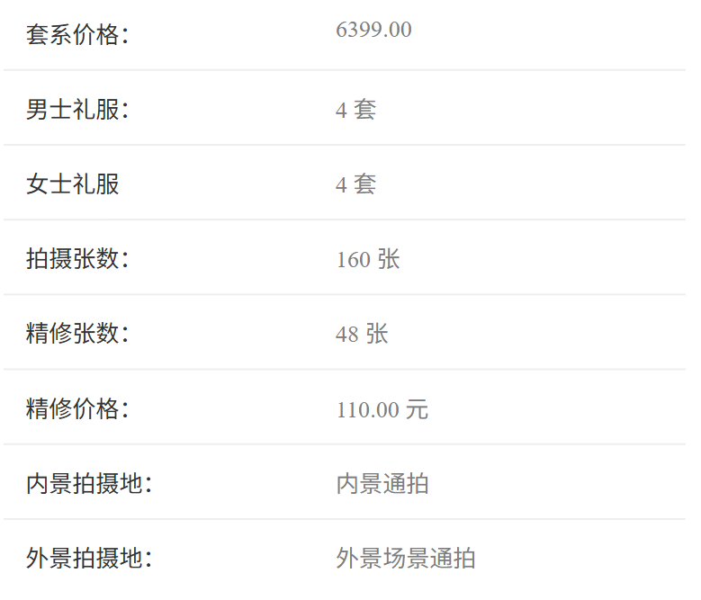

# 拍婚纱体验 📸

## 前言

也是很久没更新文章了，博客也没怎么维护，主要还是因为现在被生活的琐事缠住了，没有其他精力去写文章。

特别是技术类文章几乎是零产出，现在`AI`越来越厉害，一般的技术文章用`AI`就能完美解决，感觉没有写文章的必要。

加上如今公司-家里两点一线，没什么写文章的灵感。

不过最近也是把婚纱照拍完了，终于是能挤出一篇文章了。🎉

## 前期选择

拍婚纱嘛，肯定得先选一家靠谱的拍婚纱的店。我和我老婆是在小红书上找的，对比了几家的价格和评价，最终选择的是**6499**套餐的一家店。这个套餐后面他是给我们升级成了**7999**的套餐内容。

首先是服装是**4套**，然后我们选的是**2内2外**。精修照片是**48**张，升级后底片是全送，服装是任意选，然后就是一些相框和海报了，这都是包含在套餐内的。

## 拍摄过程

### 第一套外景苏州园林 🌿

购买套餐后，会预约拍摄时间，拍摄当天要**7:30**就到店里集合，化妆和挑选第一套衣服。第一套是拍外景，外景是苏州私家园林，乘坐套餐内包含的公司班车去园林拍摄，不需要自己打车。

衣服选择的是新中式。

我和我老婆都是i人，特意给我们选的E人摄影师，摄影师很专业也很热情，全程指导我们摆姿势和做动作。😄

大约拍摄到**11:00**的时候，第一套就拍摄完成了。后面就是回店里休息一会补补妆，继续拍第二套室内主纱。

### 第二套主纱内景 👰

主纱这边把店里的内景拍摄了有一半多吧，每个不同风格的场景摄影师都会带我们去拍，主要我老婆比较喜欢的是有花花草草内景。

### 第三套中式喜嫁内景 🏮

主纱拍完之后就马上去换衣服和化妆准备拍第三套中式喜嫁内景了，这中式喜嫁的衣服是真的重，加上前面2套拍摄都是穿的皮鞋，还要走来走去，导致脚地板疼。

中式内景这边主要就是表情一定要放开，要有那种**俏皮感**，由于拍摄之前，我和我老婆都没怎么练习表情，我这经典的假笑一眼就被摄影师看出来了，好在摄影师没有不耐烦，后面也是美美拍完准备第四套外景了。

### 第四套草地湖边外景 🌅

第四套也要乘坐公司班车去草地去拍，然后旁边就是湖，顺便可以拍湖景。草地拍摄的时候，光线也别好，拍摄出来特别有活人感。然后湖景主打的就是一个氛围感，特别是拍摄的时候是下午了，太阳刚好落山，这个时候拍摄出来的照片特别有氛围感。

### 拍摄完成 ✅

最后差不多**19:00**才拍摄完成，然后换了套普通的白寸衫，拍了张结婚照，到时候领结婚证的时候可以用。

## 选片 ⚠️

拍摄的时候会提前确认选片的时间，选片的时候坑就来了，由于没有提前做功课，选片又消费了**3588**，加了**30**多张精修，和升级了胡挑木的相框多送了一个磁吸相框。💸

选片的时候要从**200**多张底片里面选出**48**张精修入册，我和我老婆选了好几轮，最终确认下来是**80**张，由于时间关系，只能是买了精修套餐。

他这个**底片其实是全送的**，但是摄影师实在是拍得太好了，真的不好选，加上销售在那边一直推销，最终也是踩了个小坑。😅

## 后续

后面就是看精修的照片了，不过还没到预约的时间。

等后面精修的照片出来了，发几张出来给各位欣赏欣赏。🤞

## 总结

整体来说体验不错，唯一的踩坑点就是选片的时候，套餐本来只包含48张精修，如果选片的时候从底片里面选多了照片是需要额外付费的。需要注意的是套餐底片是全送的，选片是选**精修入册**的照片。