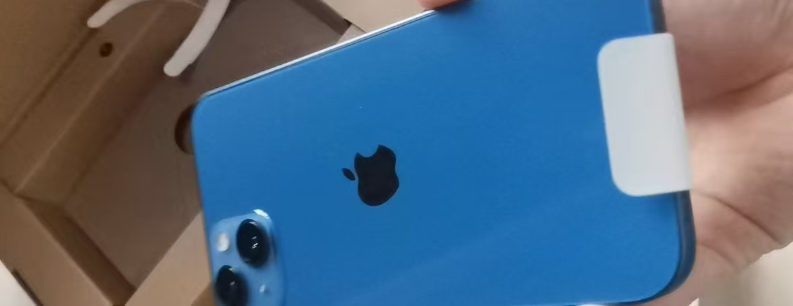
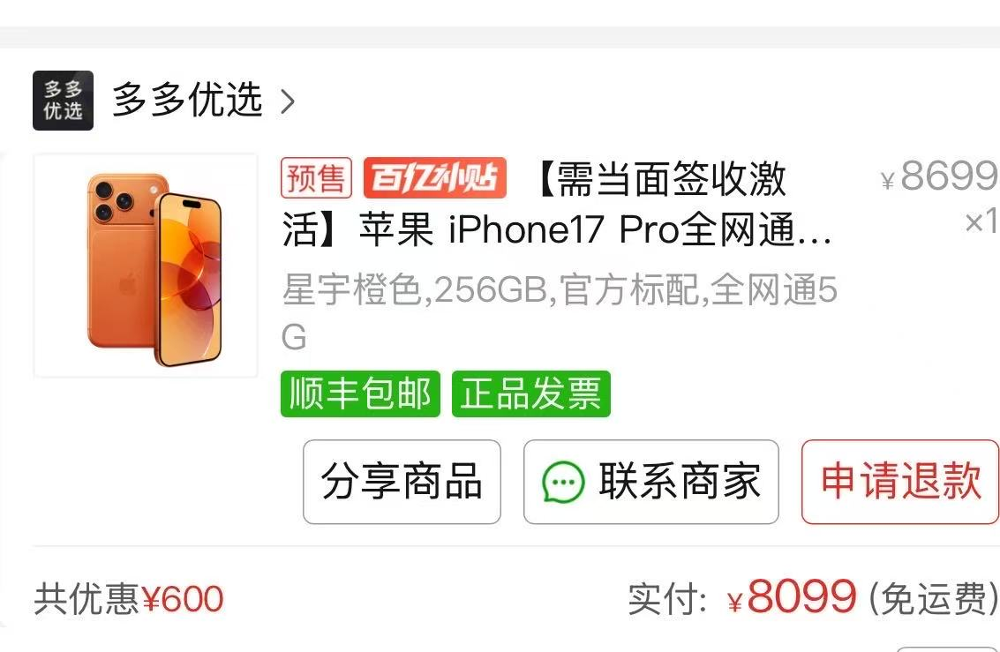
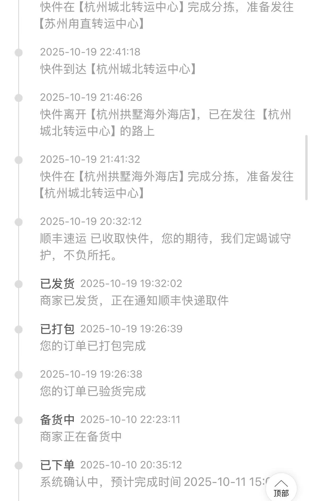
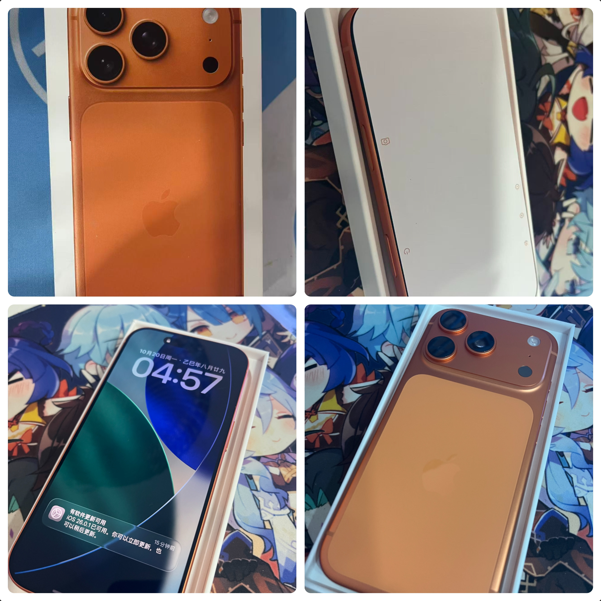
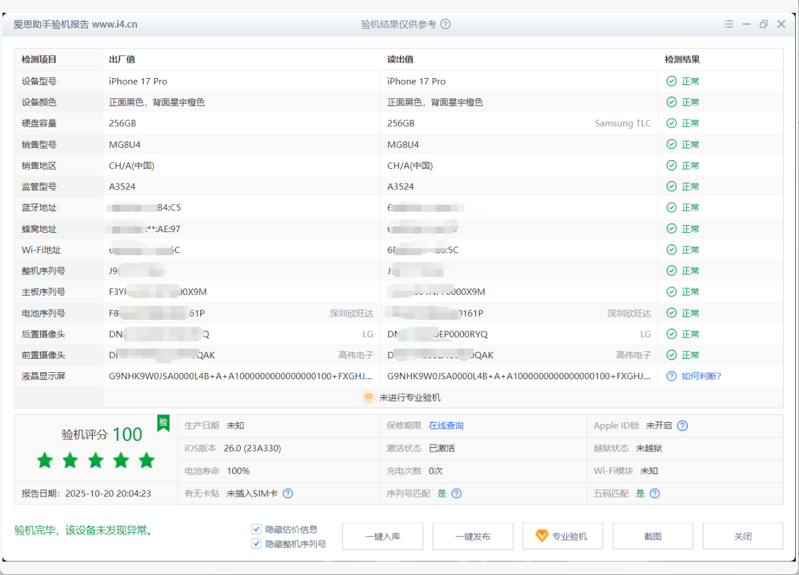

# 拼多多百亿补贴苹果17 Pro开箱

## 前言

目前使用的手机是`iPhone 13` `128G` 蓝色款，已经用了差不多3年半了，电池健康只有75%了，然后我非常喜欢更新系统，目前系统是`iOS 26.0`，这就导致了一个问题，那就是手机非常的卡，所以也是下定决心换手机了。

一开始是想着用国补买个`17 256G`基础版就行了，但是下半年这国补是真的领不到，所以只能去拼多多看看了。

## 退休

光荣退休

## 百亿补贴

在逛拼多多发现百亿补贴的`17`基础版和`pro`都挺便宜，`256G`价格分别是`5099`和`8099`，比官网和京东都便宜很多，但是需要抢，不是很好抢！！！

我一开始也是抱着试试的心态，第一波是抢`17`基础版，不出意外没抢到，下一波是晚上`8:00`,想着反正要换手机，要不试试`Pro`，结果还真让我抢到了橙色的`17`，然后8099拿下`iphone17 Pro 256G`。

## 预售

我不是直接抢的手机，而是抢的`600`元的卷，卷的有效期是一个小时，我也是犹豫了很久，最终才下单。下完单才发现我这个是预售，上面写的**9天内**发货， 不过卷也用了，也不能退，只能等了。

这9天可等死我了，期间也催过客服，并没有什么用，然后刷小红书发现有可能会被砍单，不过我的过了`48小时`也没有被砍，心也是放下来了。

也刷到了超过规定的时间没发货的，我也不知真假，不过我的是卡在最后时间才发货，我是10月**10号**买的，卡在最后一天**19号**晚上才发货。

然后我这个是**杭州**发货的。

## 开箱

顺丰快递还是给力，**20号**早上就收到快递员电话了，但是当时在上班，只能让他晚上过来。

下班后也是飞快地跑回家。

首先我的开箱步骤是：

1. 先检查手机盒子是否有明显的破损和开箱痕迹，检查后发现除了盒子有点灰没什么问题。
2. 然后检查盒子上面的序列号，在苹果官网查询：[查看保障状态 - AppleCare 与保修](https://checkcoverage.apple.com/?locale=zh_CN)，查询后是未激活的状态。
3. 接下来就是开箱了，打开包装盒，拿出手机查看摄像头是否有灰、屏幕是否有划痕、边框是否有磕碰，检查下来也是没有问题。
4. 最后就是开机激活，在系统设置-关于本机里面查看序列号和`IMEI`码和包装盒上的是否一致。

期间需要配合快递小哥完成拍照，我这个顺丰小哥还挺友好没有催我。大约也是花了**8分钟**左右完成从开箱到激活。

### 开箱图片

接下来是开箱图片，我是激活后才拍的，所以细节就不用在意了~

## 爱思检测

完成开箱和检查后，还可以用爱思助手进一步查看手机的状态，我这里直接把图放出来。

- 硬盘：`Samsung`三星
- 电池：深圳欣旺达
- 前置：高伟电子
- 后置：`LG`
- 屏幕：`G9N`

不知道这算是中奖还是普通还是踩雷了，哈哈。后续看使用起来是否有问题吧~

