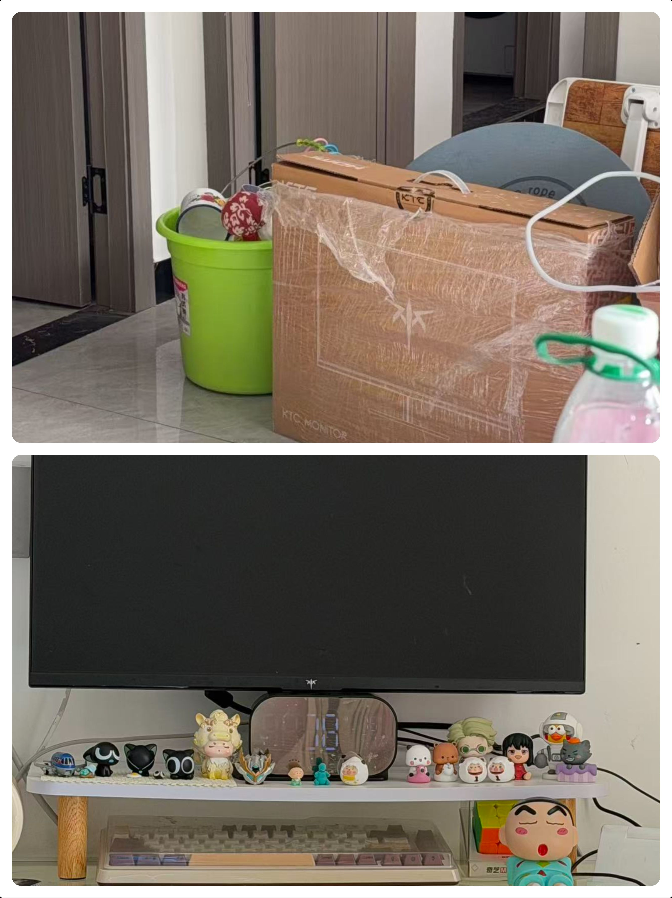
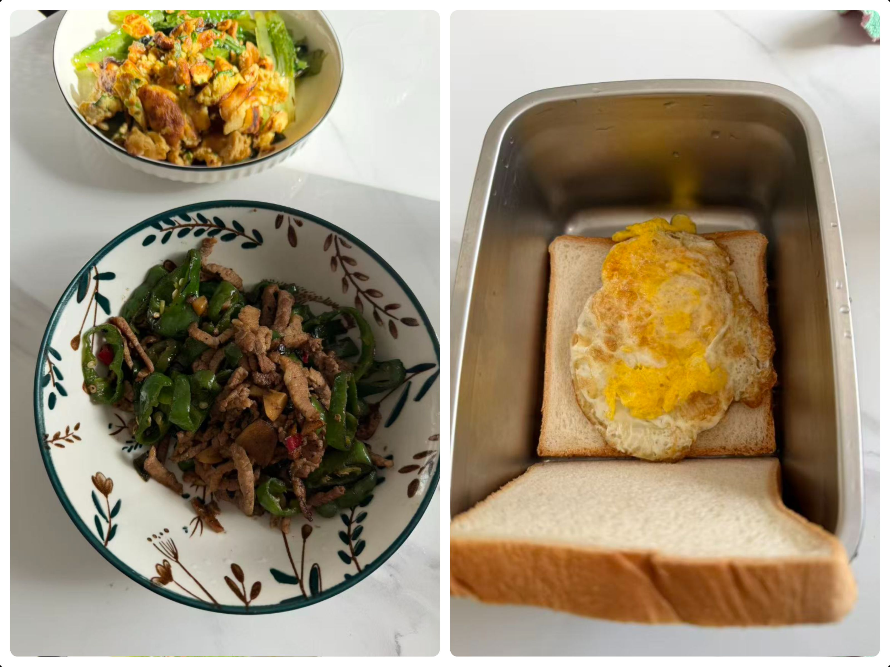

# 搬家-做饭周记

## 前言

[祝贺自己跳槽成功 - ZY知识库](https://blog.pljzy.top/posts/祝贺自己跳槽成功/祝贺自己跳槽成功/) 距离上篇跳槽文章已经过了2周了，我也是从旧公司离职了，这段时间还真忙，又是租房、然后搬家、交接项目一堆事。

简单的记录下这次搬家把。

## 旧家

这个地方我租了2年，除了厕所有点小有点潮湿外也没啥缺点了。

把我最重要的电脑打包好了。

## 新家

搞卫生、清东西累死了。

新家的阳台

## 厨艺展示

第二次抄辣椒炒肉，卖相可能不是太好，味道还是挺不错的。和第一次做鸡蛋面包。

