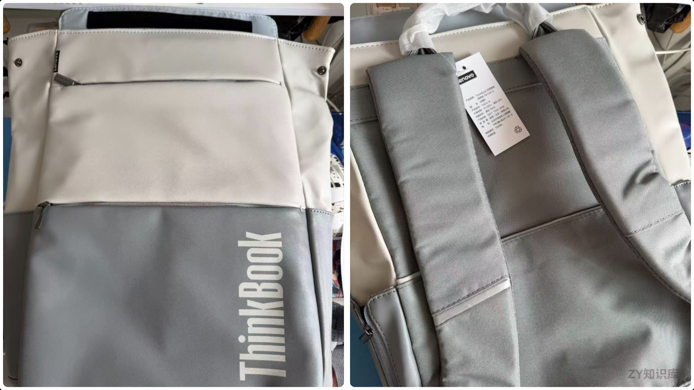
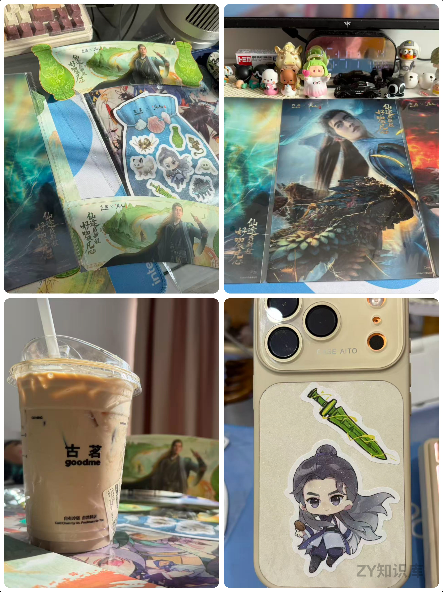

# 旧物新生，新包入手，还有一杯联动的甜

## 前言

生活就像一盒惊喜盲盒，这周打开来，满满都是温暖的碎片。旧电脑完成使命开启新旅程，新电脑包带着诚意抵达，还有一杯古茗与《凡人修仙传》联名的拿铁，让味蕾也坠入了仙侠世界。

## 旧电脑的“毕业礼”：联想拯救者Y7000 2019的回收之旅

看着那台陪伴我度过无数日夜的**联想拯救者Y7000 2019**，它曾陪我在游戏世界里冲锋陷阵，也在工作学习中默默支撑。这次决定让它“毕业”，选择了回收。从提交订单到质检完成，过程比想象中顺利。

原本以为只能回收**800-900**，回收的时候发现，用了5年多，电池健康还有**80%**以上，不得不佩服联想拯救者系列的质量了，用了这么久没出过问题（除了`windows`系统问题）

## 新电脑包的“见面礼”：ThinkBook双肩包的贴心抵达

上周买的**Thinkbook**送的双肩包到了，感觉外观不是特别好看。

日常通勤装电脑倒是够用。

## 一杯拿铁的“仙侠梦”：古茗×《凡人修仙传》联名特调

网上冲浪，发现凡人修仙传和古茗出联动套餐了，作为刚看完凡人修仙传的新粉必须支持一波。

果断点了一杯联名拿铁,看着桌上的《凡人修仙传》周边海报和手机壳上的韩立Q版形象，突然觉得生活里的小美好就是这样：一口饮品，一个爱好，就能把平凡的日子酿成诗。

## 结尾

这周的碎片，拼凑出的是一种充实又温柔的生活质感。旧物妥善告别，新物带着期待到来，还有一份味觉与兴趣的碰撞。愿我们都能在琐碎日常里，收集这些小确幸，把日子过成自己喜欢的模样。