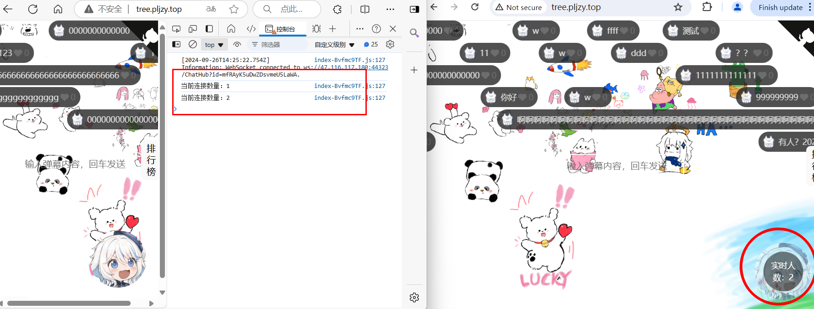

# 项目地址

项目后端地址：
- https://github.com/ZyPLJ/ZYTteeHole

项目前端页面地址：
- [ZyPLJ/TreeHoleVue (github.com)](https://github.com/ZyPLJ/TreeHoleVue) https://github.com/ZyPLJ/TreeHoleVue

目前项目测试访问地址：
- http://tree.pljzy.top/ 注意是http,输成https就访问到博客里面去了。

# 系列文章📖
- [.NET Core搭配Vue开源弹幕效果，实现一个评论小项目。好玩！ - 妙妙屋（zy） - 博客园 (cnblogs.com)](https://www.cnblogs.com/ZYPLJ/p/18403223) https://www.cnblogs.com/ZYPLJ/p/18403223
- [ZY知识库 · ZY - 弹幕树洞项目 (pljzy.top)](https://www.pljzy.top/blog/post/2b33f54a84901364.html) https://www.pljzy.top/blog/post/2b33f54a84901364.html
# 前言
接上一篇文章，无聊的时候做了个树洞项目，其实一开始打算做真正的树洞，但是奈何前端技术有限，只能去GitHub找找灵感💡，不巧看到了Vue弹幕项目，看了一下觉得挺不错就拿来用了。
那做这个项目的初衷是自己有个地方能倾述自己的想法，能够让自己随便吐槽。这个项目目前是没有记录评论的ip和用户信息的，全是匿名的，所以可以随便吐槽（当然需要保持素质）。
本篇文章主要讲一讲我是怎么实现实时消息和人数的。
# 实时消息、人数展示实现
## SignalR📖
既然是用.net写的项目，必然少不了 `SignalR`技术，最开始考虑使用消息实时性有如下几种方式：
1. WebSocket
2. SignalR
3. 轮询

最后综合考虑 `SignalR`，主要是使用起来简单，并且我要实现的功能也不复杂。
那么就简单讲下`SignalR`是什么：
> SignalR是一个由微软开发的实时通信框架，它简化了在C#中实现实时双向通信的过程。SignalR特别适用于需要实时交互的应用，如聊天程序、在线游戏、协同工作工具等。
> SignalR 支持以下用于处理实时通信的技术：
> - WebSockets
> - Server-Sent Events
> - 长轮询
> SignalR 自动选择服务器和客户端能力范围内的最佳传输方法。

简单来讲可以使用`SignalR`快速开发实时通讯项目。
## 代码实现
### 后端代码
我使用的是.net 8创建的项目，好像自带`SignalR`，如果没有则需要去Nuget去下载。
``` cs
Microsoft.AspNetCore.SignalR.Client
```
后端主要代码就是`Hub`类的实现
``` C#
public class ChatHub:Hub  
{  
    private static int _connectionCount;  
    public async Task SendComment(string content)    
    {    
		ZyComments comment = new ZyComments  
        {  
            Content = content  
        };       
        //广播评论给所有连接的客户端    
		await Clients.All.SendAsync("ReceiveComment", comment);  
    }
    public override Task OnConnectedAsync()  
    {        
	    // 每次客户端连接时增加计数  
        Interlocked.Increment(ref _connectionCount);  
        return base.OnConnectedAsync();  
    } 
    public override Task OnDisconnectedAsync(Exception? exception)  
    {        
	    // 每次客户端断开连接时减少计数  
        Interlocked.Decrement(ref _connectionCount);  
        // 广播连接数量变化    
		_ = BroadcastConnectionCount();  
        return base.OnDisconnectedAsync(exception);  
    } 
    public int GetConnectionCount()  
    {       
		// 获取当前连接数量  
        return _connectionCount;  
    }    
    public async Task BroadcastConnectionCount()  
    {        
	    await Clients.All.SendAsync("ConnectionCountChanged", _connectionCount);  
    }
}

```
简单描述就是用户评论的时候会调用`SendComment`方法将消息广播给当前连接的用户。然后在连接的时候将统计在线用户的计数++，断开连接的时候减少，并广播给连接的用户。
配置`Program.cs`文件：
``` C#
builder.Services.AddSignalR();

app.MapHub<ChatHub>("/ChatHub");
```
到此后端就编写完成了，是不是非常简单。
### 前端代码
安装客户端连接库：`npm install @microsoft/signalr`
``` js
import * as signalR from '@microsoft/signalr';

const connectionCount = ref(0);// 连接数量
let connection: signalR.HubConnection | null = null;  

connection = new signalR.HubConnectionBuilder()  
    .withUrl('https://localhost:44323/ChatHub') //后端地址 
    .build();
    
//订阅评论消息事件
connection.on('ReceiveComment', (comment: any) => {    
  comments.value.push(comment);  
  const _danmuMsg =  
      {        
	      ...
      }  
  danmaku.value.add(_danmuMsg)   
});

// 订阅连接数量变化事件  
connection.on('ConnectionCountChanged', (count) => {  
  connectionCount.value = count;  
  console.log(`当前连接数量：${count}`);  
});

//连接成功后调用BroadcastConnectionCount方法广播一次
connection.start().then(()=>{  
  connection.invoke('BroadcastConnectionCount')  
      .catch(err => console.error(err.toString()));  
}).catch(err => console.error(err.toString()));

......
```
上述展示部分代码，也很简单，当用户创建连接后调用一次计数方法广播一次，并订阅评论消息和连接数量变化事件，然后当收到广播时执行相应的逻辑。
代码所在区域：[TreeHoleVue/src/Views/Home.vue at master · ZyPLJ/TreeHoleVue (github.com)](https://github.com/ZyPLJ/TreeHoleVue/blob/master/src/Views/Home.vue) https://github.com/ZyPLJ/TreeHoleVue/blob/master/src/Views/Home.vue
# 效果展示💯


# 待完成的点🏷️
- [x] 评论限流
- [x] 关键词过滤

- [x] 将前端弹幕设置滚动频率、速度等写入配置文件或者数据库。
- [ ] 完成后台管理模块的编写。
- [x] 前端页面美化
- [x] 实时消息、人数展示
- [x] 评论点赞排行榜
- [ ] 高亮显示最新评论及最新评论时间
# 相关链接
- 前端弹幕效果使用开源项目：[https://github.com/hellodigua/vue-danmaku](https://github.com/hellodigua/vue-danmaku)
- [ASP.NET Core SignalR 入门 | Microsoft Learn](https://learn.microsoft.com/zh-cn/aspnet/core/tutorials/signalr?view=aspnetcore-8.0&tabs=visual-studio) https://learn.microsoft.com/zh-cn/aspnet/core/tutorials/signalr?view=aspnetcore-8.0&tabs=visual-studio)