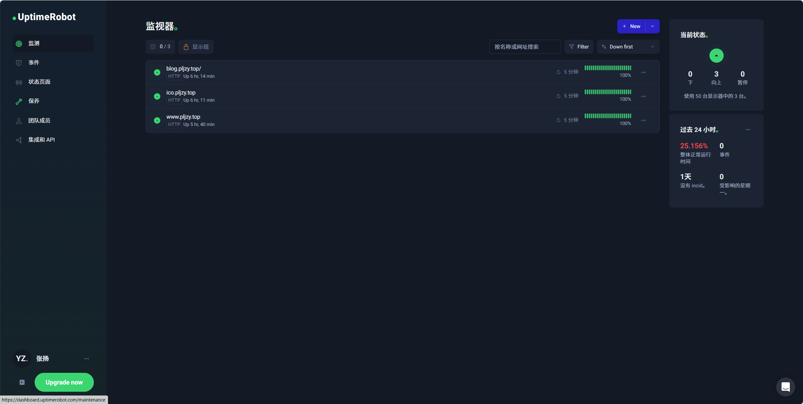
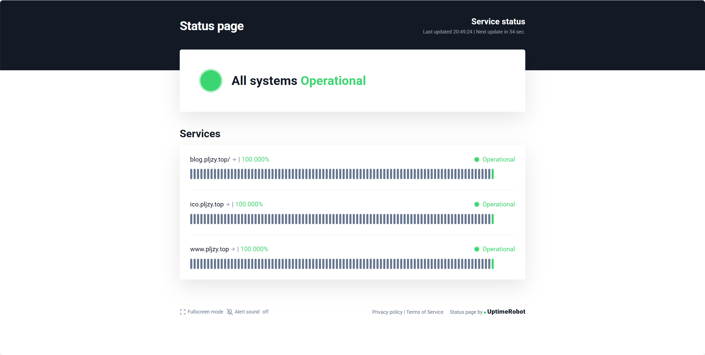

# 用uptimerobot监控网站状态

## 前言

在浏览博客的时候发现了一个免费好用的工具，它可以用来监控你的网站是否运行正常。

官网地址：[[免费状态页面 |正常运行时间机器人](https://uptimerobot.com/status-page/?ref=psp-footer)](https://uptimerobot.com/status-page/?ref=psp-footer)

## 开始部署

首先这个工具是免费+付费的模式，目前来说给用来监控博客的状态免费的账号是够用的。

### 注册账号

打开官网网址，使用邮箱注册一个账号，并根据提示完成第一个监控网站的创建即可使用。

登录后界面如图：

可以看到我这里创建了3个网站监视器。

## 状态页面

在Status Pages状态页面可以查看监视器的服务状态，目前我是才创建一天，所以前面的状态都是灰色的，绿色的状态表示网站能正常访问。

如果网站出现宕机，`uptimerobot`会通过邮件告知你。

## 总结

这是一个免费的网站健康检查的工具，当然除了网站，它还有`API`接口、端口、`SSL`监控等功能。