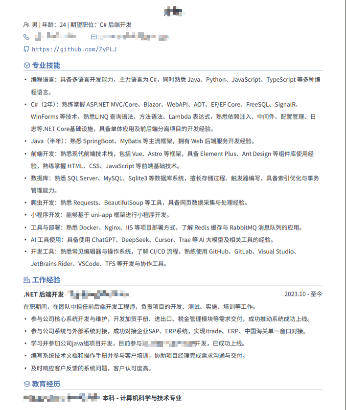
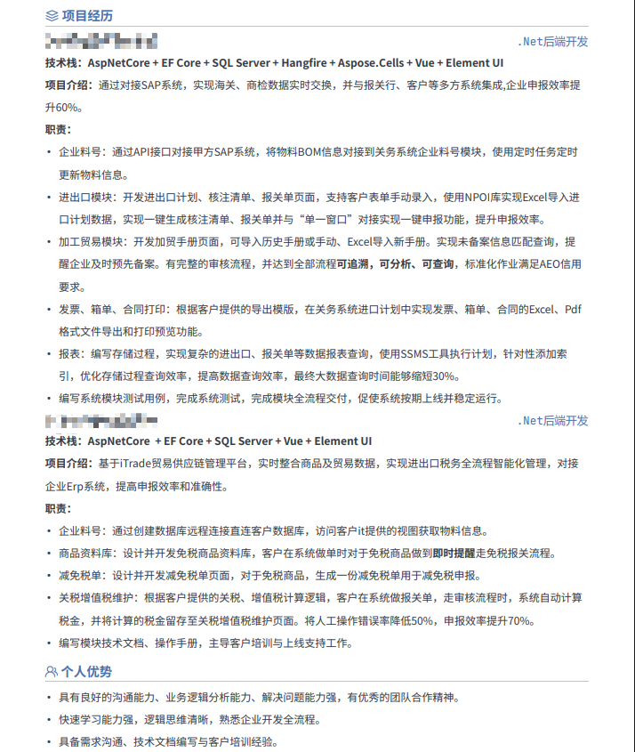

# 祝贺自己跳槽成功

## 故事的开头 📖

本人：

- 🎓 22届专科毕业->24届普通民本专升本毕业
- 💻 计算机专业，专科方向 `C#/.NET`，本科方向 `java`

负面 `buff` 叠满。😫

22年专科毕业，由于专升本原因，没有找开发岗位实习。

24年本科毕业，亲身体验就业市场的内卷，原本想在**长沙**找一份实习工作，发现工资低得可怜（3000-3500），且没有任何福利可言，真的是把普本的实习生**当日本人整**。💢

只能海投了📮，经过几周的投递与面试，收到2个offer。一个上海 `.Net`后端开发，工资**4.8k**不包住，考虑到生活压力，放弃。

另外一个苏州，也是`.Net`后端开发，工资**5k**，最后也是选择在苏州这家公司实习，生活压力相对比较小。

这一干就是2年，我从**23年10月**一直到现在，都在这家公司干，满打满算**2年1个月**，期间只有转正时涨了一次薪，我转正后的薪资是税前6K。拿着这么低的工资干了1年多，**今年7月**向公司提过涨薪，没有后文，所以我计划是年前离职，也就是**26年1月份**离职，这是我原本的打算。💔

这里应该就有人要问了，为什么不早点跳槽。主要原因有以下几点：

- 📜 学历不好，没有竞争力。
- 🏢 24年又去面试过几家，收到过一个offer，但试用期6个月工资打8折，且我是在职，加上当时离职意愿不坚定（认为现在的公司会给我涨薪的），所以放弃了。
- 👶 刚毕业经验不够，虽然我是**23年10月**就参加了工作，但是我是24年才毕业，24年跳槽企业默认实习经验不算工作经验，导致开的工资也和现在公司差不了多少，所以我想着混个工作经验再跳。

总结一下：23年10月到至今，工资6k，期间有跳槽，但都没有成功，于是下定决心**26年1月**离职。🔄

## 蓄力待发 💪

30年河东30年河西，莫欺上年穷。🔥

大学期间遇良友，亦师亦友，今年11月他内推我面试一家互联网公司，也是做 `.Net` 后端开发。

经过我**一周时间**的准备，背面试题，学新技术，我也是不负所托，通过了**机试**和**面试**。🎯

奈何这家公司位于三线城市，开个工资达不到我的预期，同时该公司开始实行**996**工作制，又把我劝退了。😮‍💨

好在通过这次面试，让我清楚的认识到自己的实力，面试通过也是给了我很大的**自信**，为后面的面试埋下了伏笔。🌟

## 绝地反击 🚀

虽然内推我的那家公司，薪资没谈拢，但是刚好**boss直聘**有一家公司约我面试，我也是立马休了年假准备面试。

机会来了挡都挡不住，因为我 `boss` 很久没打开过了，我只是登录了一下 `boss` 直聘的简历修改网站，可能 `boss` 的算法把我归为活跃用户了，竟然有公司主动联系我。🤩

第一轮面试：问了一些业务相关的问题，大约10分钟面试就结束了，当时觉得可能要凉了，便和女朋友出去吃饭了。吃饭途中收到**HR二面**的邀请，也是约的当天下午，吃完饭马不停蹄的跑回家准备二面。🍚➡️🏠

第二轮面试：问了一点编程基础，和项目相关的问题，面了大约20多分钟。

这家公司和上面内推我的公司问的问题完全不一样，第一家公司问的技术问题比较多，技术要求比较高，然后第二家公司主要是业务和项目问题比较多，技术要求不高。

可能因为第一家公司是互联网公司，第二家公司是制造业公司，虽然都是 `.Net`后端开发，但是方向是完全不同的，比如互联网公司可能是做电商系统、 `OA` 系统，而制造业公司大部分是 `MES`、`WMS` 等与生产有关的系统。🏭

最后也是收到了HR面试通过的通知，谈好了待遇，并给我发了入职通知书，我也是第二天就像现在的公司提出了离职，等待项目交接的完成，就能入职新公司了。📨✅

待遇比现在公司好很多，还是双休，薪资暂且保密~ 🤫

## 故事的结尾 🎬

历经2年，我也不在是之前啥也不懂的少年，经历了社会的毒打，体验到了生活的不易，好在有一堆知心朋友，还有个犟种女朋友陪着我。希望后面生活越来越好。🌈

学历不是终点，我也迷茫过，想开点，抓住机会也能逆风翻盘。🎉

## 简历鉴赏

请尽情拷打我的简历吧，敏感信息已打码。

