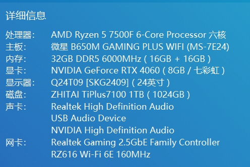

# 程序猿等于装机猿吗？

## 🧑‍💻前言

还记得当时刚入大学时，学的计算机专业，身边的长辈就会开玩笑地说：“计算机专业，那你肯定会修电脑”，每次听到这些话，我都会笑着回答：”会一点点“。但我清楚的知道，除了简单的装系统、装硬件，并不会修电脑。至今还是有很多人对程序猿有误解，认为程序猿一定会修电脑或者装电脑，但其实不然，我身边计算机专业的室友或者朋友，很少有会装机的，更别说修电脑了。

## 🖊为什么我会写这么一篇文章呢？

因为莫名其妙中枪了，我在`2024年10月16日`发布了一篇文章，主要描述自主装机如何选择配件的一篇文章。

这篇文章还是有很多网络喷子，我总结了一下如下一点：

1. 为什么要用水冷，水冷漏液你不知道吗？

对于风冷、水冷的选择，我也不想多说了，萝卜青菜各有所爱，解释再多也没用，就好比你活在这个`地球online`，摆脱不了生老病死、天灾人祸，与其和别人争论，不如坚定自己的选择。

当然对于喷子说我用水冷并不会让我写一篇文章去怼他。就在这周，出现了一位，我称之为bug的逆天存在。他的发言直击我脆弱的心灵，仿佛我整个人都被他看穿了，让我感到深深的后怕，世间竟有如此之人。

**话不多说看图：**

**图1：我一开始看到这个评论以为是简单的喷我，也不知道出于何种理由说出这种话，微星迫击炮超频`7500F`有什么问题吗，很显然他不是因为这个喷我，然后我在屏蔽的留言里面又看到了他的留言（微信自动屏蔽了），如下：**

扎心了，短短的几句话还真让他说到点子上了。

奴工码农这个标签好像真的很适合我，回想起曾经无数个下班的晚上，被客户艾特，打开电脑处理问题的日子，确实很像奴工，我无话可说。

穷逼这个标签好像也很适合我，从24年毕业，实习+转正工作也快2年了，身上的存款不见涨、工资不见涨，都说程序猿工资高，但对于我这个一无背景二无学历三无实力的人来说，高薪好像遥不可及。

这些标签我都不在意，但是他说`穷逼还装什么机`，我不能忍受这句话，从一个国人的口中说出！

一个人最终能达到什么资产，也许生来注定，也许能够逆天改命，任何人都不应该轻易的否定别人，何况素不相识。也许你很有钱，每天挥金如土，纸醉金迷，这是你的人生，没人干涉。同样有人食不果腹，解决上一顿饿下一顿，他也有他的人生，你无端端的指责他，有胳膊有腿，怎么会没钱？当然我这是打个比喻，这样的人生有什么意义？网络上的喷子活在世界上的意义是什么？

人穷志不穷，我对未来抱有无限的希望，不像某些人躲在阴暗的角落，像病毒一样到处散播。

我不知道这哥们受了什么刺激，我翻遍了我的留言区，并没有惹他，看样子是乱咬人。

先富带后富，当我看到最近的蒙古格格、天价耳环事件，心里不禁在想，人与人生来便有差距，努力做自己就行，人生不过短短3万天，活好每一天。

以上便是我的回复，与其说是回复，说是发泄更好，好在现在是法治社会，不像美利坚。。。。。。

## 🖥聊聊装机

自己组装一台电脑，也算是了却小时候的愿望，当时和朋友们打`lol`（英雄联盟），家里的电脑配置什么的记不清了，只知道玩的时候会闪退（内存不足），当时英雄联盟对于挂机玩家有惩罚，挂机了要开下一把可能要等10、20分钟，无赖只能让朋友们先开一把，自己在哪里等着惩罚时间过去，回想起来还真是怀恋。

所以当我大学毕业踏入社会，挣到人生的第一桶金就给自己装了一台机器，终于打英雄联盟不卡了，但是我自己却卡了😥

第一次了解到一台电脑需要哪些配件，还是大学第一躺专业课的时候才知道，当时老师拿着一台主机，告诉我们一台电脑需要主板、CPU、电源、内存、硬盘、散热器才能运行。后面因为专业需要，我也是买了一台笔记本，那时我才知道玩游戏需要搭配独立显卡的笔记本才行，不然会很卡。

到如今我也是能够自己从选择配件到组装配件最好装上系统点亮电脑的人了。

回归到文章标题，程序员一定会装机吗？很显然不是，我如果不是为了完成自己儿时的心愿，我也不会自己去组装一台电脑。

装机不难，装系统也不难，世间无难事只怕有心人。

最后我自己组装的电脑配置和效果图还是放出来一下，很多人没有看过我之前的文章，配置不高，`4060+7500F`

## 🔗其他链接

- [ZY知识库 · ZY - 小白装机-选配篇](https://pljzy.top/blog/post/60f2b0fa0e8491c9.html) https://pljzy.top/blog/post/60f2b0fa0e8491c9.html
- [ZY知识库 · ZY - 小白装机-装机篇](https://pljzy.top/blog/post/4030f7f731ddccd2.html) https://pljzy.top/blog/post/4030f7f731ddccd2.html
