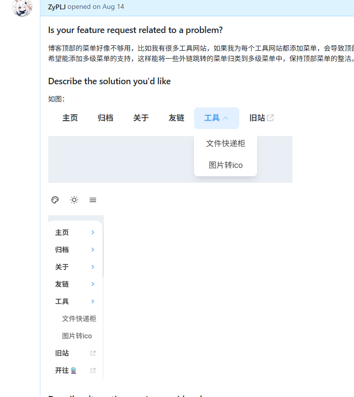
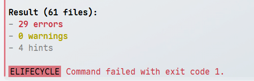
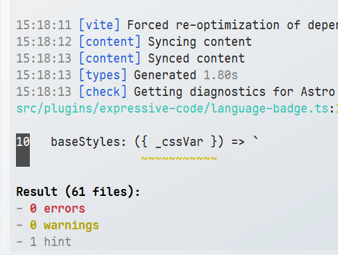
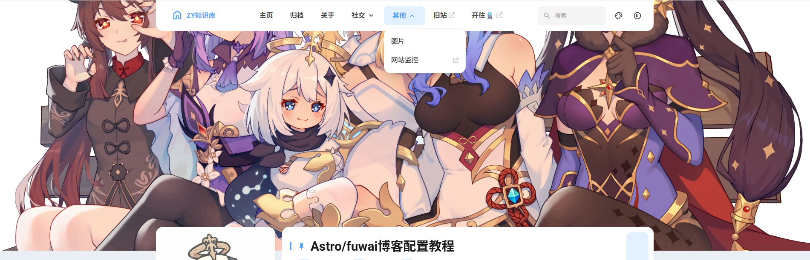
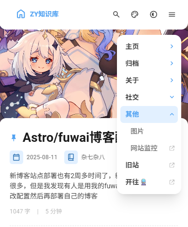

# 给博客添加多级菜单功能

## 📝 前言

目前我使用的这个博客模版是基于`Astro`的[fuwari](https://github.com/saicaca/fuwari/)开源博客模版。🌟

我也是经过了一系列魔改给博客添加了如下功能：🛠️

1. 🎵 音乐播放器
2. 📌 文章置顶固定（原作者仓库未合并的PR中找到的）
3. 💬 评论系统【基于twikoo】
4. 🔗 友链页面
5. 🎬 首图支持视频

如果对于这些功能感兴趣的可以参考下面的地址进行修改添加。🔧

`Github`地址：https://github.com/ZyPLJ/fuwai_zyplj 

我的旧站也是基于开源项目进行魔改的，旧站的菜单非常之多，迁移到新增后舍弃了很多菜单。因为新博客默认是不支持多级菜单的，我在之前在原作者项目中提过[PR](https://github.com/saicaca/fuwari/issues/596)，不过这种小功能，作者肯定是没时间去弄的，而且可能不符合作者的设计理念。🤔

那么只能自己动手做了，在提[PR](https://github.com/saicaca/fuwari/issues/596)之前我就自己尝试过，但是有点缺陷，后面也就没有提交代码，我的初版如图：



由于有点缺陷我也就没继续做下去，后面也是有人在`PR`中提到自己已经实现了，那我这次也是为后面的功能做准备，必须要把多级菜单搞定了。💪

## 🚀 开始操作

这次具体实现是参考 [Mizuki](https://github.com/matsuzaka-yuki/Mizuki)主题库实现的，参考下来，发现设计思路和我最初版是一致的，哈哈。😄

不过我把菜单图标去掉了，如果有喜欢菜单图标的可以自己参考然后修改，不是很难。

## ⚙️ config.ts

一步一步来，先在`types->config.ts`中的`NavBarLink`类型变量添加`children`类型声明

```ts
export type NavBarLink = {
	name: string;
	url: string;
	external?: boolean;
	children?: (NavBarLink | LinkPreset)[]; // 支持子菜单，可以是NavBarLink或LinkPreset
};
```

## 🎨 main.css

`styles->main.css`然后把css搞定，直接复制拿来用，注意放在`text-25`类名后面

```css
.text-25 {
    @apply text-black/25 dark:text-white/25
}

/* 下拉菜单样式 */
.dropdown-container {
    @apply relative;
}

.dropdown-menu {
    @apply absolute top-full left-0 pt-2 opacity-0 invisible pointer-events-none transition-all duration-200 ease-out transform translate-y-[-8px] z-50;
}

.dropdown-container:hover .dropdown-menu,
.dropdown-container:focus-within .dropdown-menu {
    @apply opacity-100 visible pointer-events-auto translate-y-0;
}

.dropdown-container:hover .dropdown-arrow,
.dropdown-container:focus-within .dropdown-arrow {
    @apply rotate-180;
}

.dropdown-content {
    @apply bg-[var(--float-panel-bg)] rounded-[var(--radius-large)] shadow-xl dark:shadow-none border border-black/5 dark:border-white/10 py-2 min-w-[12rem];
}

.dropdown-item {
    @apply flex items-center justify-between px-4 py-2.5 text-black/75 dark:text-white/75 hover:text-[var(--primary)] hover:bg-[var(--btn-plain-bg-hover)] transition-colors duration-150 font-medium;
}

.dropdown-item:first-child {
    @apply rounded-t-[calc(var(--radius-large)-0.5rem)];
}

.dropdown-item:last-child {
    @apply rounded-b-[calc(var(--radius-large)-0.5rem)];
}

/* 移动端菜单样式 */
.mobile-submenu {
    @apply max-h-0 overflow-hidden transition-all duration-300 ease-in-out;
}

.mobile-dropdown[data-expanded="true"] .mobile-submenu {
    @apply max-h-96;
}

.mobile-dropdown[data-expanded="true"] .mobile-dropdown-arrow {
    @apply rotate-180;
}

/* 响应式隐藏 */
@media (max-width: 768px) {
    .dropdown-container {
        @apply hidden;
    }
}

/* 无障碍支持 */
.dropdown-container:focus-within .dropdown-menu {
    @apply opacity-100 visible pointer-events-auto translate-y-0;
}

.dropdown-item:focus {
    @apply outline-none;
}

.mobile-dropdown button:focus {
    @apply outline-none;
}
```

## 🧩 DropdownMenu.astro

`components->widget->DropdownMenu.astro`

接下来新建`DropdownMenu.astro`组件把代码复制过来，代码比较多，就不细讲了，我也是用`AI`优化了一下`js`部分代码，为什么要优化，因为我在执行`pnpm check`代码检查的时候报错了,大部分是`ts`类型错误,如图：



```ts
---
import { Icon } from "astro-icon/components";
import { LinkPresets } from "../../constants/link-presets";
import { LinkPreset, type NavBarLink } from "../../types/config";
import { url } from "../../utils/url-utils";

interface Props {
	link: NavBarLink;
	class?: string;
}

const { link, class: className } = Astro.props;

// 转换子菜单中的LinkPreset为NavBarLink
const processedLink = {
	...link,
	children: link.children?.map((child: NavBarLink | LinkPreset): NavBarLink => {
		if (typeof child === "number") {
			return LinkPresets[child];
		}
		return child;
	}),
};

const hasChildren = processedLink.children && processedLink.children.length > 0;
---

<div class:list={["dropdown-container", className]} data-dropdown>
	{hasChildren ? (
		<button 
			class="btn-plain scale-animation rounded-lg h-11 font-bold px-5 active:scale-95 dropdown-trigger"
			aria-expanded="false"
			aria-haspopup="true"
			data-dropdown-trigger
		>
			<div class="flex items-center">
				{processedLink.name}
				<Icon name="material-symbols:keyboard-arrow-down-rounded" class="text-[1.25rem] transition-transform duration-200 dropdown-arrow ml-1" />
			</div>
		</button>
		<div class="dropdown-menu" data-dropdown-menu>
			<div class="dropdown-content">
				{processedLink.children?.map((child) => (
					<a 
						href={child.external ? child.url : url(child.url)} 
						target={child.external ? "_blank" : null}
						class="dropdown-item"
						aria-label={child.name}
					>
						<div class="flex items-center">
							<span>{child.name}</span>
						</div>
						{child.external && (
							<Icon name="fa6-solid:arrow-up-right-from-square" class="text-[0.75rem] text-black/25 dark:text-white/25" />
						)}
					</a>
				))}
			</div>
		</div>
	) : (
		<a 
			aria-label={processedLink.name} 
			href={processedLink.external ? processedLink.url : url(processedLink.url)} 
			target={processedLink.external ? "_blank" : null}
			class="btn-plain scale-animation rounded-lg h-11 font-bold px-5 active:scale-95"
		>
			<div class="flex items-center">
				{processedLink.name}
				{processedLink.external && <Icon name="fa6-solid:arrow-up-right-from-square" class="text-[0.875rem] transition -translate-y-[1px] ml-1 text-black/[0.2] dark:text-white/[0.2]" />}
			</div>
		</a>
	)}
</div>

<style>
	.dropdown-container {
		@apply relative;
	}

	.dropdown-menu {
		@apply absolute top-full left-0 pt-2 opacity-0 invisible pointer-events-none transition-all duration-200 ease-out transform translate-y-[-8px] z-50;
	}

	.dropdown-container:hover .dropdown-menu,
	.dropdown-container:focus-within .dropdown-menu {
		@apply opacity-100 visible pointer-events-auto translate-y-0;
	}

	.dropdown-container:hover .dropdown-arrow,
	.dropdown-container:focus-within .dropdown-arrow {
		@apply rotate-180;
	}

	.dropdown-content {
		@apply bg-[var(--float-panel-bg)] rounded-[var(--radius-large)] shadow-xl dark:shadow-none border border-black/5 dark:border-white/10 py-2 min-w-[12rem];
	}

	.dropdown-item {
		@apply flex items-center justify-between px-4 py-2.5 text-black/75 dark:text-white/75 hover:text-[var(--primary)] hover:bg-[var(--btn-plain-bg-hover)] transition-colors duration-150 font-medium;
	}

	.dropdown-item:first-child {
		@apply rounded-t-[calc(var(--radius-large)-0.5rem)];
	}

	.dropdown-item:last-child {
		@apply rounded-b-[calc(var(--radius-large)-0.5rem)];
	}

	/* 移动端隐藏下拉菜单 */
	@media (max-width: 768px) {
		.dropdown-container {
			@apply hidden;
		}
	}
</style>

<script>
    // 键盘导航支持
    document.addEventListener('DOMContentLoaded', () => {
        const dropdowns = document.querySelectorAll('[data-dropdown]');

        // 点击外部关闭下拉菜单
        const handleDocumentClick = (e: Event) => {
            dropdowns.forEach(dropdown => {
                if (!dropdown.contains(e.target as Node)) {
                    const trigger = dropdown.querySelector('[data-dropdown-trigger]') as HTMLElement;
                    const menu = dropdown.querySelector('[data-dropdown-menu]') as HTMLElement;
                    if (trigger && menu) {
                        closeDropdown(trigger, menu);
                    }
                }
            });
        };

        // 键盘事件处理函数
        const handleTriggerKeydown = (
            e: KeyboardEvent,
            trigger: HTMLElement,
            menu: HTMLElement,
            items: NodeListOf<HTMLElement>
        ) => {
            switch (e.key) {
                case 'Enter':
                case ' ':
                    e.preventDefault();
                    toggleDropdown(trigger, menu);
                    break;
                case 'ArrowDown':
                    e.preventDefault();
                    openDropdown(trigger, menu);
                    if (items.length > 0) {
                        items[0].focus();
                    }
                    break;
                case 'Escape':
                    closeDropdown(trigger, menu);
                    break;
            }
        };

        // 菜单项键盘导航处理
        const handleItemKeydown = (
            e: KeyboardEvent,
            index: number,
            items: NodeListOf<HTMLElement>,
            trigger: HTMLElement,
            menu: HTMLElement
        ) => {
            switch (e.key) {
                case 'ArrowDown':
                    e.preventDefault();
                    const nextIndex = (index + 1) % items.length;
                    items[nextIndex].focus();
                    break;
                case 'ArrowUp':
                    e.preventDefault();
                    const prevIndex = (index - 1 + items.length) % items.length;
                    items[prevIndex].focus();
                    break;
                case 'Escape':
                    closeDropdown(trigger, menu);
                    trigger.focus();
                    break;
            }
        };

        // 初始化下拉菜单
        dropdowns.forEach(dropdown => {
            const trigger = dropdown.querySelector('[data-dropdown-trigger]') as HTMLElement;
            const menu = dropdown.querySelector('[data-dropdown-menu]') as HTMLElement;
            const items = dropdown.querySelectorAll('.dropdown-item') as NodeListOf<HTMLElement>;

            if (!trigger || !menu) return;

            // 触发器键盘事件
            trigger.addEventListener('keydown', (e) => {
                handleTriggerKeydown(e as KeyboardEvent, trigger, menu, items);
            });

            // 菜单项键盘事件
            items.forEach((item, index) => {
                item.addEventListener('keydown', (e) => {
                    handleItemKeydown(e as KeyboardEvent, index, items, trigger, menu);
                });
            });
        });

        document.addEventListener('click', handleDocumentClick);
    });

    // 下拉菜单状态管理
    const toggleDropdown = (trigger: HTMLElement, menu: HTMLElement) => {
        const isOpen = trigger.getAttribute('aria-expanded') === 'true';
        isOpen ? closeDropdown(trigger, menu) : openDropdown(trigger, menu);
    };

    const openDropdown = (trigger: HTMLElement, menu: HTMLElement) => {
        trigger.setAttribute('aria-expanded', 'true');
        updateMenuClasses(menu, false);
    };

    const closeDropdown = (trigger: HTMLElement, menu: HTMLElement) => {
        trigger.setAttribute('aria-expanded', 'false');
        updateMenuClasses(menu, true);
    };

    // 菜单类名管理
    const updateMenuClasses = (menu: HTMLElement, isClosing: boolean) => {
        const classesToAdd = isClosing
            ? ['opacity-0', 'invisible', 'pointer-events-none', 'translate-y-[-8px]']
            : ['opacity-100', 'visible', 'pointer-events-auto', 'translate-y-0'];

        const classesToRemove = isClosing
            ? ['opacity-100', 'visible', 'pointer-events-auto', 'translate-y-0']
            : ['opacity-0', 'invisible', 'pointer-events-none', 'translate-y-[-8px]'];

        menu.classList.remove(...classesToRemove);
        menu.classList.add(...classesToAdd);
    };
</script>
```

## 📱 NavMenuPanel.astro

`components->widget->NavMenuPanel.astro`

`NavMenuPanel.astro`是[fuwari](https://github.com/saicaca/fuwari/)主题原本的菜单组件，也是需要修改的，因为修改的地方还比较多，我就直接把全部代码贴出来。

```ts
---
import { Icon } from "astro-icon/components";
import { LinkPresets } from "../../constants/link-presets";
import { LinkPreset, type NavBarLink } from "../../types/config";
import { url } from "../../utils/url-utils";

interface Props {
	links: NavBarLink[];
}

// 处理links中的LinkPreset转换
const processedLinks = Astro.props.links.map(
	(link: NavBarLink): NavBarLink => ({
		...link,
		children: link.children?.map(
			(child: NavBarLink | LinkPreset): NavBarLink => {
				if (typeof child === "number") {
					return LinkPresets[child];
				}
				return child;
			},
		),
	}),
);
---
<div id="nav-menu-panel" class:list={["float-panel float-panel-closed absolute transition-all fixed right-4 px-2 py-2 max-h-[80vh] overflow-y-auto"]}>
    {processedLinks.map((link) => (
            <div class="mobile-menu-item">
                {link.children && link.children.length > 0 ? (
                    <!-- 有子菜单的项目 -->
                        <div class="mobile-dropdown" data-mobile-dropdown>
                            <button
                                    class="group flex justify-between items-center py-2 pl-3 pr-1 rounded-lg gap-8 w-full text-left
                            hover:bg-[var(--btn-plain-bg-hover)] active:bg-[var(--btn-plain-bg-active)] transition"
                                    data-mobile-dropdown-trigger
                                    aria-expanded="false"
                            >
                                <div class="transition text-black/75 dark:text-white/75 font-bold group-hover:text-[var(--primary)] group-active:text-[var(--primary)]">
                                    {link.name}
                                </div>
                                <Icon name="material-symbols:keyboard-arrow-down-rounded"
                                      class="transition text-[1.25rem] text-[var(--primary)] mobile-dropdown-arrow duration-200"
                                />
                            </button>
                            <div class="mobile-submenu" data-mobile-submenu>
                                {link.children.map((child) => {
                                    const childLink = child as NavBarLink;
                                    return (
                                            <a
                                                    href={childLink.external ? childLink.url : url(childLink.url)}
                                                    class="group flex justify-between items-center py-2 pl-6 pr-1 rounded-lg gap-8 hover:bg-[var(--btn-plain-bg-hover)] active:bg-[var(--btn-plain-bg-active)] transition"
                                                    target={childLink.external ? "_blank" : null}
                                            >
                                                <div class="transition text-black/60 dark:text-white/60 font-medium group-hover:text-[var(--primary)] group-active:text-[var(--primary)]">
                                                    {childLink.name}
                                                </div>
                                                {childLink.external && <Icon name="fa6-solid:arrow-up-right-from-square" class="transition text-[0.75rem] text-black/25 dark:text-white/25 -translate-x-1" />}
                                            </a>
                                    );
                                })}
                            </div>
                        </div>
                ) : (
                    <!-- 普通链接项目 -->
                        <a href={link.external ? link.url : url(link.url)} class="group flex justify-between items-center py-2 pl-3 pr-1 rounded-lg gap-8
                    hover:bg-[var(--btn-plain-bg-hover)] active:bg-[var(--btn-plain-bg-active)] transition
                "
                           target={link.external ? "_blank" : null}
                        >
                            <div class="transition text-black/75 dark:text-white/75 font-bold group-hover:text-[var(--primary)] group-active:text-[var(--primary)]">
                                {link.name}
                            </div>
                            {!link.external && <Icon name="material-symbols:chevron-right-rounded"
                                                     class="transition text-[1.25rem] text-[var(--primary)]"
                            />}
                            {link.external && <Icon name="fa6-solid:arrow-up-right-from-square"
                                                    class="transition text-[0.75rem] text-black/25 dark:text-white/25 -translate-x-1"
                            />}
                        </a>
                )}
            </div>
    ))}
</div>

<style>
    .mobile-submenu {
        @apply max-h-0 overflow-hidden transition-all duration-300 ease-in-out;
    }

    .mobile-dropdown[data-expanded="true"] .mobile-submenu {
        @apply max-h-96;
    }

    .mobile-dropdown[data-expanded="true"] .mobile-dropdown-arrow {
        @apply rotate-180;
    }
</style>

<script>
    document.addEventListener('DOMContentLoaded', function() {
        const mobileDropdowns = document.querySelectorAll('[data-mobile-dropdown]');

        mobileDropdowns.forEach(dropdown => {
            const trigger = dropdown.querySelector('[data-mobile-dropdown-trigger]');
            const submenu = dropdown.querySelector('[data-mobile-submenu]');

            if (!trigger || !submenu) return;

            trigger.addEventListener('click', function(e) {
                e.preventDefault();
                const isExpanded = dropdown.getAttribute('data-expanded') === 'true';

                // 关闭其他打开的下拉菜单
                mobileDropdowns.forEach(otherDropdown => {
                    if (otherDropdown !== dropdown) {
                        otherDropdown.setAttribute('data-expanded', 'false');
                        const otherTrigger = otherDropdown.querySelector('[data-mobile-dropdown-trigger]');
                        if (otherTrigger) {
                            otherTrigger.setAttribute('aria-expanded', 'false');
                        }
                    }
                });

                // 切换当前下拉菜单
                const newState = !isExpanded;
                dropdown.setAttribute('data-expanded', newState.toString());
                trigger.setAttribute('aria-expanded', newState.toString());
            });
        });
    });
</script>
```

## 🧭 Navbar.astro

`components->Navbar.astro`

接下来修改`Navbar.astro`组件差不多就快完工了，这个组件只修改了2处，首先导入我们上面创建的`DropdownMenu`组件，然后把原本的代码替换一下就行了。

```ts
import DropdownMenu from "./widget/DropdownMenu.astro";


/*<div class="hidden md:flex">
    {links.map((l) => {
        return <a aria-label={l.name} href={l.external ? l.url : url(l.url)} target={l.external ? "_blank" : null}
                  class="btn-plain scale-animation rounded-lg h-11 font-bold px-5 active:scale-95"
        >
            <div class="flex items-center">
                {l.name}
                {l.external && <Icon name="fa6-solid:arrow-up-right-from-square" class="text-[0.875rem] transition -translate-y-[1px] ml-1 text-black/[0.2] dark:text-white/[0.2]"></Icon>}
            </div>
        </a>;
    })}
</div>*/
<div class="hidden md:flex">
    {links.map((l) => {
        return <DropdownMenu link={l} />;
    })}
</div>
```

## ⚙️ config.ts 

`src->config.ts`

最后修改`config.ts`配置文件就行了

```ts
export const navBarConfig: NavBarConfig = {
	links: [
		LinkPreset.Home,
		LinkPreset.Archive,
		LinkPreset.About,
		{
			name: "社交",
			url: "/links/",
			children: [LinkPreset.Links],
		},
		{
			name: "其他",
			url: "/content/",
			children: [
				LinkPreset.Images, // 如果没有lsky.pro图床，则注释掉 https://docs.lsky.pro/archive/free/v2/
				{
					name: "网站监控",
					url: "https://stats.uptimerobot.com/f3bIMzwfwF",
					external: true,
				},
			],
		},
		{
			name: "旧站",
			url: "https://pljzy.top", // Internal links should not include the base path, as it is automatically added
			external: true, // Show an external link icon and will open in a new tab
		},
		{
			name: "开往🚆",
			url: "https://www.travellings.cn/go.html", // Internal links should not include the base path, as it is automatically added
			external: true, // Show an external link icon and will open in a new tab
		},
	],
};
```

## 🎉 实现效果

首先`pnpm check`✅



可以看到是没有错误的了

然后`pnpm dev`运行项目





## 📋 总结

对于[fuwari](https://github.com/saicaca/fuwari/)博客模版添加多级菜单只需要修改6处地方。🔧

1. 📝 types->config.ts
2. 🎨 styles->main.css
3. 🧩 components->widget->DropdownMenu.astro
4. 📱 components->widget->NavMenuPanel.astro
5. 🧭 components->Navbar.astro
6. ⚙️ src->config.ts

对于开源的博客，自己虽然可以任意魔改，但要保持初心~ ❤️