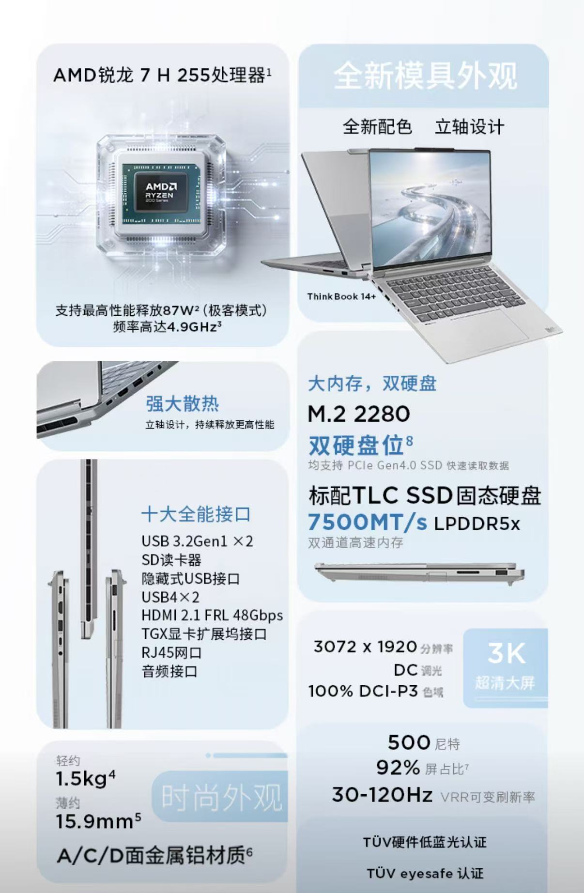
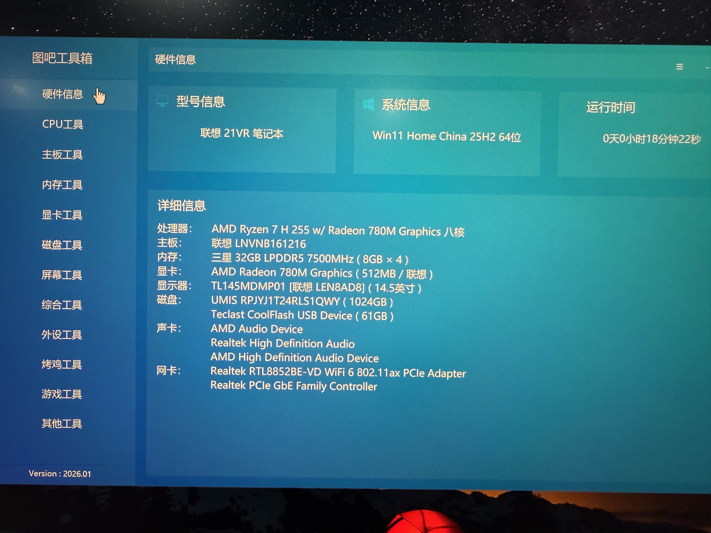
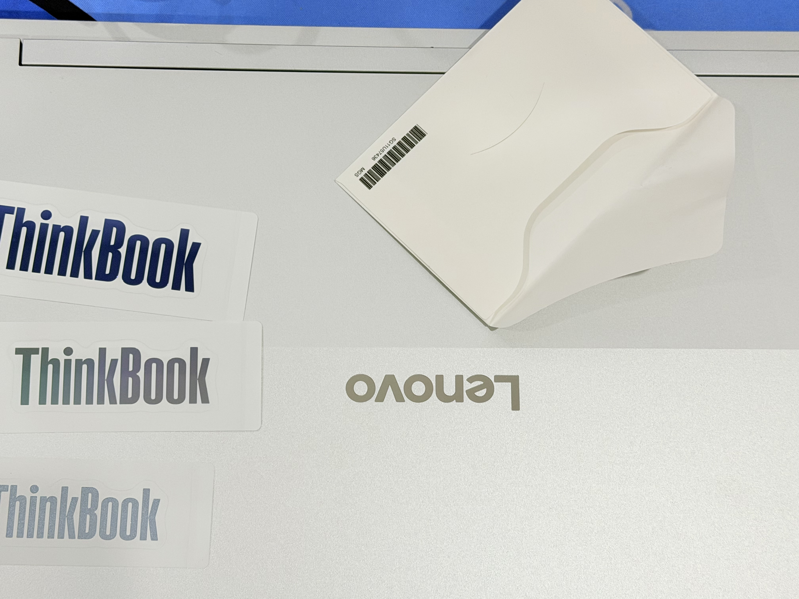
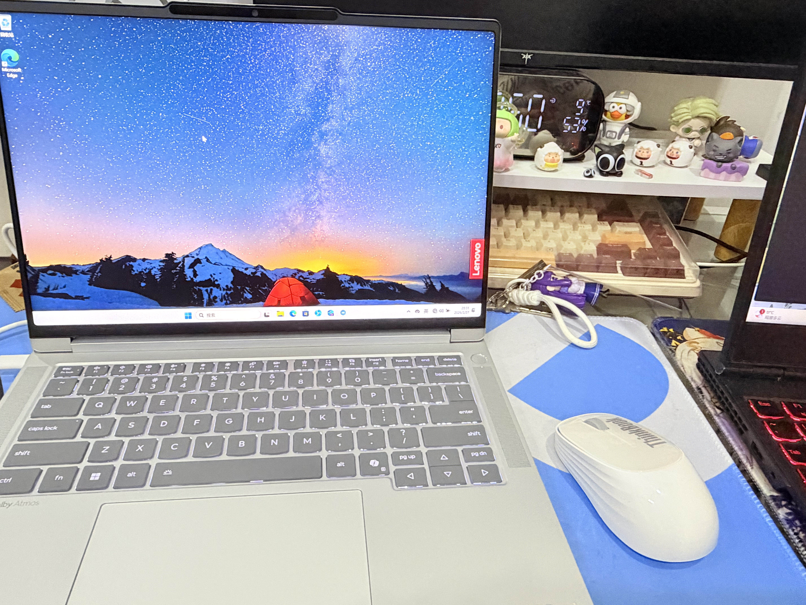
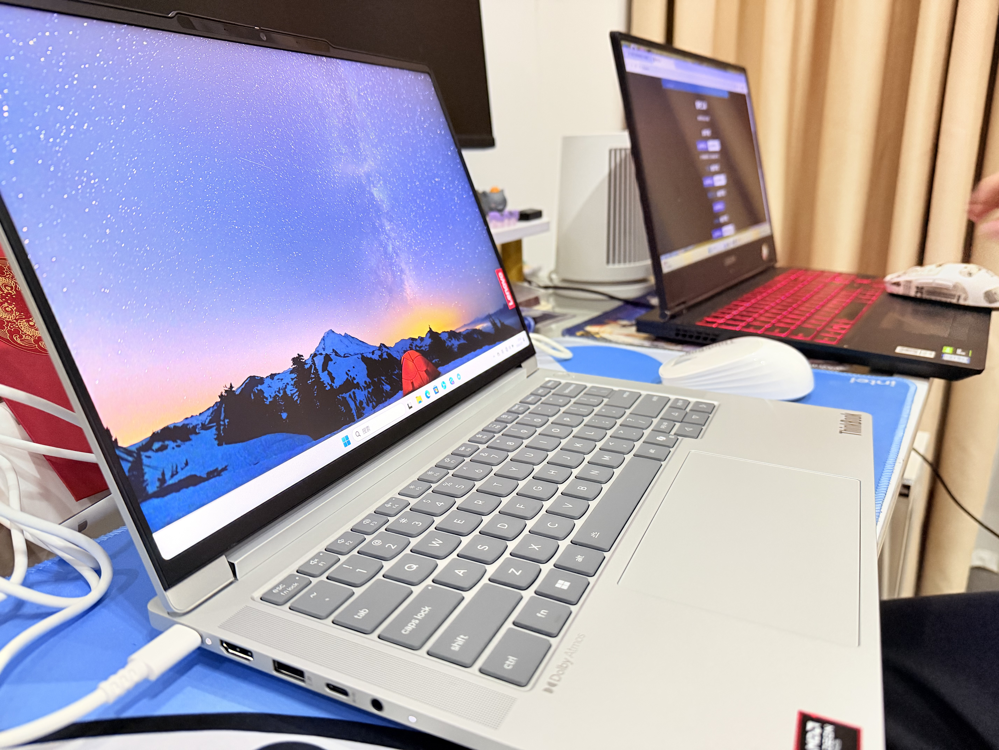

# 联想Thinkbook14+ 2026 锐龙7 H255 开箱 📦✨

## 前言 💭

目前办公我用的电脑还是19年买的联想拯救者 **Y7000 i5** 版本的，过去这么久，已经无法满足我的办公需求了 😫。

所以我也是看了对比了很久的笔记本电脑，决定换一台新的笔记本 🆕。

一开始我其实想等 **Thinkbook14+ 2026** 新酷睿版本出来的。不出意外，我刚下单买锐龙版本的，新酷睿版本就开始预约了 ⏰。

不过看了一眼新酷睿的价格还是偏高的 💸，酷睿版本内存是非板载的，后续能自己升级，反正锐龙7也够用，开箱没质量问题我也就选择留下来了 ✅。

## 配置介绍 ⚙️

*   **处理器** 🧠：搭载 **AMD Ryzen™ 7 H 255** 移动处理器，极客模式性能释放 **87W** 🚀。
*   **显卡** 🎮：集成 **AMD Radeon™ 780M** 核心显卡。
*   **内存** 💾：板载 **32GB LPDDR5x 7500MT/s** 高频内存。
*   **硬盘** 💿：配备 **1TB M.2 2280 PCIe Gen 4 TLC** 固态硬盘，双硬盘位。
*   **屏幕** 🖥️：**14.5** 英寸 **IPS LED** 显示屏，3K分辨率 (3072 × 1920)，支持 **120Hz** 高刷新率，峰值亮度达到 **500nits** ☀️。
*   **尺寸重量** 🎒：整机厚度约 **15.9mm**，重量约 **1.5kg**。

## 开箱 🔓

### 验机流程（仅供参考）📝

1.  **检查外包装** 📦
    *   封条是否完整 🔒。
    *   SN码核对 🔢。
    *   纸箱是否有明显的外观损伤，如挤压、水浸 💧。
2.  **首次开机（跳过联网激活）** 💻
    *   在联网界面输入 `Shift+F10` 或者 `Shift+FN+F10` 后，在弹出的命令窗口输入：`oobe\bypassnro` 后回车 ↩️，等待电脑重启后，再次回到联网界面就可以选择（我没有Internet连接）跳过联网 🚫🌐。
3.  **图吧工具箱** 🧰
    *   可以先用u盘下载一个 [图吧工具箱官方网站 - DIY爱好者的必备工具合集](https://www.tbtool.cn/)（https://www.tbtool.cn/）， 然后测一测屏幕有没有坏点 👁️，烤鸡时，CPU性能释放有没有问题 🔥，硬盘有没有问题 💾。
4.  **键盘与触控板测试** ⌨️，检查键盘和触控板是否有失灵的情况。
5.  **接口测试** 🔌，检测电脑接口是否都能正常工作。

做完这些检测后就可以进行激活联网了 🎉。

### 配置信息 📊

### 实机图片 📸

---

## 📝 总结

AI总结：这次从老旧的 Y7000 升级到 ThinkBook 14+ 2026 锐龙版，整体体验提升巨大！✨ 虽然错过了可升级内存的酷睿版，但 **R7 H255 + 32GB 大内存** 的组合完全能满足未来几年的办公和轻度创作需求 💼。3K 120Hz 的高刷屏看起来非常舒服，1.5kg 的重量也让通勤变得轻松许多 🎒。只要验机流程走对，避开激活陷阱，这绝对是一台性价比极高的全能本，值得入手！💯👍