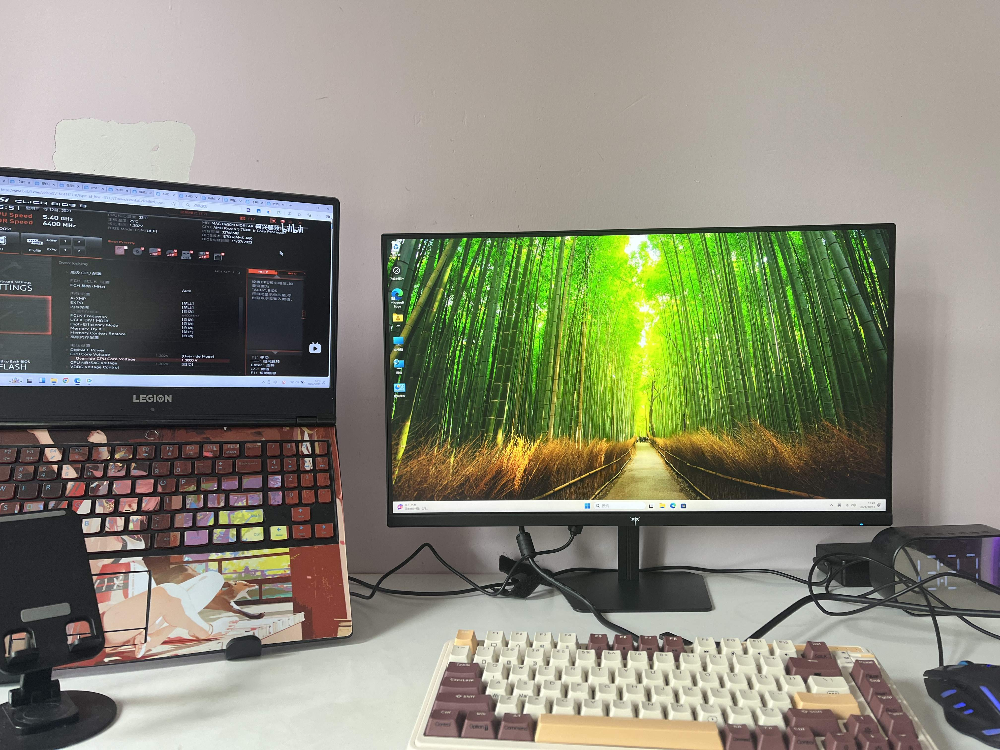
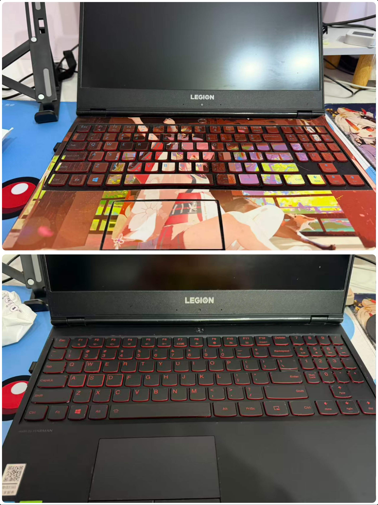
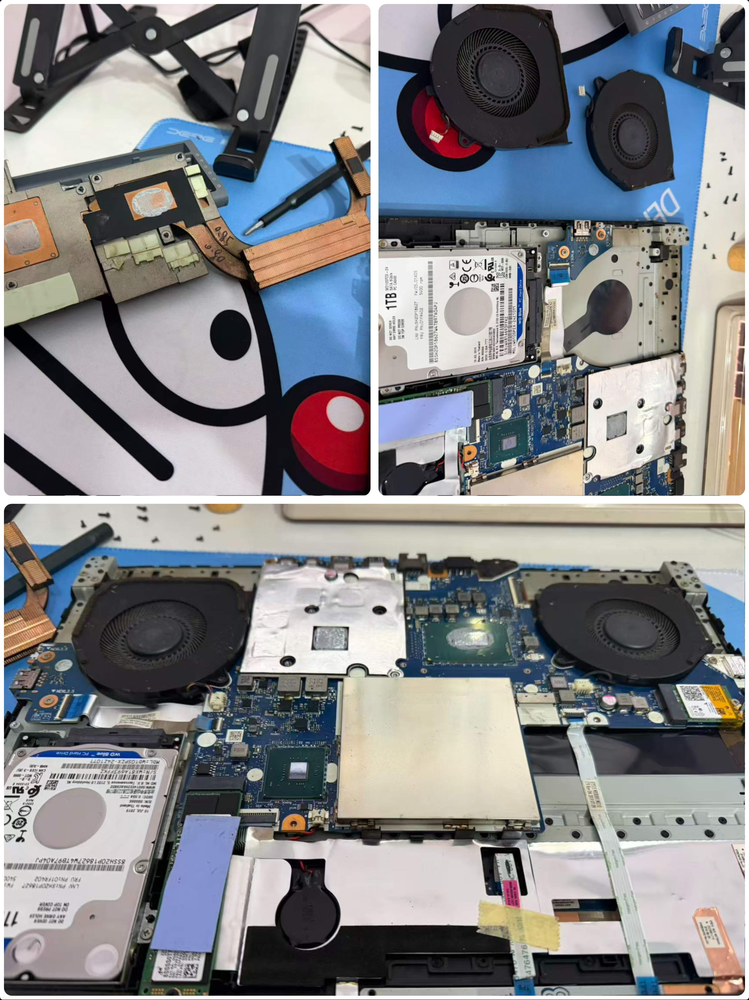
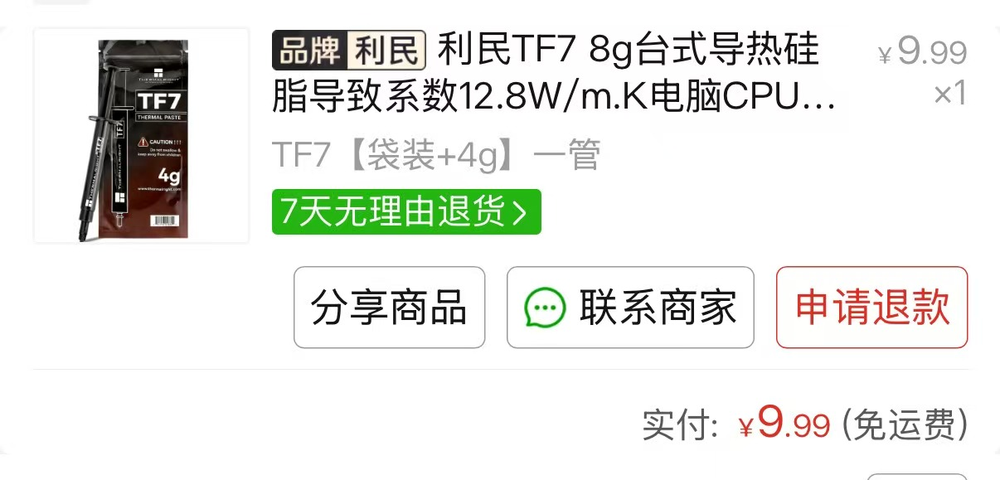
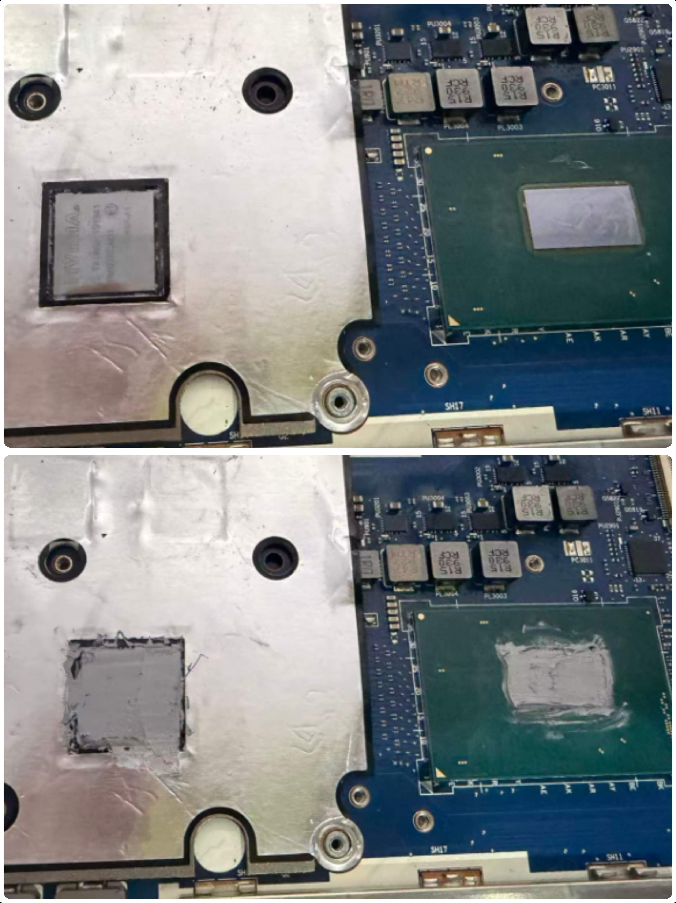
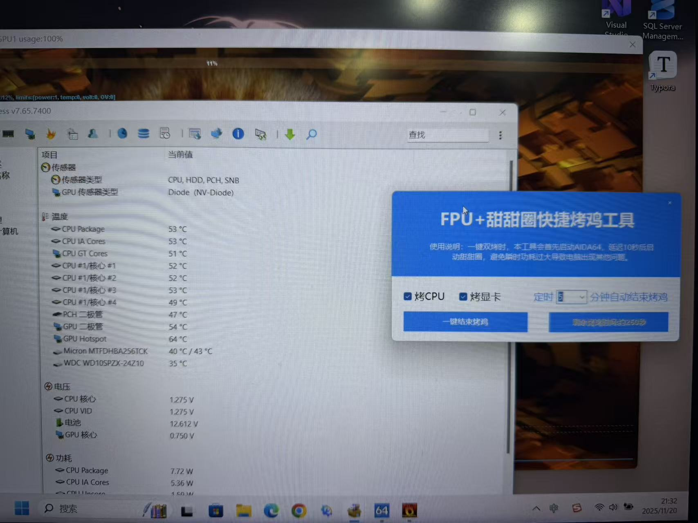
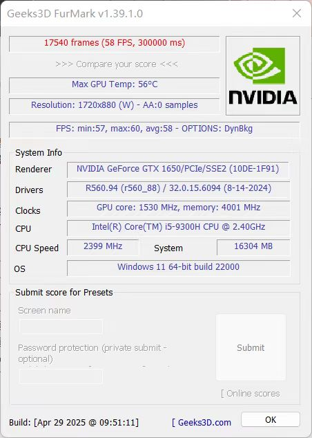
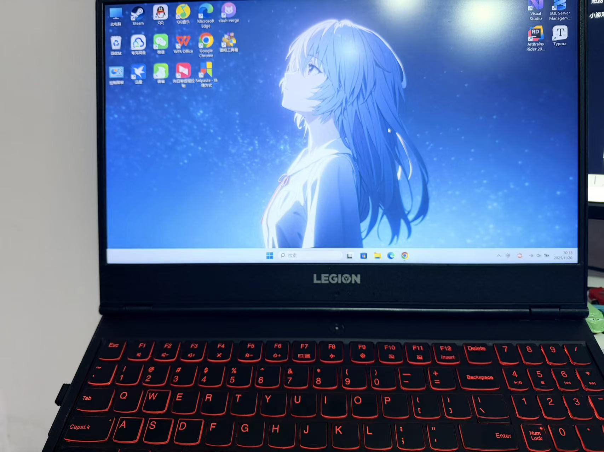

# 2019款联想拯救者Y7000清灰换硅脂

## 前言

由于24年新装了一台**主机**，我的**联想拯救者**也就一直放桌面吃灰了。

之前的3篇装机文章：

[**小白装机-选配篇**](https://blog.pljzy.top/posts/%E5%B0%8F%E7%99%BD%E8%A3%85%E6%9C%BA-%E9%80%89%E9%85%8D%E7%AF%87/%E5%B0%8F%E7%99%BD%E8%A3%85%E6%9C%BA-%E9%80%89%E9%85%8D%E7%AF%87/)

[小白装机-装机篇](https://blog.pljzy.top/posts/%E5%B0%8F%E7%99%BD%E8%A3%85%E6%9C%BA-%E8%A3%85%E6%9C%BA%E7%AF%87/%E5%B0%8F%E7%99%BD%E8%A3%85%E6%9C%BA-%E8%A3%85%E6%9C%BA%E7%AF%87/)

[**小白装机-上机体验篇**](https://blog.pljzy.top/posts/4060/%E5%B0%8F%E7%99%BD%E8%A3%85%E6%9C%BA-4060%E4%B8%8A%E6%9C%BA%E4%BD%93%E9%AA%8C%E6%84%9F%E5%8F%97%E5%88%86%E4%BA%AB/)

然后最近因为工作需要，不得已让它出山，这么久没用，灰尘多不讲，硅脂也从来没换过，那肯定会影响散热，影响散热就会影响性能，所以这次来给它做个全身**spa**。

## 贴纸清洁

首先先把贴纸撕掉，这个贴纸贴了至少2年了，该退休了，之前也清理过一次，贴纸残留的胶水非常难清理，这次的贴纸也不例外。

用了好多张酒精湿纸巾，加上棉签揉搓，大概清理了**90%**的残留的胶水，其他**10%**不影响使用懒得弄了。

## 开始拆机

> *tips: 养成好习惯，拆机前撸起袖子洗手并擦干。*

贴纸清理干净后，也是开始拆机。由于我很久之前就清理过灰尘（当时没换硅脂），所以拆起来比较轻松，第一次拆后盖，非常难拆，后盖卡得很紧，建议用拨片慢慢的别开，**小心用力过猛**把后盖弄坏了。

我这里素材拍少了，将就看一下吧。

可以看到我的散热铜管和电池已经拆下来，这里是因为电池的那个接口太难拔了，拆下来好拔一点，**不一定非得拆电池**，**但是电池的主板接口一定要拔**，**防止静电**。

由于之前清理过灰尘，风扇上的灰其实并不多，这次主要是为了换硅脂。

清理风扇的灰尘最好用刷子刷，不要用水洗。

## 涂硅脂

我这里用的硅脂是利民的**TF7**，还挺便宜的，某多上面**9.9￥**能买到**4g**。

涂新硅脂之前先把散热铜管和CPU上残留的旧硅脂清理干净。

稍微涂得有一点不均匀，无伤大雅。

## 装机测试

来小烤一下看看温度是否稳定。由于拆机之前忘记烤了，所以只有换硅脂之后的温度，少了对比。

可以看到烤鸡5分钟， `cpu` 最大测试温度**56°C**，还是挺稳的。

## 最后

还能再用3年！！！

