# 苹果手机快捷指令➕Numbers自动记账教程

# 前言

​    最近迷上了记录自己日常开销，之前一直用的是手动记账app，每次消费完之后需要自己后面空闲的时候补上记录，很不方便，有时候很容易忘记。虽然有的App提供了自动记账功能但是要支付一定的金额开通会员之类的，不然就只能手动录，所以果断放弃这种记账方式。

​    然后有一段时间使用的是<font color='blur'>微信记账本</font>,功能很多，也很方便，可以查看明细，只要是用微信支付的都能被记录下来，但是我觉得还是不够。如果想用支付宝支付是不会被记录下来的，那么闲来无事就研究了一下苹果的快捷指令来记账。下面开始详细讲解，大部分是图片教程，请耐心观看，如果有错误可以及时指出。

​    对于记账不感兴趣的可以退出去啦。

# 快捷指令

我会按照1 2 3 4...标注步骤

## 注意事项

<font color='red'>脚本搜索建议用开头或结尾的文字搜索，比如搜索步骤2，我会搜**提取文本**，步骤3我会搜**匹配**。</font>

注意如果否则语句，通过观察脚本前方空行查看是否在如果否则语句中。考虑到很多人是没有编程基础，在这里说一下截图中的**如果和否则**是成对出现的，并且否则后面会接上**结束条件**语句

## 1-8


## 8-15

注意如果否则语句层级关系。


## 15-19

列表对应你记账的类别，根据需求自行添加或删除。


## 19-24

19对应上面的列表，将列表存放在类别变量中，这里就不细讲作用了。23也是列表，23用于记录是收入还是支出。


## 24-27

这里要注意26步骤，“将”后面的变量要点击“+”加号一个一个添加上去。

同时注意27，这条指令作用是回到主屏幕，如果不加这条指令，记账的时候会停留在Numbers页面。

注意添加到“账单”中的“交易表单”这个是Numbers表格中的文件名，后面会讲。


# Numbers表格

打开苹果手机自带的`Numbers`App，如果没有的话去应用市场下载即可。

跟着图片步骤做，如果表格玩的厉害的人，可以自定义图表啥的，我这里就用苹果自己的模版了。

## 1

创建表格，注意这里表格名称，对应快捷指令24-27中的26添加到“表格名称”，后面交易表单如果没有修改名称可以不用管。

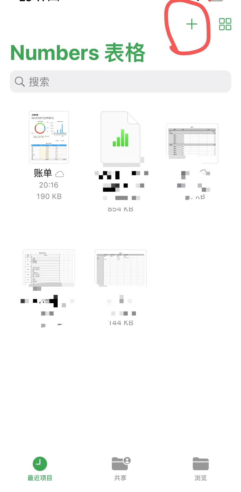

## 2

这里选择个人预算模版


## 3

创建模版后，创建新的表单。

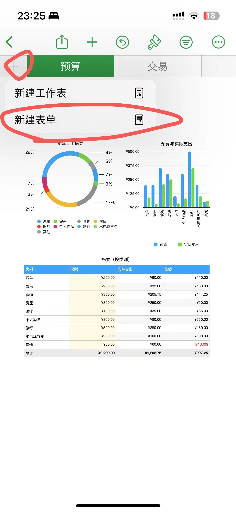

## 4

点击刚刚创建的表单，点击交易。


## 5

第4步点击交易后会进入交易表单，点击齿轮图标。


## 6

第5步点击齿轮图标后，点击类别后面的图标。


## 7

将类别的格式改为自动。按照第6步的操作后，会弹出如图所示：

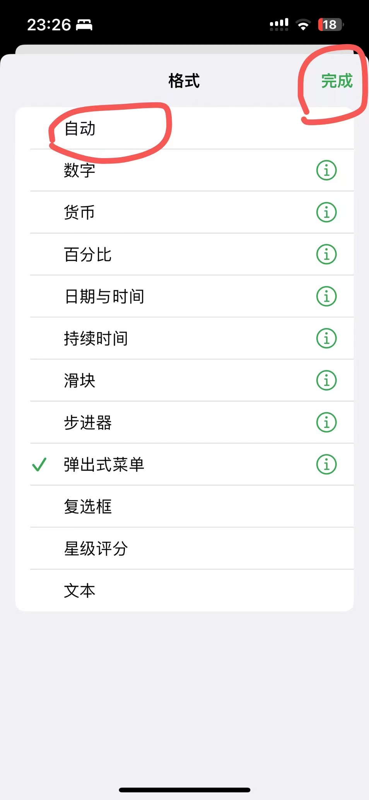

## 8

添加一个空白字段


## 9

新增的空白字段为收支类型，格式也是自动。


## 10

选择交易，把里面模版自动创建的数据删除掉。

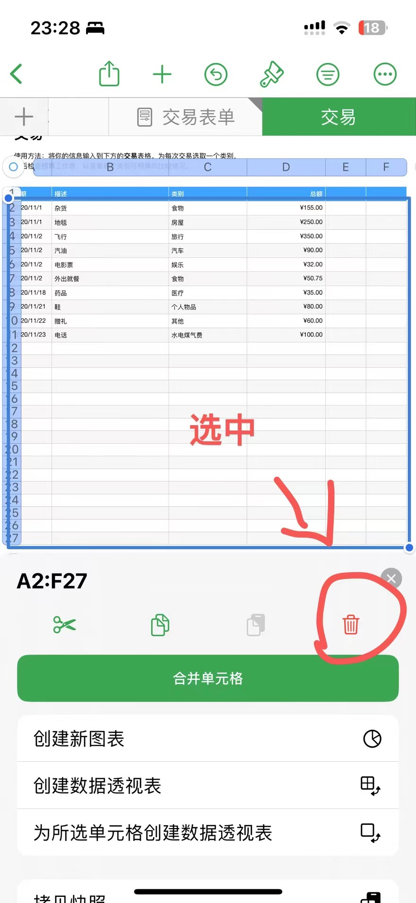

## 11

交易表单同理，删除掉就留一个就行了。

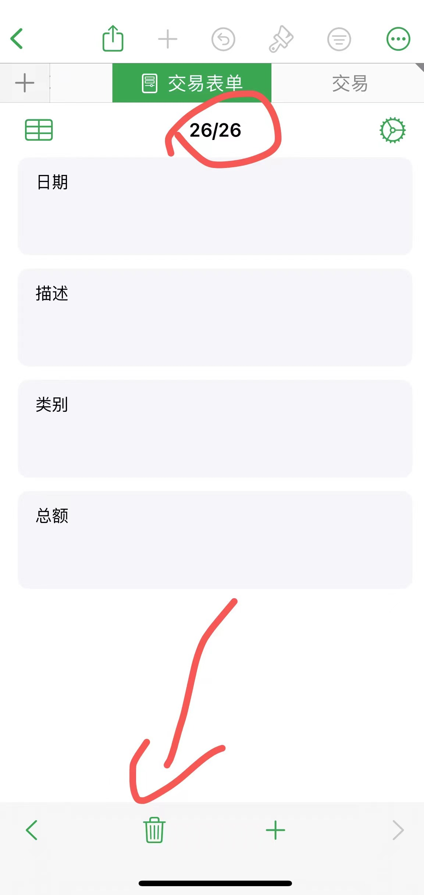

## 12

预算也是数据删除掉，然后类别就是快捷指令15-19步中的19的列表，要一一对应。到这里表格算是完成一半了，但是当你测试录入账单的时候发现预算这个界面的图标都没反应呀，数据也没有，那么这个时候就要用到Excel的知识了，我们要用公式。我下面会讲解我自己使用的公司，你们可以根据自己的需求进行更改。

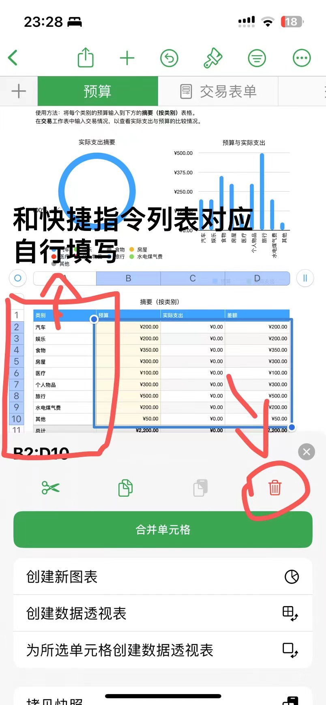

# 表格公式

## 步骤讲解

主要用到`SUMIFS`函数：

```
SUMIFS(待求和的值，待检验的值，条件，...,条件N)
```

我这里以早饭类别举例，其他列表公式同理，只是条件改一下就行了，选中每列实际支出单元格，点击单元格，编辑公式。

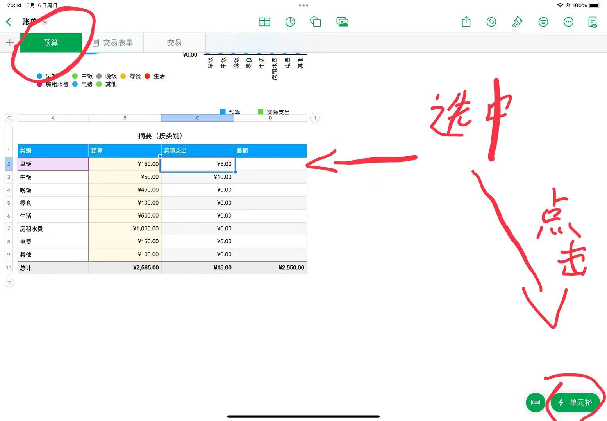

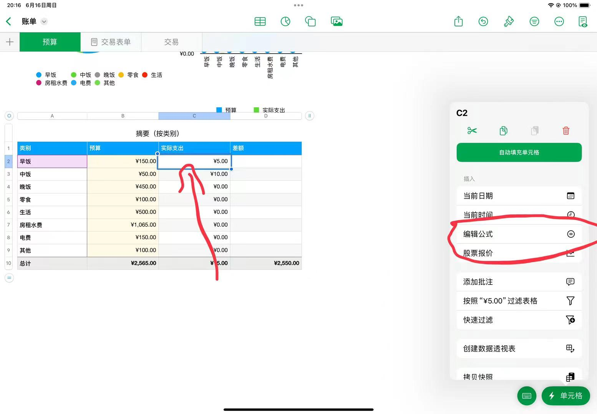

**图片制作有点粗糙，简单来讲一下。**

第一个参数：移动到交易页面点击一下总额上面的字母，一定要字母，代表整列数据。

第二个参数：同样回到交易页面点击交易列表单元格上面的字母。

第三个参数：这个是预算页面对应的类别了，你当前设置的是那个列表就选择那一个。

第四个参数：同理，注意后面需要手动输入字符串为"支出"，只统计支出的数据。

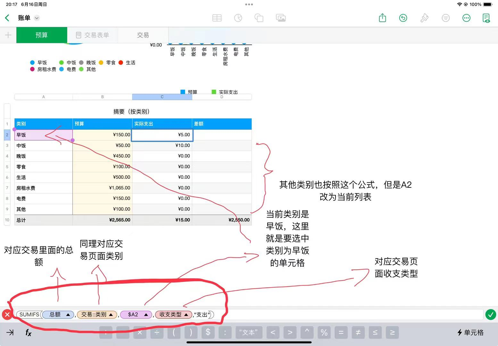

## 公式一图流

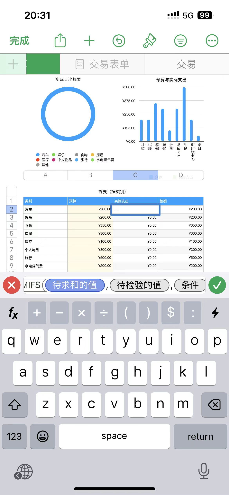


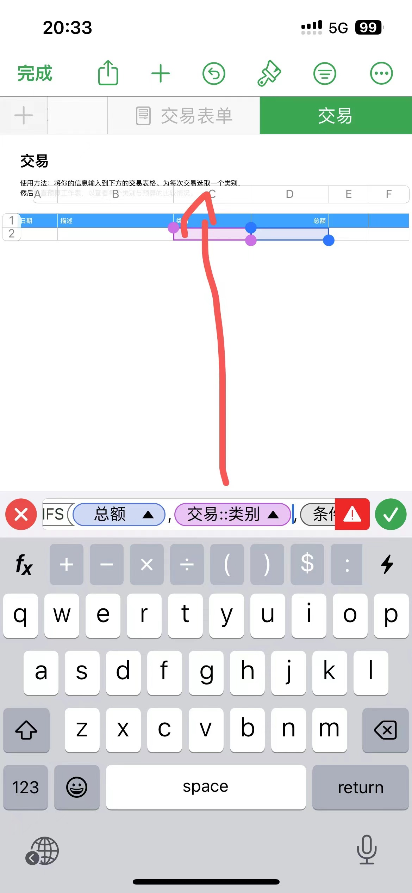

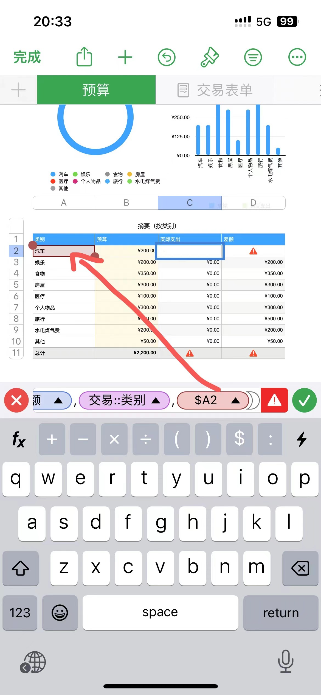

觉得条件不够的可以自己加，其实这里就是设置了**实际支出**列，根据当前**类别**去统计**支出**的金额。

# 系统设置

## 系统设置一图流


# 效果展示

在我们支付完成后，双击手机背面触发快捷指令，我这里以我的为例。因为我这个是单笔，他只识别到一笔金额，所以一开始就是选择类型的界面，如果你支付的页面有多个金额，它会弹出要你选择金额，才会进入到这步。那么我这里选择其他。


这里会要你添加描述，默认是无，但是不能为空否则录入到表格中会有问题。如果你没有描述点击已完成即可。


这里会弹出选择支出还是收入，其实这个收入这步用不上，我自己就没用，如果不想用这个可以把快捷指令和表格的支出删除掉。


执行完后，会回到手机主界面。当我们去查看表格的时候可以看到交易表单已经把刚刚记录的一票记录进去了，然后交易表里面也有数据了。预算应该也会同步过去，如果没有同步过去那就是公式设置错误了。


# 总结

本文图片居多，可能要花费写时间观看，制作不易，各位点个赞支持一下吧。如果看完整篇文章还是没有设置成功可以通过留言、评论的形式联系我。

# 参考连接

-  http://xhslink.com/Aja0vM
