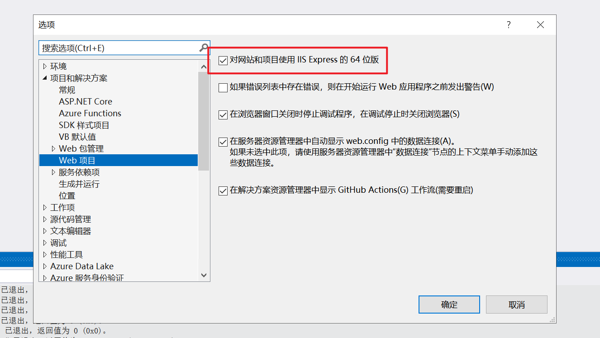
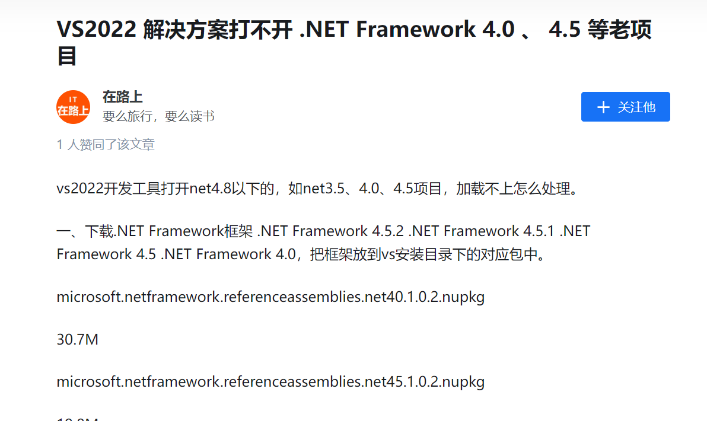

# 问题解决
公司项目都是`.NET Framework`的老项目，而我入职的时候电脑也是安装的`Visual Studio2019`，用了挺久。但是最近出的免费Ai补全的插件不支持，所以我下载了一个2022，不过问题就来了，我用`Visual Studio2022`去打开公司的老项目会报错，如图：

当我看到这些报错的时候就很疑惑，删除bin、obj文件重新加载项目生成解决方案都试了没用。正当我百思不得其解的时候，看到了一篇文章提到了如图：

我记得组长叫我部署iis的时候都会将支持32位哪里改为true，我就在想会不会就是这个问题。然后我打开了`Visual Studio 2022`的web项目设置页面，发现了默认是勾选是64位版本运行项目，如图：

把这个==勾选去掉==之后就能运行项目了，当然前提是安装了这些：

# 参考链接
[未能加载文件或程序集“XXX.dll”或它的某个依赖项的解决方法 - 睡觉对我非常重要 - 博客园 (cnblogs.com)](https://www.cnblogs.com/Chowhound/p/17158355.html)  https://www.cnblogs.com/Chowhound/p/17158355.html