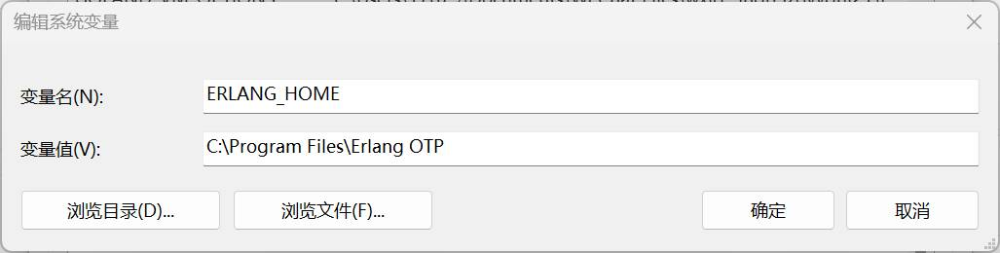
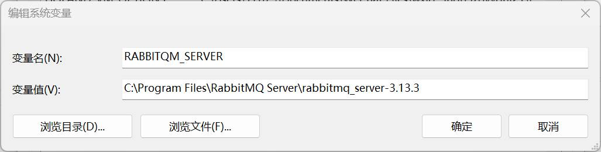
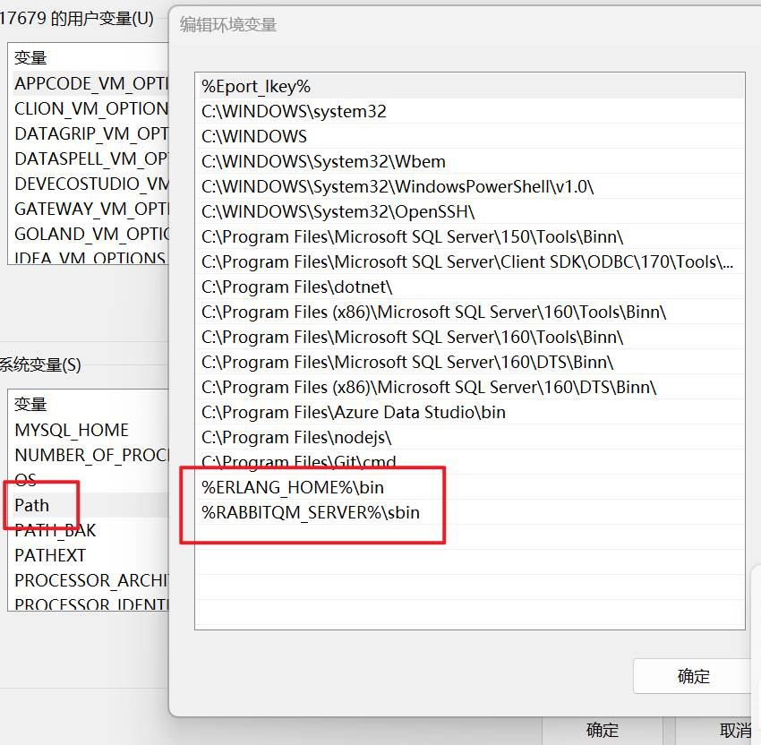
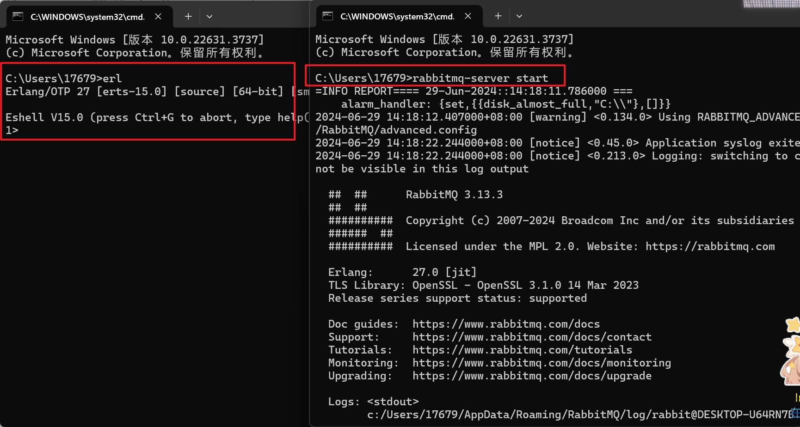
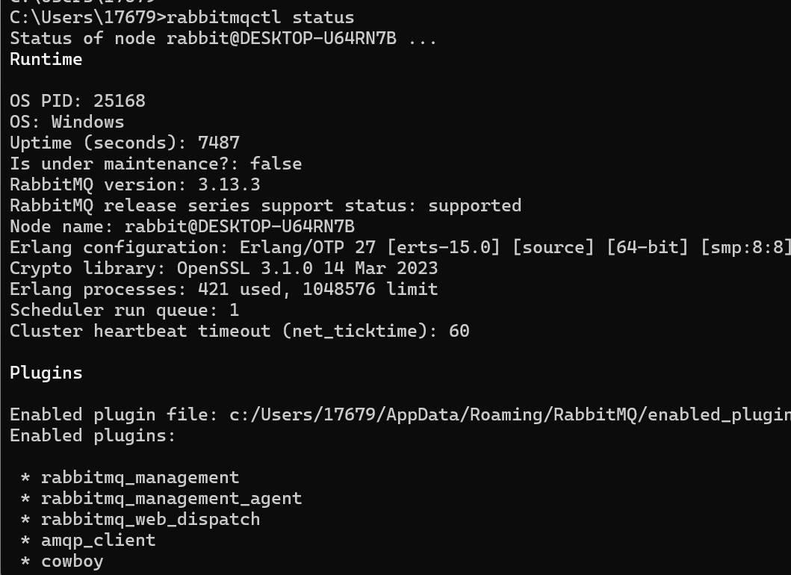
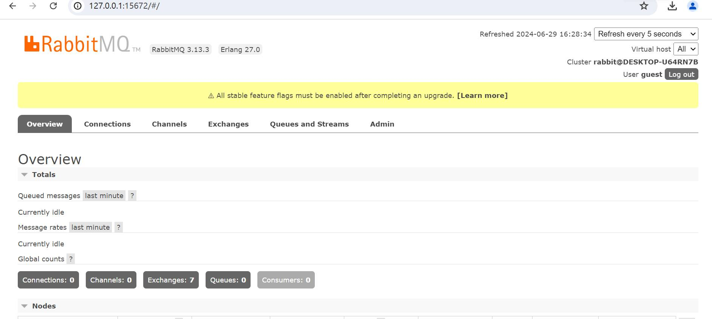

## 前言

周六在公司加班，干完活后越显无聊，想着下载`RabbiitMQ`做个小项目玩玩。然而这一下就下载了2个小时，真让人头痛。
简单的讲一下如何安装吧，网上教程和踩坑文章还是很多的，我讲我感觉有用的文章放在本文末尾。

## 安装地址

- erlang [下载 - Erlang/OTP](https://www.erlang.org/downloads) https://www.erlang.org/downloads
- RabbitMQ [Installing on Windows | RabbitMQ](https://www.rabbitmq.com/docs/install-windows) https://www.rabbitmq.com/docs/install-windows

## 安装步骤

无脑Next就行

## 环境变量

先放图：



图1、图2变量值替换成你安装的位置。
图3需要编辑系统变量Path，然后添加下面2段代码：

```
%ERLANG_HOME%\bin
```

```
%RABBITQM_SERVER%\sbin
```

## 测试安装

问题就出现在这里，我一直以为我没安装成功，看图：

打开控制台输入`erl`,和上图一致则是==安装成功==，然后是mq，输入`rabbitmq-server start`没有出现Error则启动成功。
然后我看了文章末尾的2篇链接，安装完后都是要输入`rabbitmqctl status`来测试是否安装成功，然而我输了很多次都是如图错误
![[Snipaste_2024-06-29_15-07-34.png]]
然后我以为是`.erlang.cookie`文件的问题，找了很久也只找到一个文件，网上的教程都说有2个文件，当我准备放弃的时候，我翻看了评论区，然后发现要先启动才行。
正确的流程是：

1. `rabbitmq-server start`
2. `rabbitmqctl status`
   启动之后输入`rabbitmqctl status`就行了 如图：
   

## 安装可视化插件

在mq安装目录打开控制台输入如下指令：

```sh
rabbitmq-plugins enable rabbitmq_management
```

## 成功启动

网址：http://127.0.0.1:15672/
账号：guest
密码：guest


## 参考链接

- https://blog.csdn.net/qq_25919879/article/details/113055350
- https://blog.csdn.net/xch_yang/article/details/136758177