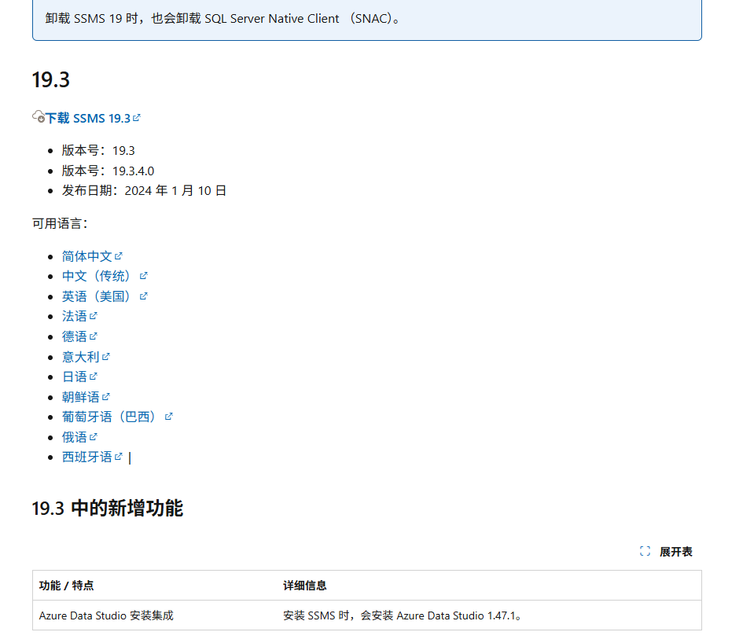
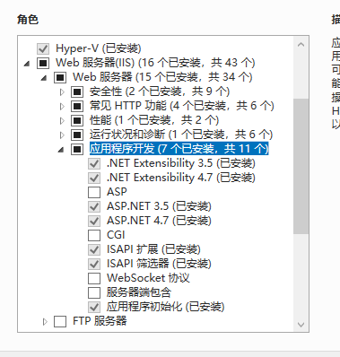

# 记录一次客户系统服务器搬迁折腾

## 开篇

有一家客户需要进行系统搬迁，将他们目前用的系统搬迁到另外一台服务器。由于原本维护这个项目的同事休假了，这件事也落在了我的头上😅

首先这家客户系统采用的版本和部署方式如下：

- 🖥️ 系统环境：Windows Server 2022 Datacenter
- 🗃️ 数据库版本：SQL server 2022
- ⚙️ 部署工具：IIS
- 🔧 系统版本：.Net Framework 4.5.2

客户那边已经安装好了数据库，我只需要安装`SQL Server Management Studio`数据库管理工具和`IIS`就行。

*💡 tips：我是解决之后才写的这篇文章，部分截图可能来自于网络。*

## 安装SSMS

📥 下载地址：https://learn.microsoft.com/zh-cn/ssms/release-notes-19

这边我选择安装的是`19.3`版本，安装的时候发生了一件小插曲，我是直接点击的下载`SSMS 19.3`,安装完成后发现是英文的，然后我回到下载网页才发现下面可以选择安装的语言，我又下了遍简体中文的版本。🔄

`SSMS`安装完成之后，将旧服务器备份的`SQl.BAK`文件还原一下即可搞定数据库迁移。✅

## 安装IIS

📚 教程很多，我这里就不再讲了。具体安装办法可以查看。
https://blog.csdn.net/wangyuxiang946/article/details/139953914

总结来说就是在**服务器管理器的添加角色和功能中**安装。🔍

## 网站报错解决

数据库配置好了，我也是把网站部署到了`IIS`，不出意外的话就要出意外了，打开网页出现`500`错误，如图：🚨

我也是马上百度了一下，直接在一篇文章中定位到了错误：“先确认安装`IIS`的时候有没有装`Asp.Net`，如果没安装的话，安装上即可。”，具体原因就是安装`IIS`的时候没有勾选`ASP`。🎯

## 结尾

应该会有人说公司系统怎么还在用`.Net Framework 4.5.2`，没办法这不是我能决定的🙂‍↔️。反正我要跳槽了！

又水了一篇，这日子越来越有盼头咯。💦✨