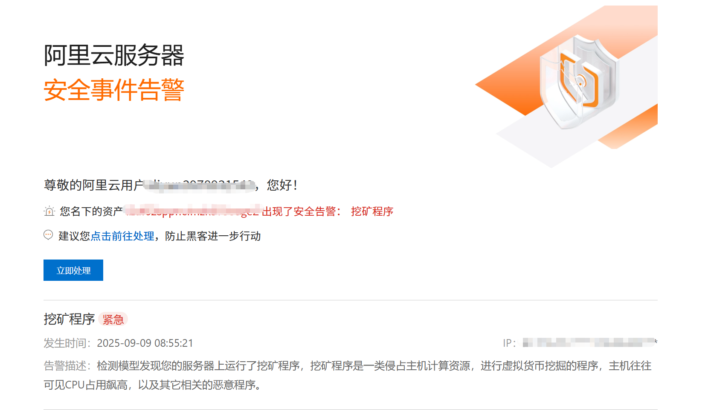
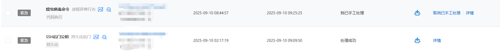
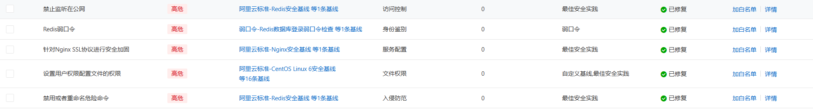

# 记录第N次服务器被植入挖坑病毒

## 📑前言

最近太忙了，无暇管理博客，也没怎么写文章，很多技术文章写一半都被我搁置了，主要还是感觉生活压力大，下班之后很难行动起来，只想躺着。

为什么标题要说是第N次呢？

其实在刚接触服务器的那段时间也被植入过挖坑程序，也算是踩坑多次。

声明：本人是个服务器小白，就单纯会敲`cd`命令和`docker`命令部署点项目玩玩！

*tip：最近太忙有一部分原因是公司老板迷上了AI，天天就是AI分享，搞得公司员工身心疲惫,我在考虑要不要写一篇吐槽文章。*

## 💥事发

上班摸鱼时间，突然发现博客访问不到了，天塌了，像这种情况，我以为是服务器被攻击了（因为之前被`DDOS`攻击过）。然后打开阿里云控制面板发现不是， 看了一下阿里云的消息发现是又被植入挖坑程序了，天塌了，按道理这时候应该会提前接收到短信的，但是好巧不巧被苹果（IOS 26.0版本）手机识别为未知发件人短信了，导致我没有第一时间弹出信息。

## 💫处理

由于之前也处理过这类事情，其实就是普通的挖坑程序，根据阿里云提供的信息，kill 进程、删除挖矿文件以及后门就能解决了。

这里就不细讲操作了。

## 💯事后

经过这次事件之后，我把ssh登录从密码登录改为秘钥登录、`Redis`从外网访问改为只能内网访问，也安装阿里云给出的建议做了一系列防护。

## 🤡总结

虽然不知道挖坑程序是怎么植入的，不过大概是ssh暴力破解或者利用了`Redis`，这就不得而知了，不过本身我的服务器也没有什么重要文件，博客的文章也是存放在本地再上传服务器的，所以我对于安全这块好像没怎么研究，只有当我的服务出现异常才会着急，希望大家不要像我学习，哈哈。