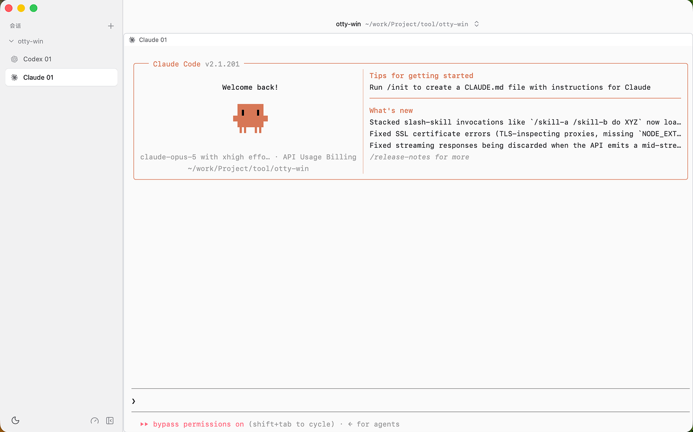
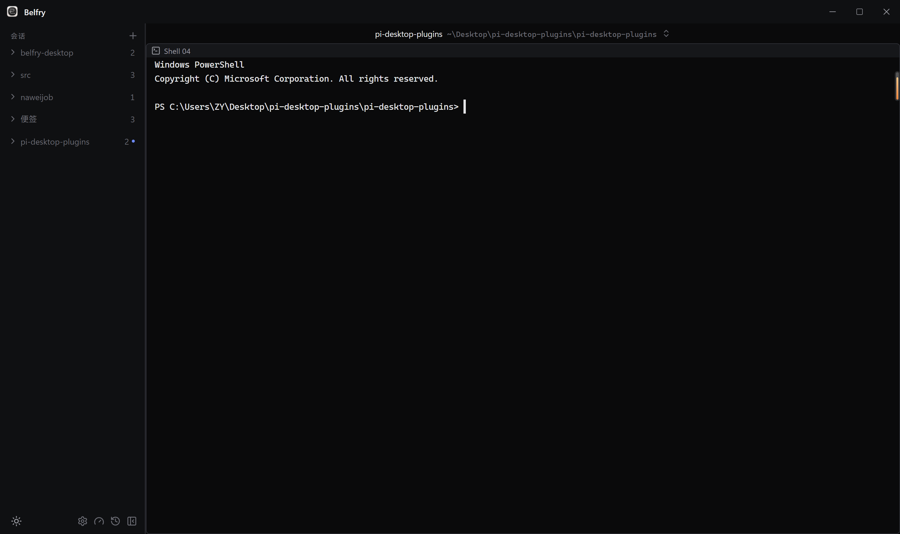
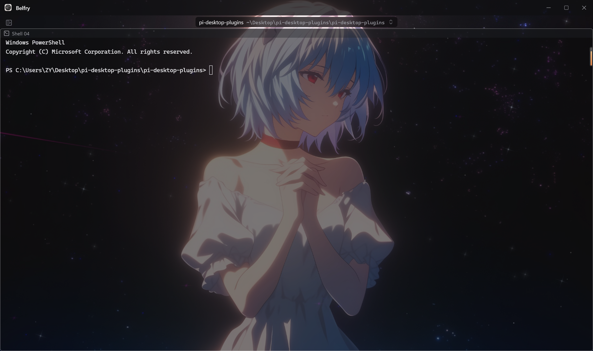
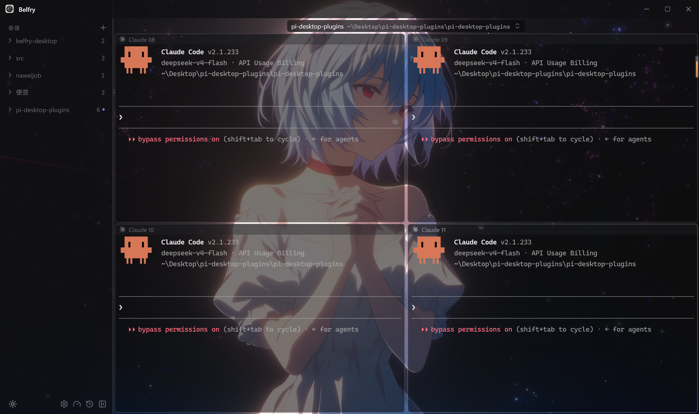

# 跨平台（macOS + Windows）AI 编程终端·Belfry

## 前言

又来打广告了，这次也是朋友开发一款终端管理工具。

平时我在用`claude code`终端时，如果想多个项目的任务**同时进行**，就需要打开多个终端。在开发的时候，除了开发工具要打开，还有终端，还有微信、等等一系列软件，这个时候终端再多起来就很麻烦，切换来切换去的。

[Belfry](https://github.com/ChengSoon/belfry-desktop)就解决了这个问题，可以将多个终端放在一个页面，同时多个项目的终端任务可以并行。

## 产品介绍

### 简介

在 macOS 和 Windows 上用同一套界面跑 Codex、Claude Code，顺带看清它们在忙什么、在等谁。Agent 不在，它照样是完整终端。

### 技术栈

| 层       | 选型                                           |
| -------- | ---------------------------------------------- |
| 桌面外壳 | Tauri 2                                        |
| 后端     | Rust 2024 edition（rustc 1.85+）、portable-pty |
| 前端     | React 19、TypeScript、Vite                     |
| 终端     | xterm.js 6 + WebGL addon                       |

## 产品截图

### 亮色

### 暗色

### 皮肤

### 多终端

## 总结

目前还在优化中，大家可以去`Github`提一提`Issues`。

## 系列合集

[[我用朋友的开源项目PI-Desktop做了个图片转化网站]]

## 友情链接

- 仓库地址— https://github.com/ChengSoon/belfry-desktop

- [LINUX DO](https://linux.do/) — 开发者社区